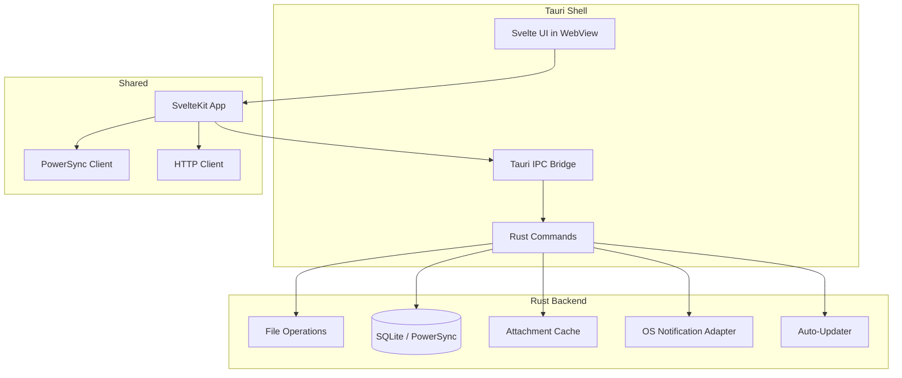

# PLAT-003: Desktop Platform

| Field | Value |
|---|---|
| **Document** | 09-PLAT-003-desktop |
| **Version** | 1.0 |
| **Status** | Draft |
| **Last Updated** | 2026-04-12 |
| **Source Docs** | `docs/altair-architecture-spec.md` (sections 6.2, 10.3), `./DESIGN.md` |

---

## Philosophy

The desktop app is the **power-user shell**. It wraps the shared SvelteKit/Svelte UI inside Tauri 2, adding native OS integration: local file access, persistent SQLite, tray notifications, and stronger offline capabilities. It targets Linux and Windows. It is a Tier 2 platform — not required for basic viability, but adds significant depth for power users.

---

## Constraints

| Constraint | Impact |
|---|---|
| Shared UI with web | Most Svelte components are reused; desktop-only features gated by platform detection |
| Tauri 2 security model | IPC commands must validate inputs; capabilities scoped per window |
| Filesystem access | Requires Tauri filesystem plugin with scoped permissions |
| Update distribution | Tauri updater plugin for self-update; manual install for first deployment |
| Target: Linux + Windows | No macOS initially; test on both targets |

---

## Feature Scope

### P0 — Must Ship (at desktop launch)
- All web P0 features (shared Svelte UI)
- Persistent SQLite for stronger offline
- Local attachment cache on filesystem
- OS notifications (tray)

### P1 — Should Ship
- Multi-window support (e.g., note editor + inventory side-by-side)
- Local file import/export (drag-and-drop)
- Keyboard-driven workflows (command palette)
- System tray with quick actions
- Focus mode with OS-level distraction blocking

### P2 — Later
- Local AI model integration (Ollama adapter)
- Graph visualization (note relationship explorer)
- Bulk import/export with progress
- Plugin/extension API

---

## Architecture



### Key Architectural Decisions
- **Shared Svelte codebase** with web — `apps/web/` serves both targets
- **Tauri 2** wraps the web app; Rust backend handles native operations
- **PowerSync** with SQLite backend (not IndexedDB) for more robust offline
- **Tauri IPC** for commands that need native access (file operations, notifications, cache management)
- **Capability scoping** — each window declares its required permissions

---

## Tauri-Specific Components

### IPC Commands

| Command | Purpose | Capability |
|---|---|---|
| `read_file` | Import local files | `fs:read` (scoped to user-selected paths) |
| `write_file` | Export data | `fs:write` (scoped) |
| `get_cache_path` | Attachment cache directory | `fs:read` (app data dir) |
| `show_notification` | OS-level notification | `notification:default` |
| `get_system_info` | Platform detection | `core:default` |

### Capability Configuration
```json
{
  "identifier": "main-window",
  "windows": ["main"],
  "permissions": [
    "fs:read-app-data",
    "fs:write-app-data",
    "notification:default",
    "shell:default",
    "updater:default"
  ]
}
```

---

## App Screens

Desktop inherits all web screens with these enhancements:

### Multi-Window Layout
- Primary window: full app with sidebar navigation
- Detachable panels: note editor, quest detail can open in secondary windows
- Window state persistence (position, size, panel arrangement)

### Command Palette
- `Ctrl+K` / `Ctrl+P` trigger
- Search across: navigation, quests, notes, items, actions
- Glassmorphism overlay per [`./DESIGN.md`](../../DESIGN.md): surface at 80% opacity, `backdrop-blur: 20px`

### System Tray
- Tray icon with unread notification count badge
- Quick actions: new quest, new note, open today view
- Sync status indicator

---

## Design System Application

Desktop uses the same [`./DESIGN.md`](../../DESIGN.md) tokens as web — the Svelte components are shared. Desktop-specific additions:

| Enhancement | Implementation |
|---|---|
| Window chrome | Custom titlebar with Foggy Canvas White background, integrated navigation |
| Tray icon | Monochrome icon using Deep Muted Teal-Navy |
| Multi-window | Each window inherits the full theme; secondary windows use a slightly elevated surface base |
| Focus mode overlay | Soft Slate Haze (`#cfddde`) dim on non-active windows |

### Dark Mode
- Respects OS dark mode preference by default
- Manual toggle in settings
- Dark tokens from DESIGN.md applied to all shared components

---

## Data Sync Architecture

### SQLite (via Tauri)
- PowerSync uses native SQLite (not IndexedDB) for better performance and larger storage
- Database file stored in Tauri app data directory
- WAL mode enabled for concurrent reads

### Offline Behavior
- Full offline capability — reads and writes work without network
- Sync coordinator runs in Rust backend (not limited by browser tab lifecycle)
- Attachment cache on local filesystem with configurable size limit
- Conflicts surfaced on next sync with resolution UI

### Attachment Handling
- Binaries cached in `{app_data}/attachments/` directory
- LRU eviction when cache exceeds size limit
- Drag-and-drop import creates attachment + note/item metadata
- Export writes to user-selected directory via Tauri file dialog

---

## Platform-Specific Behavior

### File Import/Export
- Drag-and-drop onto app window → create attachment or import data
- Export via Tauri save dialog → write to user-selected path
- Supported formats: JSON (data export), Markdown (notes), CSV (inventory)

### OS Integration
- Notifications via Tauri notification plugin
- Auto-start option (via OS autostart mechanism)
- File associations (`.altair` export files)
- Global keyboard shortcut for quick capture (optional)

---

## Performance Targets

| Metric | Target |
|---|---|
| Cold start | < 2s |
| Window open | < 500ms |
| Local read | < 50ms (native SQLite) |
| Local write | < 100ms |
| Attachment cache hit | < 200ms |

---

## Testing Strategy

| Layer | Framework | Notes |
|---|---|---|
| Shared UI | Same as web (Vitest + Playwright) | Components tested in browser context |
| Tauri commands | Rust unit tests | Command logic tested without UI |
| Integration | Tauri test harness | IPC round-trip testing |
| E2E | WebDriver or Tauri test utils | Desktop-specific flows (file import, notifications) |
