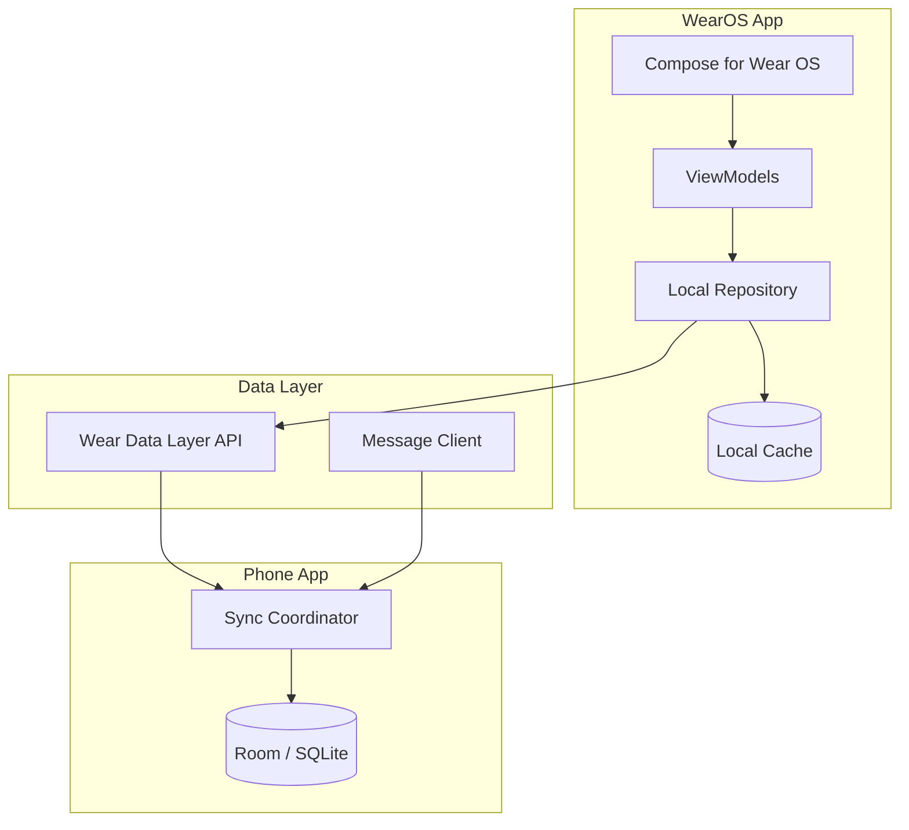

# PLAT-004: WearOS Platform

| Field | Value |
|---|---|
| **Document** | 09-PLAT-004-wearos |
| **Version** | 1.0 |
| **Status** | Draft |
| **Last Updated** | 2026-04-12 |
| **Source Docs** | `docs/altair-architecture-spec.md` (section 6.3) |

---

## Philosophy

WearOS is a **reduced-scope companion**, not a full client. It provides quick-glance information and single-tap actions on the wrist. The user should never need to open their phone for simple routine completions, quick logging, or viewing today's priorities. It is a Tier 3 platform — future scope, not required for v1.

---

## Constraints

| Constraint | Impact |
|---|---|
| Tiny screen (round/square, ~1.4") | Extremely simplified UI — no complex navigation |
| Limited input | Voice, taps, rotary crown — no keyboard |
| Battery-critical | Minimize background processing; lean on phone for sync |
| Android companion dependency | WearOS app communicates via Data Layer API to Android phone app |
| Always-on display | Ambient mode must show useful info without burning battery |

---

## Feature Scope

### P0 — Must Ship (at WearOS launch)
- View today's quests (titles + priority)
- Mark quest complete (single tap)
- View due routines
- Mark routine complete
- Receive notifications (routine due, timer complete)

### P1 — Should Ship
- Quick item consumption logging (e.g., "used 1 of X")
- Focus session timer on wrist
- Daily check-in (energy level only — simplified)
- Complication: next quest due

### P2 — Later
- Voice note capture
- Shopping list check-off
- Quick quest creation via voice

---

## Architecture

### Key Architectural Decisions
- **Compose for Wear OS** — same Kotlin/Compose paradigm as phone app
- **Wear Data Layer API** — syncs minimal data subset from phone, not directly from server
- **Phone acts as proxy** — WearOS never talks to the backend directly
- **Local cache on watch** — small SQLite cache for today's data
- **No PowerSync on watch** — too heavy for wearable; phone relays changes

---

## App Screens

### Today Tile
- Scrollable list of today's quests
- Each item: title + priority indicator (color dot)
- Tap to complete; long-press for defer
- Rotary crown scrolls the list

### Routine Card
- Shows next due routine
- Single tap to mark complete
- Swipe to dismiss

### Timer Screen (P1)
- Circular progress indicator
- Quest title
- Elapsed time (large, centered)
- Tap to end session

### Check-in (P1)
- Simple 1-5 energy slider
- Rotary crown to adjust
- Confirm button

### Complication (P1)
- Shows next quest title and due time
- Tap opens Today tile

---

## Design System Application

WearOS adapts the [`./DESIGN.md`](../../DESIGN.md) system for the constrained wearable context:

| Token | WearOS Adaptation |
|---|---|
| Foggy Canvas White (`#f8fafa`) | Not used — Wear OS defaults to dark backgrounds |
| Abyssal Ink (`#080f10`) | Base background (dark mode primary) |
| Deep Sea Charcoal (`#0c1c1e`) | Card backgrounds |
| Glacial Sky Blue (`#abcbdd`) | Primary accent — quest completion, active states |
| Arctic Whisper (`#d0eaee`) | Text on dark surfaces |
| Warm Coral Ember (`#ee7d77`) | Urgent priority indicator |
| Manrope | Display/title text (limited use — one heading per screen) |
| Plus Jakarta Sans | Body/label text |

### Wear-Specific Rules
- Always dark mode — no light mode on wearable
- Maximum 3 lines of text per card
- Touch targets minimum 48dp (larger than standard 44dp for wrist interaction)
- High contrast required — no subtle tonal shifts on this screen size
- Ambient mode: reduce to monochrome outline, minimal content

---

## Data Sync Architecture

### Phone ↔ Watch Communication
- **Data Items**: phone pushes today's quests + routines to watch DataStore
- **Messages**: watch sends completion events to phone for immediate sync
- **Channel**: bidirectional for focus session timer sync

### Data Subset on Watch

| Data | Source | Update Frequency |
|---|---|---|
| Today's quests | Phone → Watch | On phone sync + on quest change |
| Due routines | Phone → Watch | On phone sync + on schedule change |
| Active focus session | Bidirectional | Real-time |
| Check-in state | Watch → Phone | On submission |

### Offline Behavior
- Watch caches today's data locally
- Completions stored locally and synced to phone when reconnected
- If phone is unreachable, watch operates on stale data with local-only completions

---

## Performance Targets

| Metric | Target |
|---|---|
| App launch | < 1s |
| Screen transition | < 200ms |
| Completion action | < 100ms (local) |
| Data refresh from phone | < 2s |
| Battery impact | < 5% per day (ambient mode) |

---

## Implementation Notes

- WearOS app lives in `apps/android/` as a Wear OS module alongside the phone app
- Shared Kotlin domain models and DTOs between phone and watch modules
- Koin DI with a simplified watch-specific module set
- Minimal dependencies — no PowerSync, no Room (lightweight SQLite wrapper or DataStore)

---

## Testing Strategy

| Layer | Framework | Notes |
|---|---|---|
| Unit (ViewModels) | JUnit 5 | Shared test utilities with phone app |
| UI | Compose for Wear OS Testing | Wear-specific screen tests |
| Data Layer | Mock Data Layer API | Test phone ↔ watch communication |
| E2E | Wear OS emulator | Critical flows: view today, complete quest |
