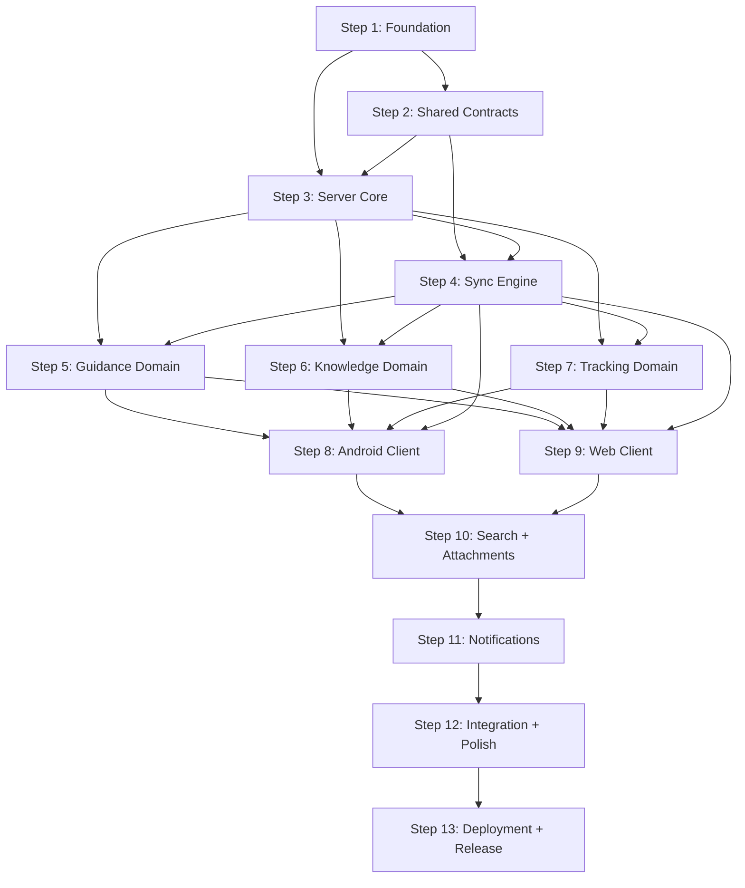

# PLAN-001: v1 Implementation Plan

| Field | Value |
|---|---|
| **Document** | 10-PLAN-001-v1 |
| **Version** | 1.0 |
| **Status** | Draft |
| **Last Updated** | 2026-04-12 |
| **Source Docs** | `docs/altair-architecture-spec.md` (sections 24-26) |

---

## Dependency Graph

---

## Parallel Tracks

| Track | Focus | Steps | Agent Type |
|---|---|---|---|
| **Backend** | Server, sync, APIs | S1, S3, S4, S5-S7 (server), S10 (server), S11 | Backend |
| **Android** | Android client | S8, S11 (client) | Full-stack (Kotlin) |
| **Web** | Web client | S9 | Full-stack (Svelte) |
| **Contracts** | Shared types + schemas | S2 | Full-stack |
| **Infra** | Docker, CI, deployment | S1 (infra), S13 | Backend |

### Parallelization Strategy
- Steps 1-2 are sequential (foundation before everything else)
- Steps 5, 6, 7 can run in parallel after Step 4
- Steps 8 and 9 can run in parallel (different platforms, same API)
- Steps 10 and 11 can overlap with client development
- Desktop client deferred to v2 (see ADR-001)

---

## Shared Module Strategy

| Module | Location | Consumers |
|---|---|---|
| Contracts (entity types, relation types, sync streams) | `packages/contracts/` | Server, Android, Web, Desktop |
| API schemas (DTOs, request/response types) | `packages/api-contracts/` | Server, all clients |
| Design tokens (CSS variables, color values) | `packages/design-system/` | Web, Desktop |
| Migrations | `infra/migrations/` | Server, CI |

---

## Steps

### Step 1: Foundation

**What to build:**
- Monorepo structure per ADR-007: `apps/`, `packages/`, `infra/`, `docs/`, `Context/`
- Rust workspace setup (Cargo workspace with server + worker crates)
- SvelteKit project scaffolding (`apps/web/`)
- Android project scaffolding (`apps/android/`)
- Docker Compose setup: PostgreSQL, PowerSync Open Edition, MongoDB (PowerSync dep), RustFS (S3-compatible storage) — per ADR-012 (no Zitadel)
- CI pipeline (build + lint + test for all stacks)
- Database migration tooling (sqlx migrate)
- Initial migration: `users`, `households`, `household_memberships`

**Done when:**
- `cargo build` succeeds for server crate
- `bun run dev` starts SvelteKit dev server
- Android project builds in Android Studio
- `docker compose up` starts full stack (Postgres, PowerSync, MongoDB, RustFS)
- CI runs on push to main
- Users table exists with seed data

---

### Step 2: Shared Contracts

**What to build:**
- `packages/contracts/` with JSON registries:
  - `entity-types.json`
  - `relation-types.json`
  - `sync-streams.json`
- Code generation or manual constant files:
  - TypeScript: `entityTypes.ts`, `relationTypes.ts`, `syncStreams.ts`
  - Kotlin: `EntityType.kt`, `RelationType.kt`, `SyncStream.kt`
  - Rust: `entity_type.rs`, `relation_type.rs`, `sync_stream.rs`
- Shared DTO schemas: `EntityRef`, `RelationRecord`, `AttachmentRecord`, `SyncSubscriptionRequest`
- CI validation: registry values match language bindings

**Done when:**
- All three language bindings compile and pass tests
- CI validates registry consistency
- Entity type constants used in at least one module per stack

---

### Step 3: Server Core

**What to build:**
- Axum application skeleton with module structure
- Auth module: Argon2id password hashing + server-issued JWT (ADR-012)
- Auth middleware for all routes — validates JWT signature and claims (invariant SEC-2)
- Core module: initiatives CRUD with user/household scoping (invariant SEC-1)
- Tags CRUD
- Entity relations CRUD with registry validation (invariant C-1, C-2)
- Error handling: `AppError` enum with `thiserror`, HTTP status mapping
- Database pool setup (sqlx)
- Migrations for: `initiatives`, `tags`, `attachments`, `entity_relations`, guidance tables, knowledge tables, tracking tables
- Health endpoint

**Done when:**
- Registration and login endpoints return valid JWT access tokens
- Axum middleware validates server-issued JWTs
- Authenticated CRUD for initiatives, tags, relations
- Unknown entity types rejected at write time
- User A cannot see User B's data
- All migrations applied and reversible

---

### Step 4: Sync Engine

**What to build:**
- Sync mutation endpoint (`/sync/push`): accept MutationEnvelope, validate, apply
- Mutation dedup by `mutation_id` (invariant S-2)
- Version conflict detection using `base_version` (invariant S-1) — LWW default with conflict logging per ADR-003
- Conflict copy creation for Knowledge notes (ADR-003)
- `sync_conflicts` table for preserving both versions on conflict
- Stricter quantity conflict checks for tracking items (invariant S-3)
- Device checkpoint management (invariant S-4)
- Sync pull endpoint (`/sync/pull`): return changes since checkpoint
- PowerSync server configuration with sync stream definitions
- Soft delete handling (invariant S-6)
- Access boundary filtering on all sync queries (invariant S-7)

**Done when:**
- Idempotent mutation replay produces same result
- Two conflicting mutations from different devices surface a conflict (not silent overwrite)
- Quantity conflicts detected for item mutations
- Checkpoints advance monotonically
- Deleted records remain queryable until all devices have synced past deletion

---

### Step 5: Guidance Domain (Server)

**What to build:**
- Epic CRUD (scoped to initiative)
- Quest CRUD with status transitions (see `06-state-machines.md`)
- Quest initiative ownership validation (invariant E-3)
- Routine CRUD with frequency validation (invariant E-4)
- Routine → quest spawning logic
- Focus session CRUD
- Daily check-in CRUD (unique per user per date)
- Domain event emission: `QuestCompleted`, `RoutineDue`

**Done when:**
- Full CRUD for all Guidance entities via API
- Quest status transitions enforced
- Routine spawns quests per frequency config
- Focus sessions track duration
- Domain events emitted on state transitions

---

### Step 6: Knowledge Domain (Server)

**What to build:**
- Note CRUD with user scoping
- Note snapshot creation (immutable — invariant E-6)
- Backlink derivation from entity_relations (invariant E-5)
- Note-to-note and note-to-entity relation endpoints
- Domain event emission: `NoteLinked`

**Done when:**
- Note CRUD works with offline-generated UUIDs
- Snapshots are immutable (no UPDATE path)
- Backlinks queryable by target note
- Cross-domain relations via entity_relations

---

### Step 7: Tracking Domain (Server)

**What to build:**
- Location and Category CRUD (household-scoped)
- Item CRUD with location/category/household scoping (invariants E-8)
- Item event recording (append-only — invariant D-5)
- Quantity validation: no negative from consumption (invariant E-7)
- Shopping list and shopping list item CRUD (invariant E-9)
- Domain event emission: `ItemQuantityChanged`

**Done when:**
- Items scoped to household with location/category filtering
- Item events append-only, no delete
- Consumption event that would produce negative quantity is rejected
- Shopping list items can reference inventory items within same household

---

### Steps 8-13: Directional Summaries

> Steps 8-13 are described directionally. Full task breakdowns will be created when these steps are ready for planning (after Steps 5-7 complete). Prescriptive task lists this far ahead add planning overhead without proportional value.

---

### Step 8: Android Client

**Goals:** Native Android client with Compose UI covering all three domains (Guidance, Knowledge, Tracking). Offline-first via Room + PowerSync Kotlin SDK. Background sync and push notifications.

**Key constraints:**
- Room entities must mirror Postgres schema (invariant D-4)
- PowerSync connector handles sync; tokens from built-in auth (ADR-012)
- Offline creation/completion must sync correctly when connectivity returns

**Open questions:**
- FCM vs. alternative push provider for self-hosted deployments
- WorkManager scheduling strategy for background sync intervals

---

### Step 9: Web Client

**Goals:** SvelteKit app with Svelte 5 runes and PowerSync web SDK. All P0 user flows. Design system implementation per DESIGN.md.

**Key constraints:**
- Login form + cookie-based JWT auth (ADR-012), no OIDC redirect flow
- CSRF protection via SvelteKit built-in + SameSite cookies (invariant SEC-6)
- Cross-domain search interface

**Open questions:**
- Admin panel scope (user management, household config, system health)
- Whether search UI belongs here or in Step 10

---

### Step 10: Search + Attachments

**Goals:** Cross-domain search (Postgres FTS + optional pgvector semantic search per ADR-004). Attachment upload/download via S3-compatible storage (RustFS per ADR-005). Graceful degradation when no embedding API is configured.

**Key constraints:**
- Attachment binaries never flow through sync engine (invariant S-5)
- Signed URLs for download with configurable TTL (invariant SEC-4)
- AI provider abstraction must support OpenAI-compatible, Anthropic-compatible, and Ollama endpoints

**Open questions:**
- Thumbnail generation strategy (server-side vs. client-side)
- Embedding pipeline batch size and rate limiting

---

### Step 11: Notifications

**Goals:** Server-owned notification generation (ADR-008) with FCM push (Android) and SSE (web). Client-local fallback for time-critical offline scenarios. Cross-device read/dismiss state via PowerSync.

**Key constraints:**
- At-least-once delivery, idempotent by notification_id
- Quiet hours and per-category toggles
- < 5s trigger-to-device latency target

**Open questions:**
- SSE vs. WebSocket for web real-time channel
- Self-hosted FCM alternative for fully offline deployments

---

### Step 12: Integration + Polish

**Goals:** Cross-platform sync testing (Android <-> Web). Conflict resolution UI. Error/empty states. Accessibility audit (WCAG AA). Performance profiling.

**Key constraints:**
- All testable assertions (A-001 through A-031) must pass
- All invariants verified
- Design system audit against DESIGN.md

**Open questions:**
- Conflict resolution UX pattern (inline vs. dedicated view)
- Performance budget per platform

---

### Step 13: Deployment + Release

**Goals:** Production Docker Compose config. Reverse proxy (Caddy or Traefik). Backup strategy. Release builds (Android APK/AAB, web static). Self-hosting documentation.

**Key constraints:**
- 4-container stack: Postgres, PowerSync, MongoDB, RustFS (per ADR-002/ADR-012)
- 8GB practical minimum (ADR-002 amendment)
- Built-in auth — no OIDC provider setup required (ADR-012)

**Open questions:**
- Auto-update strategy for self-hosted deployments
- Monitoring/alerting for self-hosters (optional Prometheus/Grafana stack?)

---

## Architecture Decision Records

All ADRs are located in `Context/Decisions/`:

| ADR | Topic | Status | File |
|---|---|---|---|
| ADR-001 | Defer desktop (Tauri) to v2 | Accepted | `ADR-001-defer-desktop-to-v2.md` |
| ADR-002 | Deployment targets (8GB practical min) | Accepted (Amended) | `ADR-002-deployment-targets.md` |
| ADR-003 | Sync protocol: LWW + conflict logging | Accepted | `ADR-003-sync-protocol-conflict-resolution.md` |
| ADR-004 | Search: Postgres FTS + pgvector + external embeddings | Accepted | `ADR-004-search-embedding-strategy.md` |
| ADR-005 | Attachment: self-hosted S3-compatible storage | Accepted | `ADR-005-attachment-storage.md` |
| ADR-006 | Auth session model (authorization model only) | Partially Superseded | `ADR-006-auth-session-model.md` |
| ADR-007 | Monorepo structure | Accepted | `ADR-007-monorepo-structure.md` |
| ADR-008 | Notifications: server-owned + client-local fallback | Accepted | `ADR-008-notification-ownership-delivery.md` |
| ADR-009 | OIDC state/CSRF protection | Superseded | `ADR-009-oidc-state-csrf-protection.md` |
| ADR-010 | Token storage post-callback | Superseded | `ADR-010-token-storage-post-callback.md` |
| ADR-011 | AppError variant taxonomy | Accepted | `ADR-011-apperror-variant-taxonomy.md` |
| ADR-012 | Built-in auth: Argon2id + JWT | Accepted | `ADR-012-builtin-auth-argon2id-jwt.md` |

---

## Risk Mitigation

| Risk | Mitigation | Step |
|---|---|---|
| Sync complexity | Design and test sync first; build conflict UX early | S4, S12 |
| Multi-codebase overhead | Share contracts, not fantasies; keep domain behavior native | S2 |
| PowerSync integration unknowns | Prototype early with seed dataset; validate stream design | S4 |
| AI scope creep | Keep AI optional; external embeddings only for v1; graceful degradation | S10 |
| Performance on large inventories | Index design from `05-erd.md`; lazy loading; pagination | S7, S12 |
| Deployment stack complexity | 4 containers (ADR-012 removed Zitadel); validate memory on 8GB target | S1, S13 |

---

## v1.1 / v2 Candidates

Not in scope for v1, but tracked for planning:
- Desktop client — Tauri 2 wrapping SvelteKit UI (ADR-001)
- WearOS companion app (see `09-PLAT-004-wearos.md`)
- Local AI inference — Ollama adapter, on-device embeddings, GPU-accelerated search
- Richer note editor (Markdown / rich text)
- CRDT-based text merging for notes (v1 uses conflict copies)
- Automation rule engine (low stock → restock quest)
- iOS contributor path
- Note graph visualization
- Collaborative household spaces
- Email notifications
- Proactive AI suggestions
