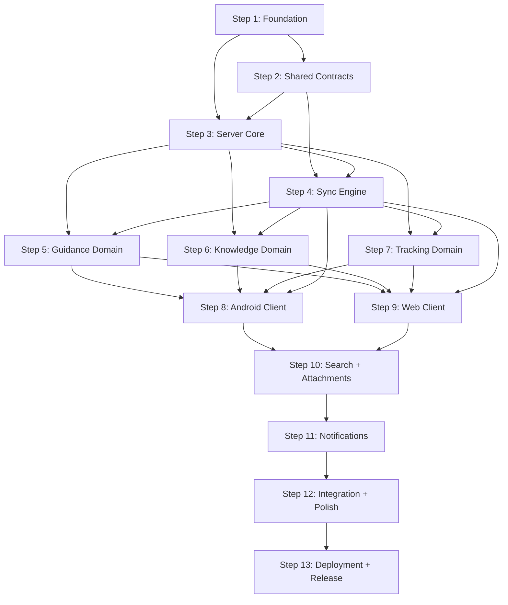

# PLAN-001: v1 Implementation Plan

| Field | Value |
|---|---|
| **Document** | 10-PLAN-001-v1 |
| **Version** | 1.0 |
| **Status** | Draft |
| **Last Updated** | 2026-04-12 |
| **Source Docs** | `docs/altair-architecture-spec.md` (sections 24-26) |

---

## Dependency Graph

---

## Parallel Tracks

| Track | Focus | Steps | Agent Type |
|---|---|---|---|
| **Backend** | Server, sync, APIs | S1, S3, S4, S5-S7 (server), S10 (server), S11 | Backend |
| **Android** | Android client | S8, S11 (client) | Full-stack (Kotlin) |
| **Web** | Web client | S9 | Full-stack (Svelte) |
| **Contracts** | Shared types + schemas | S2 | Full-stack |
| **Infra** | Docker, CI, deployment | S1 (infra), S13 | Backend |

### Parallelization Strategy
- Steps 1-2 are sequential (foundation before everything else)
- Steps 5, 6, 7 can run in parallel after Step 4
- Steps 8 and 9 can run in parallel (different platforms, same API)
- Steps 10 and 11 can overlap with client development
- Desktop client deferred to v2 (see ADR-001)

---

## Shared Module Strategy

| Module | Location | Consumers |
|---|---|---|
| Contracts (entity types, relation types, sync streams) | `packages/contracts/` | Server, Android, Web, Desktop |
| API schemas (DTOs, request/response types) | `packages/api-contracts/` | Server, all clients |
| Design tokens (CSS variables, color values) | `packages/design-system/` | Web, Desktop |
| Migrations | `infra/migrations/` | Server, CI |

---

## Steps

### Step 1: Foundation

**What to build:**
- Monorepo structure per ADR-007: `apps/`, `packages/`, `infra/`, `docs/`, `Context/`
- Rust workspace setup (Cargo workspace with server + worker crates)
- SvelteKit project scaffolding (`apps/web/`)
- Android project scaffolding (`apps/android/`)
- Docker Compose setup: PostgreSQL, PowerSync Open Edition, MongoDB (PowerSync dep), Zitadel (OIDC), Garage (S3-compatible storage)
- CI pipeline (build + lint + test for all stacks)
- Database migration tooling (sqlx migrate)
- Initial migration: `users`, `households`, `household_memberships`
- Zitadel OIDC application configuration

**Done when:**
- `cargo build` succeeds for server crate
- `bun run dev` starts SvelteKit dev server
- Android project builds in Android Studio
- `docker compose up` starts full stack (Postgres, PowerSync, MongoDB, Zitadel, Garage)
- CI runs on push to main
- Users table exists with seed data
- OIDC login flow works end-to-end

---

### Step 2: Shared Contracts

**What to build:**
- `packages/contracts/` with JSON registries:
  - `entity-types.json`
  - `relation-types.json`
  - `sync-streams.json`
- Code generation or manual constant files:
  - TypeScript: `entityTypes.ts`, `relationTypes.ts`, `syncStreams.ts`
  - Kotlin: `EntityType.kt`, `RelationType.kt`, `SyncStream.kt`
  - Rust: `entity_type.rs`, `relation_type.rs`, `sync_stream.rs`
- Shared DTO schemas: `EntityRef`, `RelationRecord`, `AttachmentRecord`, `SyncSubscriptionRequest`
- CI validation: registry values match language bindings

**Done when:**
- All three language bindings compile and pass tests
- CI validates registry consistency
- Entity type constants used in at least one module per stack

---

### Step 3: Server Core

**What to build:**
- Axum application skeleton with module structure
- Auth module: OIDC relying party, JWT access token validation via Zitadel JWKS endpoint (ADR-006)
- Auth middleware for all routes — validates JWT signature and claims (invariant SEC-2)
- Core module: initiatives CRUD with user/household scoping (invariant SEC-1)
- Tags CRUD
- Entity relations CRUD with registry validation (invariant C-1, C-2)
- Error handling: `AppError` enum with `thiserror`, HTTP status mapping
- Database pool setup (sqlx)
- Migrations for: `initiatives`, `tags`, `attachments`, `entity_relations`, guidance tables, knowledge tables, tracking tables
- Health endpoint

**Done when:**
- OIDC login via Zitadel returns valid JWT access tokens
- Axum middleware validates tokens against JWKS endpoint
- Authenticated CRUD for initiatives, tags, relations
- Unknown entity types rejected at write time
- User A cannot see User B's data
- All migrations applied and reversible

---

### Step 4: Sync Engine

**What to build:**
- Sync mutation endpoint (`/sync/push`): accept MutationEnvelope, validate, apply
- Mutation dedup by `mutation_id` (invariant S-2)
- Version conflict detection using `base_version` (invariant S-1) — LWW default with conflict logging per ADR-003
- Conflict copy creation for Knowledge notes (ADR-003)
- `sync_conflicts` table for preserving both versions on conflict
- Stricter quantity conflict checks for tracking items (invariant S-3)
- Device checkpoint management (invariant S-4)
- Sync pull endpoint (`/sync/pull`): return changes since checkpoint
- PowerSync server configuration with sync stream definitions
- Soft delete handling (invariant S-6)
- Access boundary filtering on all sync queries (invariant S-7)

**Done when:**
- Idempotent mutation replay produces same result
- Two conflicting mutations from different devices surface a conflict (not silent overwrite)
- Quantity conflicts detected for item mutations
- Checkpoints advance monotonically
- Deleted records remain queryable until all devices have synced past deletion

---

### Step 5: Guidance Domain (Server)

**What to build:**
- Epic CRUD (scoped to initiative)
- Quest CRUD with status transitions (see `06-state-machines.md`)
- Quest initiative ownership validation (invariant E-3)
- Routine CRUD with frequency validation (invariant E-4)
- Routine → quest spawning logic
- Focus session CRUD
- Daily check-in CRUD (unique per user per date)
- Domain event emission: `QuestCompleted`, `RoutineDue`

**Done when:**
- Full CRUD for all Guidance entities via API
- Quest status transitions enforced
- Routine spawns quests per frequency config
- Focus sessions track duration
- Domain events emitted on state transitions

---

### Step 6: Knowledge Domain (Server)

**What to build:**
- Note CRUD with user scoping
- Note snapshot creation (immutable — invariant E-6)
- Backlink derivation from entity_relations (invariant E-5)
- Note-to-note and note-to-entity relation endpoints
- Domain event emission: `NoteLinked`

**Done when:**
- Note CRUD works with offline-generated UUIDs
- Snapshots are immutable (no UPDATE path)
- Backlinks queryable by target note
- Cross-domain relations via entity_relations

---

### Step 7: Tracking Domain (Server)

**What to build:**
- Location and Category CRUD (household-scoped)
- Item CRUD with location/category/household scoping (invariants E-8)
- Item event recording (append-only — invariant D-5)
- Quantity validation: no negative from consumption (invariant E-7)
- Shopping list and shopping list item CRUD (invariant E-9)
- Domain event emission: `ItemQuantityChanged`

**Done when:**
- Items scoped to household with location/category filtering
- Item events append-only, no delete
- Consumption event that would produce negative quantity is rejected
- Shopping list items can reference inventory items within same household

---

### Step 8: Android Client

**What to build:**
- Compose UI for all Guidance, Knowledge, Tracking screens
- Room database with entities matching Postgres schema (invariant D-4)
- PowerSync connector integration
- Koin DI modules
- ViewModel layer with `UiState` sealed classes
- Offline quest completion flow
- Note quick capture
- Item creation + consumption logging
- Shopping list management
- FCM push notification integration
- WorkManager for background sync and attachment upload

**Done when:**
- All P0 user flows work on Android
- Offline creation and completion sync correctly
- Push notifications delivered for routines and timers
- Item created offline is visible on web after sync (assertion A-025)

---

### Step 9: Web Client

**What to build:**
- SvelteKit app with Svelte 5 runes
- PowerSync web SDK integration (IndexedDB)
- All Guidance, Knowledge, Tracking screens
- Design system implementation per `./DESIGN.md`
- CSRF protection in server hooks (invariant SEC-6)
- Navigation and routing
- Search interface
- Admin panel

**Done when:**
- All P0 user flows work in browser
- Design system matches DESIGN.md tokens
- CSRF protection enforced
- Cross-app search returns results from all domains
- Note created offline on Android visible on web (assertion A-018)

---

### Step 10: Search + Attachments

**What to build:**
- PostgreSQL full-text search indexing via `tsvector`/`tsquery` (async job on entity create/update) — ADR-004
- `pgvector` extension for semantic search (optional, requires external embedding API)
- AI provider abstraction layer: adapter pattern for OpenAI-compatible, Anthropic-compatible, Ollama endpoints — ADR-004
- Embedding pipeline: async background jobs generate vectors via external API, store in pgvector
- Hybrid search ranking: keyword FTS + vector similarity + domain boosts
- Search API endpoint with cross-domain results
- Graceful degradation: keyword-only search when no embedding API configured
- Attachment upload endpoint with S3-compatible object storage (Garage/RustFS) — ADR-005
- Storage abstraction trait: `upload`, `download`, `delete`, `presign_url`
- Attachment download with signed URLs (invariant SEC-4)
- Thumbnail/derivative generation background job
- Attachment metadata sync (no binary in sync — invariant S-5)

**Done when:**
- FTS search returns results across notes, quests, items within 1s
- Semantic search works when external embedding API is configured
- Search degrades gracefully to keyword-only without embedding API
- Attachment upload/download works from Android and web
- Binaries never flow through sync engine
- Signed URLs expire after configured TTL

---

### Step 11: Notifications

**What to build:**
- Server-owned notification generation in background worker — ADR-008
- `notifications` table synced to clients via PowerSync for cross-device read/dismiss state
- FCM push integration (Android): notification channels per category, high-priority for timer/conflicts
- SSE channel for web real-time notifications; in-app notification bell with unread count
- Client-local fallback for time-critical offline scenarios (focus session timers, offline routine reminders)
- Notification types: routine due, timer complete, daily check-in, evening wrap-up, weekly harvest, low stock alert, maintenance due, sync conflict
- User preference management (quiet hours, category toggles, per-channel config)
- Delivery guarantees: at-least-once via job queue, idempotent by `notification_id`, max 3 retries
- Target: < 5s latency from trigger to device, > 95% delivery success

**Done when:**
- Routine due notifications delivered on Android via FCM
- Web client receives real-time notifications via SSE
- Timer completion fires even offline (client-local fallback)
- Quiet hours respected at server dispatch time
- Dismissing notification on one device dismisses everywhere
- Users can toggle notification categories

---

### Step 12: Integration + Polish

**What to build:**
- Cross-platform sync testing (Android ↔ Web)
- Conflict resolution UI on all v1 clients
- Error state handling across all flows
- Empty state designs per `07-user-flows.md`
- Accessibility audit (WCAG AA compliance)
- Performance profiling and optimization
- Design system audit against `./DESIGN.md`

**Done when:**
- All testable assertions (A-001 through A-031) pass
- All invariants verified
- Conflict UI exists on web and Android
- Empty states designed and implemented
- Performance targets met

---

### Step 13: Deployment + Release

**What to build:**
- Docker Compose production configuration (per ADR-002: targets 4GB min, 8GB recommended)
- Reverse proxy setup (Caddy or Traefik)
- Environment configuration (secrets management, OIDC provider config)
- Backup strategy for Postgres + object storage
- Release builds: Android APK/AAB, Web static deployment
- Documentation: self-hosting guide, setup instructions, Zitadel OIDC setup guide

**Done when:**
- `docker compose up` deploys full stack (Postgres, PowerSync, MongoDB, Zitadel, Garage, Axum)
- Android app installable from APK
- Web app deployed behind reverse proxy
- Self-hosting guide covers setup, backup, update
- Deployment tested on Raspberry Pi 4 (8GB) and standard VPS

---

## Architecture Decision Records

All 8 ADRs have been accepted and are located in `Context/Decisions/`:

| ADR | Topic | Status | File |
|---|---|---|---|
| ADR-001 | Defer desktop (Tauri) to v2 | Accepted | `ADR-001-defer-desktop-to-v2.md` |
| ADR-002 | Deployment targets (4GB min, 8GB recommended) | Accepted | `ADR-002-deployment-targets.md` |
| ADR-003 | Sync protocol: LWW + conflict logging | Accepted | `ADR-003-sync-protocol-conflict-resolution.md` |
| ADR-004 | Search: Postgres FTS + pgvector + external embeddings | Accepted | `ADR-004-search-embedding-strategy.md` |
| ADR-005 | Attachment: self-hosted S3-compatible storage | Accepted | `ADR-005-attachment-storage.md` |
| ADR-006 | Auth: OAuth 2.0 / OIDC via Zitadel | Accepted | `ADR-006-auth-session-model.md` |
| ADR-007 | Monorepo structure | Accepted | `ADR-007-monorepo-structure.md` |
| ADR-008 | Notifications: server-owned + client-local fallback | Accepted | `ADR-008-notification-ownership-delivery.md` |

---

## Risk Mitigation

| Risk | Mitigation | Step |
|---|---|---|
| Sync complexity | Design and test sync first; build conflict UX early | S4, S12 |
| Multi-codebase overhead | Share contracts, not fantasies; keep domain behavior native | S2 |
| PowerSync integration unknowns | Prototype early with seed dataset; validate stream design | S4 |
| AI scope creep | Keep AI optional; external embeddings only for v1; graceful degradation | S10 |
| Performance on large inventories | Index design from `05-erd.md`; lazy loading; pagination | S7, S12 |
| Deployment stack complexity | 6 containers on Pi 4; validate memory budget early in S1 | S1, S13 |
| OIDC setup friction | Guided first-run setup; document Zitadel config; test on fresh installs | S1, S13 |

---

## v1.1 / v2 Candidates

Not in scope for v1, but tracked for planning:
- Desktop client — Tauri 2 wrapping SvelteKit UI (ADR-001)
- WearOS companion app (see `09-PLAT-004-wearos.md`)
- Local AI inference — Ollama adapter, on-device embeddings, GPU-accelerated search
- Richer note editor (Markdown / rich text)
- CRDT-based text merging for notes (v1 uses conflict copies)
- Automation rule engine (low stock → restock quest)
- iOS contributor path
- Note graph visualization
- Collaborative household spaces
- Email notifications
- Proactive AI suggestions
