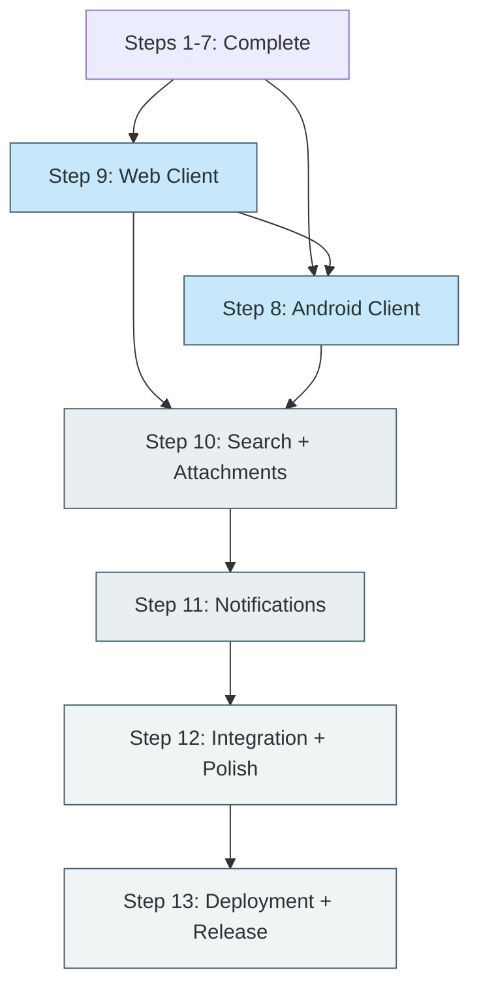

# PLAN-001: v2 Implementation Plan (Steps 8–13)

| Field | Value |
|---|---|
| **Document** | 10-PLAN-001-v2 |
| **Version** | 1.0 |
| **Status** | Draft |
| **Last Updated** | 2026-04-15 |
| **Prerequisite** | `10-PLAN-001-v1.md` Steps 1–7 complete |
| **Source Docs** | `09-PLAT-001-android.md`, `09-PLAT-002-web.md`, `08-SUB-001-notifications.md`, `04-architecture.md`, `07-user-flows.md`, `DESIGN.md`, all ADRs |

---

## Scope

This document provides prescriptive task breakdowns for Steps 8–13 of the v1 implementation plan. Steps 1–7 (foundation, contracts, server core, sync engine, guidance/knowledge/tracking domains) are complete. All server CRUD endpoints, sync infrastructure, PowerSync sync rules, and Docker Compose stack are operational.

---

## Sequencing Change

The v1 plan listed Steps 8 (Android) and 9 (Web) as parallel tracks. This plan **sequences Web first, then Android** for two reasons:

1. **Faster iteration loop.** SvelteKit hot-reload is sub-second; Android emulator builds are 30–90s. API surface issues, sync stream gaps, and missing server behavior are discovered and fixed faster when the web client is the first consumer.
2. **Reference implementation.** The web client establishes the canonical UI patterns, data flow, and PowerSync integration. Android can then replicate proven patterns rather than pioneering them in a slower feedback loop.

**Effective step order:** 9 → 8 → 10 → 11 → 12 → 13

---

## Dependency Graph (Steps 8–13)

---

## Resolved Open Questions

These were flagged as open in the v1 plan's directional summaries. All are now resolved.

| Step | Question | Resolution |
|---|---|---|
| S8 | FCM vs. alternative push provider | **FCM** with `PushDispatcher` trait for future adapters. No UnifiedPush in v1. |
| S8 | WorkManager sync scheduling | **15-min periodic + event-driven expedited** (foreground, connectivity change, local write). |
| S9 | Admin panel scope | **Minimal:** user management, household overview, instance health. No system config UI. |
| S9 | Search UI in Step 9 or 10 | **Shell in Step 9** (route, nav, layout), **wiring in Step 10** (endpoint + connection). |
| S10 | Thumbnail generation | **Server-side** in background worker using `image` crate. Stored in RustFS alongside originals. |
| S10 | Embedding batch size / rate limit | **Batch of 20, 1 req/s default**, configurable via `EMBEDDING_RATE_LIMIT_RPS`. Exponential backoff on 429. |
| S11 | SSE vs. WebSocket for web | **SSE** via `axum::response::sse::Sse`. Unidirectional, auto-reconnect, proxy-friendly. |
| S11 | Self-hosted FCM alternative | **Deferred.** Document the limitation. Client-local fallback covers timer notifications offline. |
| S12 | Conflict resolution UX | **Dedicated view** accessible from nav badge. Side-by-side comparison with Keep Mine / Keep Theirs / Merge. |
| S12 | Performance budget | **Use platform spec targets** + sync-specific: initial sync <10s, incremental <2s, conflict resolution <3s. |
| S13 | Auto-update strategy | **No auto-update.** Version check endpoint + documentation for `docker compose pull`. |
| S13 | Monitoring / alerting | **Structured JSON logs + `/metrics` Prometheus endpoint.** No bundled Grafana. |

---

## Steps

### Step 9: Web Client

> **Build first.** The web client is the reference implementation for all client-side patterns.

**Existing state:** SvelteKit project scaffolded at `apps/web/`. Auth routes (login, register) with cookie-based JWT working. Server hooks decode JWT and populate `event.locals.user`. Contracts package imported (`$lib/contracts/`). Svelte 5 runes available. No domain screens, no PowerSync integration, no design system applied.

**What to build:**

**9a. PowerSync integration + data layer**
- Install `@powersync/web` SDK
- Initialize PowerSync client at app startup (Svelte context provider or module singleton)
- Configure connection to PowerSync service (`localhost:8082` dev, configurable via env)
- Implement `PowerSyncBackendConnector`: fetch credentials from the Altair server JWT, provide `fetchCredentials()` and `uploadData()` methods
- Define PowerSync schema mirroring the Postgres tables (match column names exactly — invariant D-4)
- Auto-subscribe to baseline sync streams on login: `user_data`, `household`, `guidance`, `knowledge`, `tracking`
- Create repository layer: thin wrappers around PowerSync reactive queries using `$derived` runes
- Verify: data appears in IndexedDB after login and initial sync

**9b. Layout shell + design system**
- Implement the `DESIGN.md` "Ethereal Canvas" system as CSS custom properties in `app.css` (the full token set from `09-PLAT-002-web.md`)
- Load Manrope and Plus Jakarta Sans fonts
- Build layout component: left sidebar (Faded Glacier), top bar (Foggy Canvas White), main content area
- Sidebar navigation items: Today, Guidance, Knowledge, Tracking, Search (placeholder), Settings, Admin
- Active nav state: pill-shaped background on Pale Seafoam Mist, Deep Muted Teal-Navy text
- No visible borders between layout zones — hierarchy through tonal shift only
- Component primitives: Card (rounded-2xl, Gossamer White, no shadow), Button (pill-shaped, primary + secondary + ghost), Input (no border, Pale Seafoam Mist fill, focus transition), Tag/Badge (Dusty Mineral Blue or Sky-Washed Aqua, all-caps label)
- Responsive: sidebar collapses to hamburger menu below 768px

**9c. Today view**
- Route: `/` (authenticated, redirect to `/auth/login` if no session)
- Manrope Display greeting: "Good morning, {display_name}"
- Daily check-in card (if not yet completed today) — energy + mood selectors
- Due routines section — reactive query from PowerSync for routines due today
- Today's quests list — filtered by due date or no date + not completed
- Quick action FAB or button group: New Quest, New Note
- Empty state per `07-user-flows.md` UF-02

**9d. Guidance screens**
- `/guidance/initiatives` — initiative list with status filter chips, create button
- `/guidance/initiatives/[id]` — initiative detail with epic/quest tree view, inline quest creation
- `/guidance/epics/[id]` — epic detail, child quests list, breadcrumb nav (Initiative → Epic)
- `/guidance/quests/[id]` — quest detail: title, status, priority, epic/initiative breadcrumb, tags, focus session history
- `/guidance/quests/[id]/focus` — focus session timer (browser-based): Manrope Display timer, signature gradient progress ring, background dims to Soft Slate Haze, end button
- `/guidance/routines` — routine list with frequency badges, create/edit
- Quest status transitions enforced in UI (match `06-state-machines.md`): only valid transitions shown as actions
- All writes go to PowerSync local DB + outbox (offline-first pattern)

**9e. Knowledge screens**
- `/knowledge` — notes list, sortable by updated_at, searchable (local PowerSync query)
- `/knowledge/[id]` — note editor: wide content area on Gossamer White, metadata panel (narrow right) on Pale Seafoam Mist
- `[[` trigger for note linking: inline search dropdown querying local PowerSync data, creates `entity_relation` on selection
- Backlinks section below content: chips on Dusty Mineral Blue / Sky-Washed Aqua showing notes that link to this one (query-time derivation from `entity_relations` — invariant E-5)
- Snapshot history sidebar: list of immutable snapshots, view-only (invariant E-6)
- Tags: chip input with autocomplete from existing tags

**9f. Tracking screens**
- `/tracking` — inventory view with table/card toggle, filters (location, category, stock level), inline quantity display
- `/tracking/items/[id]` — item detail: name, quantity, location, category, event timeline (append-only history from `tracking_item_events`), tags
- `/tracking/items/new` — item creation form: name, quantity stepper, location dropdown (household-scoped), category dropdown (household-scoped), optional barcode field
- Consumption logging: quantity selector on item detail, validates no negative (invariant E-7), creates `item_event`
- `/tracking/locations` — location CRUD (household-scoped)
- `/tracking/categories` — category CRUD (household-scoped)
- `/tracking/shopping-lists` — shopping list with pill-shaped checkboxes, linked item quantities shown, add from inventory or freeform, completed items dimmed to Ghost Border Ash opacity
- Low-stock highlighting: quantity badge in Sophisticated Terracotta when below threshold

**9g. Search shell (placeholder for Step 10)**
- `/search` route with global search bar in top navigation
- Results page layout: domain-grouped sections with entity type chips
- Wired to a "Search not yet available" empty state until Step 10 connects the backend
- Local PowerSync query fallback: basic client-side text filter across entity titles

**9h. Admin panel**
- `/admin` — guarded by `is_admin` claim in JWT (redirect non-admins)
- `/admin/users` — user list (name, email, status, role), invite flow (if registration is admin-gated), deactivate action
- `/admin/households` — household list with member counts
- `/admin/health` — instance health: DB connectivity (call `/health` endpoint), PowerSync status, storage usage summary from RustFS (if endpoint available, otherwise deferred)

**9i. Settings + preferences**
- `/settings` — user profile editing (display name, email, password change)
- Notification preferences UI placeholder (categories, quiet hours — functional wiring in Step 11)
- Logout action: clear cookies, redirect to login

**9j. CSRF protection**
- SvelteKit server hooks enforce CSRF tokens for all POST/PUT/DELETE form actions (invariant SEC-6)
- Token injected via `handle` hook, validated on state-changing requests
- API proxy routes validate `Origin` header

**9k. Testing**
- Vitest unit tests for utility functions and stores
- Component tests with `@testing-library/svelte` for key flows: login, quest creation, note editing, item creation
- Playwright E2E tests for critical paths: register → login → create quest → complete quest → logout
- Accessibility: axe-core integration in Playwright tests for WCAG AA automated checks

**Done when:**
- Login/register flow works end-to-end with cookie-based JWT
- PowerSync initial sync completes and data is visible in all domain screens
- All three domains (Guidance, Knowledge, Tracking) have full CRUD via the UI
- Offline writes queue in outbox and sync when reconnected
- Focus session timer runs in the browser with proper UI dimming
- Note linking via `[[` creates entity_relations and backlinks are visible
- Quest status transitions enforced per state machine
- Shopping list checklist works with linked inventory items
- Admin panel shows user list and instance health
- Design system matches `DESIGN.md` tokens (spot-check: no pure black, no borders inside cards, pill-shaped buttons, Manrope headings, Plus Jakarta Sans body)
- Playwright E2E passes for register → login → create quest → complete → logout
- axe-core reports zero critical/serious accessibility violations

---

### Step 8: Android Client

> **Build second.** Follows patterns established by the web client. Focuses on mobile-native strengths: capture, offline, notifications.

**Existing state:** Android project scaffolded at `apps/android/`. Contracts package present (`com.getaltair.altair.contracts`): entity types, relation types, sync streams, DTOs. Material 3 theme configured with Ethereal Canvas color mapping. `MainActivity.kt` exists. No navigation, no screens, no Room database, no PowerSync integration.

**What to build:**

**8a. Room database + PowerSync integration**
- Define Room entities mirroring Postgres schema (column names must be snake_case — invariant D-4): `users`, `initiatives`, `tags`, `attachments`, `entity_relations`, `guidance_epics`, `guidance_quests`, `guidance_routines`, `guidance_focus_sessions`, `guidance_daily_checkins`, `knowledge_notes`, `knowledge_note_snapshots`, `tracking_locations`, `tracking_categories`, `tracking_items`, `tracking_item_events`, `tracking_shopping_lists`, `tracking_shopping_list_items`
- Define Room DAOs for each entity group
- Integrate PowerSync Kotlin SDK with Room as the managed SQLite store
- Implement `PowerSyncBackendConnector`: fetch JWT from Altair server, provide credentials and upload methods
- Auto-subscribe to baseline sync streams on login
- Verify: data appears in Room after login and initial sync

**8b. Koin dependency injection setup**
- `DatabaseModule`: Room database instance, all DAOs
- `RepositoryModule`: repository implementations wrapping DAOs + PowerSync
- `ViewModelModule`: all ViewModels
- `SyncModule`: PowerSync connector, sync coordinator
- `PreferencesModule`: DataStore preferences
- `NetworkModule`: HTTP client (Ktor or OkHttp), API service for auth endpoints

**8c. Navigation + auth**
- Bottom navigation: Today, Knowledge, Tracking, Settings
- Nested navigation via Navigation Component for detail screens
- Login screen: email + password inputs on Pale Seafoam Mist, pill-shaped primary CTA
- Register screen: email + password + display name
- Token storage: DataStore (encrypted) for access + refresh tokens
- Auth interceptor: attach JWT to all API requests, handle 401 with refresh flow
- Deep link handling: `altair://quest/{id}`, `altair://item/{id}`, `altair://checkin`

**8d. Today view**
- Greeting header (Manrope Display)
- Daily check-in card (energy + mood) if not yet completed today
- Due routines section — reactive Flow from Room/PowerSync
- Today's quests list
- Quick action FAB: New Quest, New Note, Scan Item
- Swipe-right on quest card to complete (300ms cubic-bezier transition)
- Empty state: "Nothing on the horizon" with create quest CTA

**8e. Guidance screens**
- Quest list (filterable by initiative, status, priority)
- Quest detail: title, status transitions (valid transitions only per state machine), priority, epic/initiative breadcrumb, tags, focus session history
- Focus session: full-screen timer (Manrope Display), signature gradient progress ring, dim background to Soft Slate Haze, end button. Timer backed by `CountDownTimer` — works offline
- Initiative/Epic browsing: list → detail → child quests
- Routine list with frequency badges, mark-routine-done action
- Daily check-in form
- All writes via PowerSync outbox (offline-first)

**8f. Knowledge screens**
- Quick note capture: minimal input surface, expandable to full editor
- Note list: sortable, locally searchable
- Note detail: title, content (text editing — no rich text in v1), tags, backlinks display
- Note linking: search existing notes, create `entity_relation`
- Snapshot history (view-only list)

**8g. Tracking screens**
- Inventory list: search/filter bar, location and category filters, item cards with quantity badge, low-stock highlighting (Sophisticated Terracotta)
- Item detail: name, quantity, location, category, event timeline, tags
- Item creation: name, quantity stepper, location dropdown (household-scoped), category dropdown, barcode field (manual entry — scanner in 8i)
- Consumption logging: quantity selector, no-negative validation (invariant E-7), creates `item_event`
- Location and category management screens
- Shopping list: checklist with pill-shaped checkboxes, linked item quantities, add from inventory or freeform, completed items dimmed

**8h. Background sync**
- `SyncWorker` via WorkManager: 15-minute `PeriodicWorkRequest` with `NetworkType.CONNECTED` constraint
- Event-driven expedited sync: `OneTimeWorkRequest` on foreground resume, connectivity change, and local write
- `AttachmentUploadWorker`: separate chain, `NetworkType.UNMETERED` preferred for files > 5MB (placeholder — binary upload wired in Step 10)
- Offline indicator: subtle Weathered Slate icon when mutations are queued but unsynced

**8i. Barcode scanner (P1 — build if time permits)**
- Full-screen camera overlay using CameraX + ML Kit barcode scanning
- Scan frame with Deep Muted Teal-Navy border
- Result slide-up card: match existing item (update quantity?) or pre-fill creation form
- Barcode stored on item record
- Works offline (lookup against local Room data)

**8j. Design system verification**
- Material 3 color scheme maps to Ethereal Canvas tokens (verify `Color.kt` and `Theme.kt` match `DESIGN.md`)
- Typography: Manrope for Display/Headline, Plus Jakarta Sans for Body/Label
- Cards: `ElevatedCard` with `RoundedCornerShape(16.dp)`, no shadow for static cards
- Buttons: pill-shaped via `RoundedCornerShape(50)`
- Inputs: filled style with `surfaceContainerLow`, no outline
- No dividers inside cards — `2rem` spacing gaps

**8k. Testing**
- JUnit 5 + Turbine for ViewModel and UseCase Flow testing
- Room DAO tests with in-memory database
- Compose UI tests (semantics-based) for key screens: login, today view, quest detail, item creation
- Integration tests with Koin test modules

**Done when:**
- Login/register flow works with JWT token storage
- PowerSync initial sync populates Room database
- All three domains have full CRUD via Compose UI
- Offline writes queue and sync when connectivity returns
- Focus session timer works offline (AlarmManager/CountDownTimer fallback)
- Swipe-to-complete on quests applies status transition
- Shopping list checklist works with linked inventory items
- Background sync runs via WorkManager (observable in device job scheduler)
- Barcode scanner (if built) scans and matches/creates items
- Design system spot-check passes (no pure black, pill buttons, Manrope headings, correct color mapping)
- JUnit tests pass for ViewModels and DAOs
- App builds and runs on API 26+ emulator

---

### Step 10: Search + Attachments

> Server-side features + client wiring on both platforms.

**What to build:**

**10a. Full-text search (server)**
- Add `tsvector` columns to searchable tables: `guidance_quests` (title, description), `knowledge_notes` (title, content), `tracking_items` (name, description), `initiatives` (title, description)
- Migration: create `tsvector` columns with `GIN` indexes, populate from existing data via trigger
- Trigger: auto-update `tsvector` on INSERT/UPDATE
- Search endpoint: `GET /api/search?q={query}&domain={optional}` — queries all domains, returns unified result set with entity type, title, preview snippet, relevance score
- Results grouped by domain, ordered by relevance within each group
- Pagination: cursor-based or offset/limit

**10b. Semantic search (server, optional)**
- Migration: enable `pgvector` extension, add `embedding vector(1536)` column to searchable tables (nullable)
- AI provider abstraction: trait with methods `generate_embedding(text) → Vec<f32>`, `summarize(text) → String`
- Implementations: `OpenAiCompatibleProvider` (covers OpenAI, Ollama, any compatible endpoint), `AnthropicProvider`
- Configuration via env vars: `AI_PROVIDER` (openai_compatible | anthropic | disabled), `AI_API_KEY`, `AI_API_BASE_URL`, `AI_EMBEDDING_MODEL`
- Background worker: `embedding_jobs` queue table, pick batches of 20, call provider, write vectors to pgvector, 1 req/s rate limit (configurable via `EMBEDDING_RATE_LIMIT_RPS`), exponential backoff on 429
- Hybrid search: when embeddings exist, combine FTS score + cosine similarity + domain boost weights into a unified ranking
- Graceful degradation: if no AI provider configured or provider unavailable, search falls back to FTS-only with no user-visible error

**10c. Attachment upload/download (server)**
- Storage abstraction trait in server: `upload(bucket, key, data, content_type)`, `download(bucket, key)`, `delete(bucket, key)`, `presign_url(bucket, key, expiry)`
- S3-compatible implementation using `aws-sdk-s3` crate configured for RustFS (`localhost:9000` dev, configurable via env)
- Upload endpoint: `POST /api/attachments/upload` — multipart form, validates auth + ownership, writes blob to RustFS, updates `attachments` table with storage key and status
- Download endpoint: `GET /api/attachments/{id}/download` — validates user ownership (invariant SEC-4), returns presigned URL or proxies stream
- Attachment metadata already syncs via PowerSync (table exists, sync rules defined)
- Max upload size: configurable, default 50MB
- Supported types: images (JPEG, PNG, WebP), PDF, audio (MP3, M4A), video (MP4) — validate MIME type on upload

**10d. Thumbnail generation (server background worker)**
- After image upload completes, queue thumbnail job
- Generate two sizes: small (150px width) and medium (400px width) using `image` crate
- Output format: WebP for size efficiency
- Store alongside original in RustFS: `{bucket}/{key}/thumb_sm.webp`, `{bucket}/{key}/thumb_md.webp`
- Update attachment metadata with thumbnail keys
- PDF preview: render first page as image (using `pdf` crate or deferred to P2 if complex)

**10e. Search UI wiring (web)**
- Connect `/search` route to `GET /api/search` endpoint
- Global search bar: debounced input (300ms), fires search on ≥2 characters
- Results page: cards grouped by domain (Guidance, Knowledge, Tracking), entity type chip (all-caps label, Dusty Mineral Blue), preview snippet with query highlight
- Click result navigates to entity detail screen
- Empty state: "No matches found" with suggestion to broaden query

**10f. Search UI wiring (Android)**
- Search accessible from top bar or dedicated nav item
- Same debounced search → API call pattern
- Results grouped by domain with entity type chips
- Navigate to entity detail on tap

**10g. Attachment UI (web)**
- Attachment strip on note editor, quest detail, item detail
- File picker for upload (drag-and-drop on note editor)
- Upload progress indicator
- Thumbnail display for images, file icon for other types
- Click to download (opens presigned URL)
- Attachment metadata displayed: filename, type, size

**10h. Attachment UI (Android)**
- Attachment section on note detail, quest detail, item detail
- Camera capture button (runtime permission for `CAMERA`) → direct upload
- File picker for other attachment types
- Background upload via `AttachmentUploadWorker` (WorkManager) — resumable, queued
- Thumbnail display, lazy binary download on viewport entry
- Local cache with LRU eviction (bounded storage)

**Done when:**
- Cross-domain search returns results from quests, notes, and items via FTS
- Semantic search returns results when AI provider is configured (test with a local Ollama instance or OpenAI key)
- Search degrades gracefully to FTS-only when no AI provider is configured
- Image attachment upload works from both web and Android
- Thumbnails are generated server-side and visible on both platforms
- Attachment download works via presigned URL
- Attachment binaries never flow through sync engine (invariant S-5) — verify by checking PowerSync traffic
- Embedding jobs process asynchronously without blocking CRUD operations

---

### Step 11: Notifications

> Server notification engine + platform-specific delivery.

**What to build:**

**11a. Notifications table + server infrastructure**
- Migration: create `notifications` table per `08-SUB-001-notifications.md` schema (id, user_id, category, title, body, action_type, action_target, priority, read_at, dismissed_at, scheduled_for, created_at, updated_at)
- Add `notifications` to PowerSync sync rules (user-scoped: `WHERE user_id = bucket.user_id`) for cross-device read/dismiss sync
- Notification service module in server: `create_notification()`, `mark_read()`, `mark_dismissed()`, `list_for_user()`
- API endpoints: `GET /api/notifications` (list, filterable by read/unread), `PATCH /api/notifications/{id}/read`, `PATCH /api/notifications/{id}/dismiss`

**11b. Notification scheduler (background worker)**
- Domain event listeners in the background worker:
  - Routine due: evaluate user timezone + routine frequency config, create notification when `next_occurrence` matches current time
  - Daily check-in: scheduled per user's configured morning time (default 08:00)
  - Evening wrap-up: scheduled per user's configured evening time (default 20:00), includes completed quest count
  - Weekly harvest: scheduled per user's configured day/time (default Sunday 18:00)
  - Low stock alert: triggered when `item_event` drops quantity below user-set threshold
  - Sync conflict: triggered by conflict detection in sync engine
- Quiet hours enforcement: check user's quiet hours (default 22:00–07:00) at dispatch time, defer delivery until quiet hours end
- At-least-once delivery: job queue with max 3 retries, idempotent by `notification_id`

**11c. User notification preferences**
- Migration: add notification preference columns to `users` table (or separate `notification_preferences` table): quiet_hours_start, quiet_hours_end, morning_checkin_time, evening_wrapup_time, weekly_harvest_day, weekly_harvest_time, per-category toggles (JSON or individual boolean columns)
- API endpoints: `GET /api/settings/notifications`, `PUT /api/settings/notifications`
- Sync preferences via PowerSync for cross-device consistency

**11d. FCM push delivery (Android)**
- Firebase project setup: obtain `google-services.json`, add Firebase dependencies to Android project
- Server-side: `PushDispatcher` trait with `send(device_token, notification) → Result<()>`
- `FcmDispatcher` implementation using Firebase Admin SDK (HTTP v1 API from Rust — `reqwest` + FCM endpoint)
- Device token registration: Android client sends FCM token to server on login and token refresh (`POST /api/devices/register`)
- `devices` table: id, user_id, platform, push_token, created_at, updated_at
- Notification channels (Android O+): map categories to channels — `timer_complete` and `sync_conflict` on high-priority channel, others on default
- Grouped notifications for batch scenarios

**11e. SSE delivery (web)**
- Server: `GET /api/notifications/stream` — SSE endpoint via `axum::response::sse::Sse`
- Per-user channel: server maintains a `tokio::sync::broadcast` channel per connected user
- When notification is created, broadcast to all connected channels for that user
- Client: `EventSource` connection on app load, reconnects automatically
- In-app notification bell with unread count badge (Sophisticated Terracotta for high priority)
- Toast-style notifications for real-time events (fade in/out with 300ms transition)

**11f. Client-local notifications**
- Android: focus session timer completion via `AlarmManager` or `CountDownTimer` — fires even offline
- Android: offline routine reminders via `WorkManager` scheduled alarm (if server unreachable at scheduled time)
- Web: browser `setTimeout` / `Notification API` for active focus session timer completion
- Client-local notifications are temporary — server canonical state takes precedence on reconnect

**11g. Notification preferences UI**
- Web: `/settings/notifications` — category toggles, quiet hours picker, schedule times for check-in/wrap-up/harvest
- Android: Settings screen → Notifications section — same controls via Compose UI
- Both write to the server via `PUT /api/settings/notifications`, synced via PowerSync

**Done when:**
- Routine due notifications fire at correct times respecting user timezone
- Daily check-in notification arrives at configured morning time
- Low stock alert fires when item quantity drops below threshold
- Sync conflict notification appears on both platforms when conflict is detected
- FCM push notifications arrive on Android device (test with real device or emulator with Google Play Services)
- SSE notifications appear in web notification bell in real time
- Quiet hours are enforced: no notifications dispatched during configured window
- Focus session timer notification fires on Android even when offline
- Notification read/dismiss state syncs across devices via PowerSync
- Category toggles work: disabling a category prevents those notifications
- Delivery latency < 5s from trigger to device (measure during testing)

---

### Step 12: Integration + Polish

> Cross-platform verification, conflict UX, error/empty states, accessibility, performance.

**What to build:**

**12a. Cross-platform sync testing**
- Test matrix: Web ↔ Android, two Android devices, two web sessions
- Scenarios to verify:
  - Create quest on Web → appears on Android after sync
  - Complete routine on Android → reflected on Web
  - Create note on Android offline → syncs to Web when connectivity returns
  - Consume item on Web → quantity updates on Android
  - Add to shopping list on Android → visible on Web
- Measure: initial sync time with seed dataset (target: <10s for <1000 entities), incremental sync (target: <2s for <50 changes)

**12b. Conflict resolution UI**
- **Dedicated "Sync Conflicts" view** on both platforms:
  - Web: `/conflicts` route, accessible from nav badge
  - Android: Conflicts screen, accessible from notification or settings
- Conflict list: cards showing entity type, title, timestamp of each version
- Detail view: side-by-side comparison (local version vs. server version)
- Resolution actions:
  - "Keep Mine" — apply local version, discard server version
  - "Keep Theirs" — accept server version, discard local version
  - For quantity conflicts (invariant S-3): explicit numeric input for resolved quantity
  - For Knowledge notes: "Keep Both" — creates conflict copy per ADR-003
- Sophisticated Terracotta badge on nav item when unresolved conflicts exist
- After resolution: mutation pushed to server, conflict record cleared

**12c. Error states (both platforms)**
- Implement all error states from `07-user-flows.md`:
  - Network offline: subtle Weathered Slate icon in status bar area, auto-retry on reconnect
  - Sync conflict: Terracotta badge with conflict count
  - Upload failed: attachment card shows failed state with retry button
  - Search timeout: inline message in results area with retry action
  - Auth expired: modal overlay requesting re-login
  - Validation error: field-level message in Sophisticated Terracotta
- All error messages use Plus Jakarta Sans body text, never alarming tone

**12d. Empty states (both platforms)**
- Implement all empty states from `07-user-flows.md`:
  - Today (no quests): Manrope Display "Nothing on the horizon." + create quest CTA
  - Initiative (no epics): illustration area + "Start building" prompt
  - Notes list: quick capture prompt with pill-shaped CTA
  - Inventory (no items): "Track your first item" with creation options
  - Shopping list: "Add items to get started"
  - Search (no results): "No matches found" with broaden query suggestion
- All use Foggy Canvas White background, centered content, signature gradient CTAs

**12e. Accessibility audit**
- Web: Playwright + axe-core automated WCAG AA checks on all routes
- Android: Accessibility Scanner (Android Studio tool) on all screens
- Manual checklist:
  - All interactive elements ≥44x44 touch/click targets
  - Color never sole indicator of state (paired with icon or text)
  - Focus indicators visible for keyboard navigation (Ghost Border Ash ring)
  - Screen reader labels on all icon buttons
  - Reduced motion preference respected (disable transitions)
  - Contrast ratios: all text meets WCAG AA (4.5:1 body, 3:1 large)

**12f. Performance profiling**
- Web targets (from `09-PLAT-002-web.md`):
  - First contentful paint: < 1.5s
  - Time to interactive: < 3s
  - Route navigation: < 300ms
  - Search response: < 1s
  - Local read: < 100ms
- Android targets (from `09-PLAT-001-android.md`):
  - Cold start: < 1.5s
  - Screen transition: < 300ms
  - Local write: < 200ms
  - Sync cycle: < 5s (typical batch)
- Sync-specific targets:
  - Initial sync (fresh device, <1000 entities): < 10s
  - Incremental sync (<50 changes): < 2s
  - Conflict resolution round-trip: < 3s
- Profile with representative seed data (50 initiatives, 200 quests, 100 notes, 300 items, 500 item events)
- Address any target misses before release

**12g. Assertion verification**
- Run through all 31 testable assertions (A-001 through A-031) from the invariants spec
- Verify all invariants are enforced end-to-end (not just server-side unit tests, but through the full client → sync → server path)
- Key cross-cutting assertions to test through the UI:
  - A-001: unauthenticated API access rejected
  - A-002: User A cannot see User B's data
  - A-003: replaying a mutation is idempotent
  - A-004: conflicting mutations surface a conflict
  - A-005: unknown entity types rejected
  - A-007: attachment binaries not in sync traffic

**12h. Design system audit**
- Spot-check all screens against `DESIGN.md`:
  - No pure black (`#000000`) anywhere — Midnight Charcoal (`#2a3435`) for max contrast
  - No explicit borders inside cards — spacing gaps only
  - No "Alert Red" — Sophisticated Terracotta for errors
  - Pill-shaped buttons, rounded-2xl cards, no square corners
  - Manrope for headings, Plus Jakarta Sans for body
  - 300ms cubic-bezier transitions on all state changes
  - Signature gradient on primary CTAs

**Done when:**
- Cross-platform sync works reliably for all entity types (create, update, delete, offline → online)
- Conflict resolution UI resolves conflicts on both platforms without data loss
- All error states display correctly and recovery actions work
- All empty states render with proper design system styling
- axe-core reports zero critical/serious violations on all web routes
- Android Accessibility Scanner reports no critical issues
- All performance targets met or acknowledged with documented exceptions
- All 31 assertions pass end-to-end
- Design system audit passes with no violations of absolute rules from `DESIGN.md`

---

### Step 13: Deployment + Release

> Production configuration, reverse proxy, backup, release builds, documentation.

**What to build:**

**13a. Production Docker Compose**
- `infra/compose/docker-compose.prod.yml` — production overrides:
  - No exposed debug ports (Postgres 5432, MongoDB 27017 internal only)
  - Resource limits per container (memory caps to fit within 8GB total — ADR-002)
  - Restart policies: `unless-stopped` on all services
  - Volume backup paths documented
  - Environment variable reference for all configurable values
- Altair server container: multi-stage Rust build (builder → runtime with `distroless` or `alpine`)
- Background worker: same binary, different entrypoint or flag
- Web client: SvelteKit build → static adapter or Node adapter, served by reverse proxy or own container
- Android: not containerized (APK/AAB output)

**13b. Reverse proxy**
- Caddy as the default reverse proxy (auto-HTTPS with Let's Encrypt, minimal config)
- `infra/compose/Caddyfile`: routes for web app, API, PowerSync, attachment downloads
- HTTPS termination at Caddy — internal traffic is HTTP
- WebSocket/SSE passthrough for PowerSync and notification streams
- Static file serving for web client build output
- Fallback: document Traefik configuration for users who prefer it

**13c. Backup strategy**
- `infra/scripts/backup.sh`:
  - `pg_dump` for Postgres (full dump, compressed)
  - RustFS data volume snapshot or `mc mirror` (MinIO client compatible with RustFS)
  - MongoDB dump (PowerSync dependency — less critical, can be rebuilt)
- Restore script: `infra/scripts/restore.sh`
- Cron-friendly: designed to run as a daily cron job
- Documented retention policy recommendation (7 daily, 4 weekly)

**13d. Release builds**
- Android: Gradle release build producing signed APK and AAB
  - Signing key management documented (keystore generation, env-based signing config)
  - Version code and version name from git tag or manual increment
  - ProGuard/R8 minification enabled
- Web: `bun run build` producing static output
  - Build output directory documented
  - Environment variable injection at build time (API URL, PowerSync URL)
- Server: `cargo build --release` producing optimized binary
  - Dockerfile for production image
  - Binary size and startup time documented

**13e. Observability**
- Structured JSON logging via `tracing` + `tracing-subscriber` (already in server — verify format)
- `/metrics` endpoint: Prometheus-format metrics via `metrics` + `metrics-exporter-prometheus` crates
  - Request latency histograms (by route)
  - Sync throughput (mutations/sec, sync cycles/min)
  - Active SSE connections
  - Background job queue depth and processing time
  - Error rates by category
- `/health` endpoint enhancement: include version string, DB connectivity, PowerSync reachability, RustFS reachability
- Version check: `/health` response includes `version` field; admin panel can compare against a published manifest URL (optional, user-configured)
- No bundled Grafana or Prometheus — users point their own monitoring stack at `/metrics`

**13f. Self-hosting documentation**
- `docs/self-hosting.md` (or `README.md` deployment section):
  - Prerequisites: Docker, Docker Compose, domain name (optional for LAN)
  - Quick start: clone, configure `.env`, `docker compose up`
  - `.env` reference: all variables with descriptions, defaults, and whether required
  - FCM setup guide (optional): Firebase project, `google-services.json`, server API key
  - AI provider setup guide (optional): OpenAI API key, Ollama local, Anthropic
  - HTTPS setup with Caddy (automatic) vs. manual cert
  - Backup and restore procedures
  - Upgrading: `docker compose pull && docker compose up -d`, migration notes per release
  - Troubleshooting: common issues (port conflicts, memory limits, sync not connecting)
  - Hardware recommendations: minimum (4GB Pi 4), recommended (8GB), comfortable (16GB+)

**13g. Security hardening review**
- Verify all SEC invariants in production configuration:
  - SEC-1: per-user data isolation (re-test with production build)
  - SEC-2: no unauthenticated access except `/auth/register`, `/auth/login`, `/health`
  - SEC-3: Argon2id parameters appropriate (verify iteration count)
  - SEC-4: attachment URLs signed or gated
  - SEC-5: no secrets in source, config files, or container images
  - SEC-6: CSRF protection active on web
- HTTP security headers via Caddy: `X-Content-Type-Options`, `X-Frame-Options`, `Strict-Transport-Security`
- Rate limiting on auth endpoints (prevent brute force)

**Done when:**
- `docker compose -f docker-compose.prod.yml up` starts the full stack on a clean machine
- Caddy terminates HTTPS and routes to all services correctly
- Web app loads via HTTPS with correct API connectivity
- Android APK installs and connects to the production server
- Backup script produces restorable dumps; restore script recovers a working instance
- `/health` returns version, DB status, and service reachability
- `/metrics` returns Prometheus-format data scrapeable by a Prometheus instance
- Self-hosting documentation tested by following it on a fresh machine (or VM)
- Security headers present on all responses
- Auth rate limiting active (verify: 5+ rapid failed logins trigger throttle)
- Total memory usage of all containers under 8GB with representative data load

---

## Implementation Notes for Agent Workflows

These notes are for Claude Code or similar agents executing tasks from this plan.

**Pattern replication.** The server codebase follows a consistent `mod.rs` → `models.rs` + `service.rs` + `handlers.rs` pattern for each domain entity. New server modules (notifications, search, attachments) should follow the same structure. Reference `apps/server/server/src/tracking/items/` as the canonical example — it demonstrates household scoping, invariant validation, soft deletes, and sqlx integration tests.

**Web patterns.** The web app uses SvelteKit 2 with Svelte 5 runes. Auth is cookie-based JWT via form actions (see `apps/web/src/routes/auth/login/+page.server.ts`). Server hooks (`hooks.server.ts`) decode the JWT and populate `event.locals.user`. New routes should check `event.locals.user` and redirect to login if null.

**Android patterns.** The Android app uses Jetpack Compose, Koin for DI, and the Material 3 theme defined in `apps/android/app/src/main/java/com/getaltair/altair/ui/theme/`. Contracts are at `com.getaltair.altair.contracts`. New screens should follow the ViewModel + UiState sealed class pattern.

**Contract enforcement.** All entity type and relation type identifiers must come from `packages/contracts/`. TypeScript bindings are at `apps/web/src/lib/contracts/`, Kotlin at `com.getaltair.altair.contracts`, Rust at `apps/server/server/src/contracts.rs`. Never use inline magic strings for entity types (invariant C-1).

**Sync rules.** PowerSync sync rules are at `infra/compose/sync_rules.yaml`. Any new synced table must be added to the appropriate bucket definition. Column names in client local storage must match Postgres exactly (invariant D-4).

**Testing conventions.** Server: `sqlx::test` with `migrations = "../../../infra/migrations"`. Web: Vitest for unit/component, Playwright for E2E. Android: JUnit 5 + Turbine for Flows, Compose Testing for UI.

---

## Risk Mitigation Updates

Carries forward from v1 plan with updates for steps 8–13.

| Risk | Mitigation | Step |
|---|---|---|
| PowerSync web SDK integration complexity | Web client built first to surface issues early; reference patterns for Android | S9 |
| FCM dependency for self-hosted users | `PushDispatcher` trait allows future adapters; client-local fallback for timers | S8, S11 |
| Embedding API cost / availability | Graceful degradation to FTS-only; batch + rate limit controls | S10 |
| Cross-platform sync edge cases | Dedicated sync test matrix in Step 12; conflict resolution UI built before release | S12 |
| Memory budget on 8GB target | Resource limits in prod compose; profile with representative data | S12, S13 |
| Attachment storage growth | No built-in cap in v1; documented as ops responsibility; garbage collection for soft-deleted attachments | S10, S13 |
| Accessibility gaps | Automated axe-core + manual audit before release; not post-release cleanup | S12 |
| Self-hosting documentation quality | Test docs on a fresh machine; iterate based on actual friction | S13 |

---

## Subtask Index

Quick reference for all subtasks across steps 8–13.

| Step | Sub | Description | Platform |
|---|---|---|---|
| 9 | 9a | PowerSync integration + data layer | Web |
| 9 | 9b | Layout shell + design system | Web |
| 9 | 9c | Today view | Web |
| 9 | 9d | Guidance screens | Web |
| 9 | 9e | Knowledge screens | Web |
| 9 | 9f | Tracking screens | Web |
| 9 | 9g | Search shell (placeholder) | Web |
| 9 | 9h | Admin panel | Web |
| 9 | 9i | Settings + preferences | Web |
| 9 | 9j | CSRF protection | Web |
| 9 | 9k | Testing | Web |
| 8 | 8a | Room database + PowerSync integration | Android |
| 8 | 8b | Koin DI setup | Android |
| 8 | 8c | Navigation + auth | Android |
| 8 | 8d | Today view | Android |
| 8 | 8e | Guidance screens | Android |
| 8 | 8f | Knowledge screens | Android |
| 8 | 8g | Tracking screens | Android |
| 8 | 8h | Background sync | Android |
| 8 | 8i | Barcode scanner (P1) | Android |
| 8 | 8j | Design system verification | Android |
| 8 | 8k | Testing | Android |
| 10 | 10a | Full-text search (server) | Server |
| 10 | 10b | Semantic search (server, optional) | Server |
| 10 | 10c | Attachment upload/download (server) | Server |
| 10 | 10d | Thumbnail generation (worker) | Server |
| 10 | 10e | Search UI wiring | Web |
| 10 | 10f | Search UI wiring | Android |
| 10 | 10g | Attachment UI | Web |
| 10 | 10h | Attachment UI | Android |
| 11 | 11a | Notifications table + server infra | Server |
| 11 | 11b | Notification scheduler (worker) | Server |
| 11 | 11c | User notification preferences | Server |
| 11 | 11d | FCM push delivery | Android + Server |
| 11 | 11e | SSE delivery | Web + Server |
| 11 | 11f | Client-local notifications | Android + Web |
| 11 | 11g | Notification preferences UI | Android + Web |
| 12 | 12a | Cross-platform sync testing | All |
| 12 | 12b | Conflict resolution UI | Android + Web |
| 12 | 12c | Error states | Android + Web |
| 12 | 12d | Empty states | Android + Web |
| 12 | 12e | Accessibility audit | Android + Web |
| 12 | 12f | Performance profiling | All |
| 12 | 12g | Assertion verification | All |
| 12 | 12h | Design system audit | Android + Web |
| 13 | 13a | Production Docker Compose | Infra |
| 13 | 13b | Reverse proxy (Caddy) | Infra |
| 13 | 13c | Backup strategy | Infra |
| 13 | 13d | Release builds | All |
| 13 | 13e | Observability | Server |
| 13 | 13f | Self-hosting documentation | Docs |
| 13 | 13g | Security hardening review | All |
