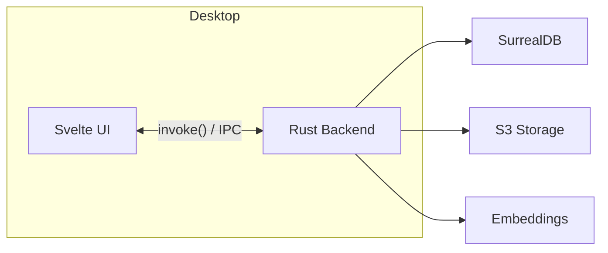
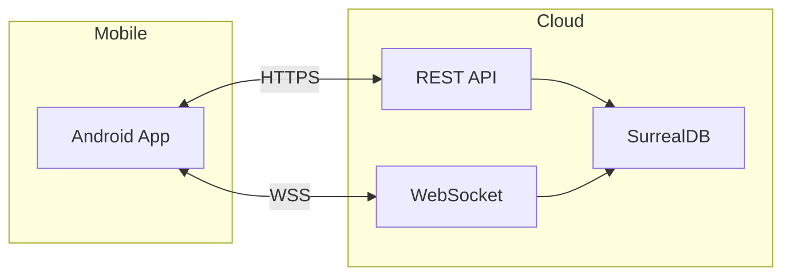
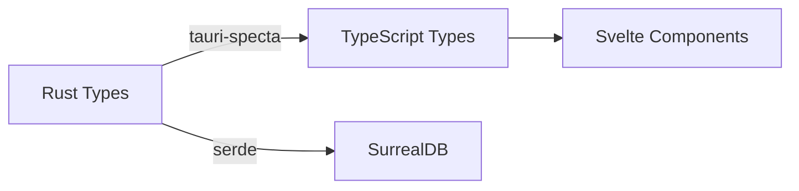
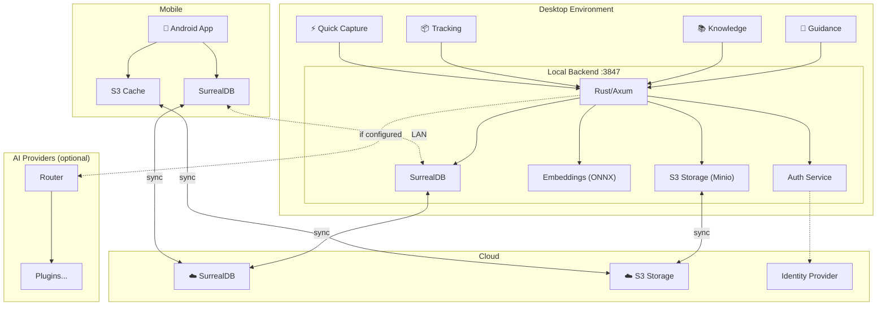
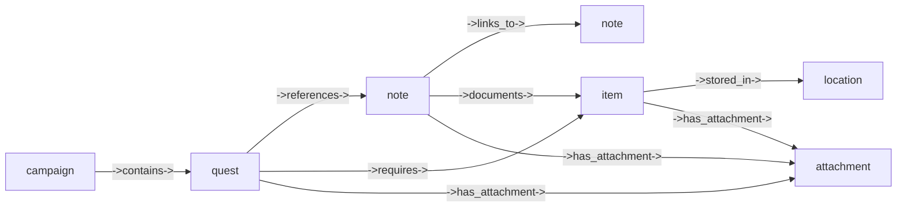
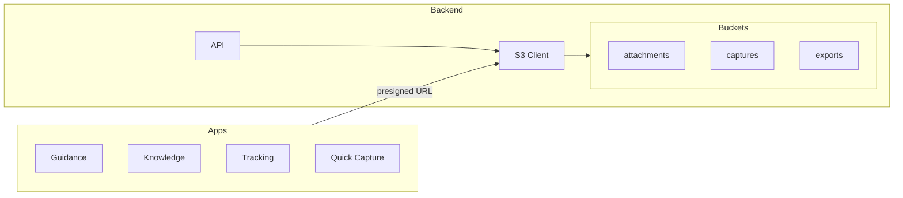
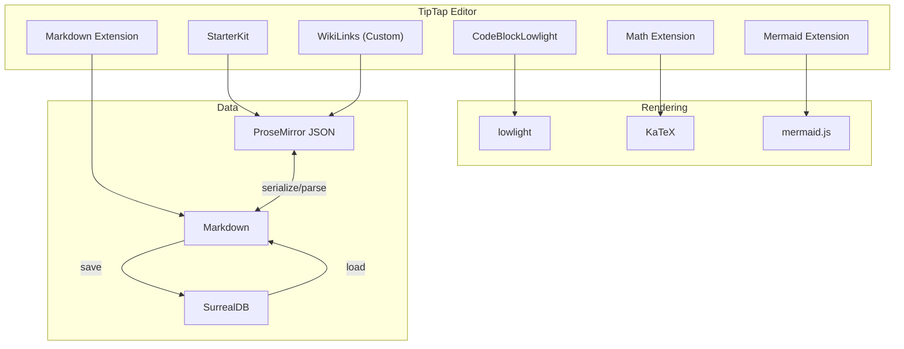
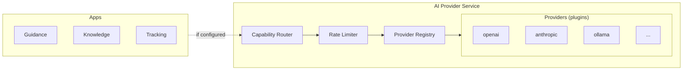

# Altair Technical Architecture

**Version**: 1.3
**Status**: APPROVED
**Created**: 2025-11-29
**Updated**: 2025-12-06
**Author**: Robert Hamilton

> **ADHD-focused productivity ecosystem** — Three apps (Guidance, Knowledge, Tracking) with unified sync

---

## Quick Reference

| Layer              | Technology         | Notes                               |
| ------------------ | ------------------ | ----------------------------------- |
| **Database**       | SurrealDB 2.x      | Embedded + cloud, native graph      |
| **Object Storage** | S3-compatible      | Minio, Backblaze B2, R2, etc.       |
| **Desktop**        | Tauri 2.0 + Svelte | ~10MB per app                       |
| **Desktop IPC**    | Tauri Commands     | Type-safe via tauri-specta          |
| **Backend**        | Rust + Axum        | localhost:3847 (configurable)       |
| **Mobile**         | Tauri 2.0 Android  | Same codebase                       |
| **Mobile API**     | REST + WebSocket   | HTTPS for CRUD, WSS for sync        |
| **Sync**           | Change feeds       | Last-write-wins, all tables         |
| **Embeddings**     | Local ONNX         | Always-on, ~25MB model              |
| **Auth**           | Plugin-based       | Local, OAuth, extensible            |
| **AI Providers**   | Plugin-based       | **Optional** — Claude, OpenAI, etc. |
| **Note Editor**    | TipTap 3.x         | WYSIWYG + Markdown, WikiLinks       |

---

## Architecture Overview

### Why These Choices

**SurrealDB over SQLite:**

- Native graph queries for Quest→Note→Item relationships (no JOIN tables)
- Built-in vector search (HNSW indexes) and full-text search
- Same database runs embedded (desktop/mobile) and server (cloud)
- Change feeds enable simple sync without CRDT complexity

**Tauri over Electron:**

- 10MB bundles vs 100MB+
- ~50MB RAM vs 200-300MB
- Native performance, same codebase for Android

**Rust backend:**

- Same language as Tauri and SurrealDB (no context switching)
- No garbage collector pauses for timer accuracy

**S3-compatible object storage:**

- Standard S3 API (portable across providers)
- Runs locally (Minio) or cloud (Backblaze B2, Cloudflare R2, AWS S3)
- Handles photos, audio, video, PDFs, any file type

**TipTap for Note Editor:**

- WYSIWYG + bidirectional Markdown (v3.7+)
- Clean extension architecture for WikiLinks, math, diagrams
- MIT licensed with strong community

---

## Communication Patterns

### Desktop (Tauri Commands)

Apps communicate with the local backend via Tauri IPC, not HTTP:



**Why not REST:**

- No HTTP serialization overhead
- Type-safe across boundary (via tauri-specta)
- No port management or localhost networking
- Direct function calls with automatic serde

**Implementation:**

```rust
// Backend defines commands
#[tauri::command]
async fn create_quest(
    state: State<'_, AppState>,
    title: String,
    energy_cost: EnergyCost,
) -> Result<Quest, ApiError> {
    state.db.create("quest").content(Quest {
        title,
        energy_cost,
        status: QuestStatus::Backlog,
        ..Default::default()
    }).await
}

#[tauri::command]
async fn search_notes(
    state: State<'_, AppState>,
    query: String,
    mode: SearchMode,
) -> Result<Vec<SearchResult>, ApiError> {
    state.search.hybrid_search(&query, mode).await
}
```

```typescript
// Frontend calls via invoke (types auto-generated by tauri-specta)
const quest = await invoke('create_quest', {
  title: 'Fix auth bug',
  energyCost: 'medium',
});

const results = await invoke('search_notes', {
  query: 'authentication',
  mode: 'hybrid',
});
```

### Mobile ↔ Cloud (REST + WebSocket)

Mobile communicates with cloud backend over network:



**Transport split:**

| Operation                           | Transport         | Why                                 |
| ----------------------------------- | ----------------- | ----------------------------------- |
| CRUD (create, read, update, delete) | REST              | Simple, cacheable, stateless        |
| Real-time sync                      | WebSocket         | Persistent connection, push updates |
| File uploads                        | Presigned S3 URLs | Direct upload, no proxy             |

**REST endpoints (when needed):**

```
POST   /api/quests           Create quest
GET    /api/quests/:id       Get quest
PATCH  /api/quests/:id       Update quest
DELETE /api/quests/:id       Archive quest
GET    /api/quests           List quests (with filters)

POST   /api/sync/push        Push local changes
POST   /api/sync/pull        Pull remote changes
GET    /api/sync/changes     Stream change feed (WebSocket upgrade)
```

### Backend ↔ Services (Native Drivers)

Backend uses native drivers, not HTTP, for local services:

| Service   | Connection         | Library            |
| --------- | ------------------ | ------------------ |
| SurrealDB | Native WebSocket   | `surrealdb` crate  |
| S3/Minio  | HTTP (S3 protocol) | `aws-sdk-s3` crate |
| ONNX      | In-process         | `ort` crate        |

### Type Safety Across Boundaries



**tauri-specta setup:**

```rust
// Generate TypeScript types from Rust
#[derive(Serialize, Deserialize, Type)]
pub struct Quest {
    pub id: RecordId,
    pub title: String,
    pub status: QuestStatus,
    pub energy_cost: EnergyCost,
    // ...
}

#[derive(Serialize, Deserialize, Type)]
pub enum EnergyCost {
    Low,
    Medium,
    High,
    Variable,
}
```

Generated `bindings.ts`:

```typescript
export interface Quest {
  id: string;
  title: string;
  status: QuestStatus;
  energyCost: EnergyCost;
}

export type EnergyCost = 'Low' | 'Medium' | 'High' | 'Variable';
```

### Summary

| Path                  | Method           | Type Safety                      |
| --------------------- | ---------------- | -------------------------------- |
| Desktop UI ↔ Backend | Tauri IPC        | tauri-specta (Rust → TS)         |
| Mobile ↔ Cloud       | REST + WebSocket | Shared types (manual or codegen) |
| Backend ↔ SurrealDB  | Native driver    | serde + SurrealDB types          |
| Backend ↔ S3         | AWS SDK          | SDK types                        |

---

## System Diagram



### Data Flow

1. **Desktop app action** → Tauri command (IPC) → Backend processes
2. **Backend writes** → Embedded SurrealDB → Change feed records it
3. **Media uploads** → Presigned URL → Direct to S3 → Backend confirms
4. **Local sync** → Backend polls change feeds → Merges changes
5. **Cloud sync** → Backend ↔ Cloud over WebSocket (TLS)
6. **Mobile action** → REST API (HTTPS) → Cloud backend → SurrealDB
7. **Mobile sync** → WebSocket connection → Push/pull changes

---

## Security

### Authentication (Plugin-Based)

Like AI providers, auth uses a plugin architecture for extensibility:

```rust
#[async_trait]
trait AuthProvider: Send + Sync {
    fn id(&self) -> &str;

    /// Authenticate user, return session token
    async fn authenticate(&self, credentials: Credentials) -> Result<Session>;

    /// Validate existing session
    async fn validate(&self, token: &str) -> Result<User>;

    /// Refresh session token
    async fn refresh(&self, token: &str) -> Result<Session>;

    /// Revoke session
    async fn logout(&self, token: &str) -> Result<()>;
}

enum Credentials {
    Password { username: String, password: String },
    OAuth { provider: String, code: String },
    ApiKey { key: String },
}
```

### Built-in Auth Providers

| Provider       | Use Case             | Notes                                              |
| -------------- | -------------------- | -------------------------------------------------- |
| `local`        | Single-user, offline | Password stored with Argon2id, no network required |
| `oauth-google` | Google account       | Standard OAuth 2.0 + PKCE                          |
| `oauth-github` | GitHub account       | Standard OAuth 2.0 + PKCE                          |
| `oidc`         | Generic OIDC         | Any OpenID Connect provider                        |

### Secrets Management

API keys and sensitive config use OS-native secure storage:

| Platform    | Storage                             |
| ----------- | ----------------------------------- |
| **Linux**   | libsecret (GNOME Keyring / KWallet) |
| **macOS**   | Keychain                            |
| **Windows** | Credential Manager                  |
| **Android** | EncryptedSharedPreferences          |

```rust
// Never store secrets in config files
struct SecureConfig {
    // Loaded from OS keychain at runtime
    api_keys: HashMap<String, SecretString>,
    auth_tokens: HashMap<String, SecretString>,
}

impl SecureConfig {
    fn get_api_key(&self, provider: &str) -> Option<&SecretString> {
        self.api_keys.get(provider)
    }
}
```

### Encryption

| Layer                | Method            | Notes                                                      |
| -------------------- | ----------------- | ---------------------------------------------------------- |
| **In Transit**       | TLS 1.3           | All cloud connections, WebSocket included                  |
| **At Rest (Cloud)**  | AES-256-GCM       | Minio server-side encryption                               |
| **At Rest (Local)**  | OS-level          | Rely on OS disk encryption (BitLocker, FileVault, LUKS)    |
| **Sensitive Fields** | Application-level | Optional field-level encryption for notes marked "private" |

### Authorization

Simple role model for single-user with potential sharing:

```surql
DEFINE TABLE user SCHEMAFULL;
DEFINE FIELD email ON user TYPE string;
DEFINE FIELD role ON user TYPE string DEFAULT 'owner'
    ASSERT $value IN ['owner', 'viewer'];
DEFINE FIELD created_at ON user TYPE datetime DEFAULT time::now();

-- Row-level security
DEFINE ACCESS account ON DATABASE TYPE RECORD
    SIGNUP (CREATE user SET email = $email, role = 'owner')
    SIGNIN (SELECT * FROM user WHERE email = $email);
```

---

## Data Model

### Graph Relationships



### Core Tables

#### User

```surql
DEFINE TABLE user SCHEMAFULL CHANGEFEED 7d;

DEFINE FIELD email ON user TYPE string;
DEFINE FIELD display_name ON user TYPE option<string>;
DEFINE FIELD role ON user TYPE string DEFAULT 'owner'
    ASSERT $value IN ['owner', 'viewer'];
DEFINE FIELD preferences ON user FLEXIBLE TYPE object DEFAULT {};
DEFINE FIELD created_at ON user TYPE datetime DEFAULT time::now();
DEFINE FIELD updated_at ON user TYPE datetime VALUE time::now();

DEFINE INDEX user_email ON user FIELDS email UNIQUE;
```

#### Campaign (Guidance)

```surql
DEFINE TABLE campaign SCHEMAFULL CHANGEFEED 7d;

DEFINE FIELD title ON campaign TYPE string ASSERT string::len($value) <= 200;
DEFINE FIELD description ON campaign TYPE option<string> ASSERT string::len($value) <= 2000;
DEFINE FIELD status ON campaign TYPE string DEFAULT 'active'
    ASSERT $value IN ['active', 'completed', 'archived'];
DEFINE FIELD color ON campaign TYPE option<string>;
DEFINE FIELD owner ON campaign TYPE record<user>;
DEFINE FIELD created_at ON campaign TYPE datetime DEFAULT time::now();
DEFINE FIELD updated_at ON campaign TYPE datetime VALUE time::now();
DEFINE FIELD device_id ON campaign TYPE string;

DEFINE INDEX campaign_status ON campaign FIELDS status;
DEFINE INDEX campaign_owner ON campaign FIELDS owner;
```

#### Quest (Guidance)

```surql
DEFINE TABLE quest SCHEMAFULL CHANGEFEED 7d;

DEFINE FIELD title ON quest TYPE string ASSERT string::len($value) <= 500;
DEFINE FIELD description ON quest TYPE option<string> ASSERT string::len($value) <= 5000;
DEFINE FIELD status ON quest TYPE string DEFAULT 'backlog'
    ASSERT $value IN ['backlog', 'active', 'completed', 'archived'];
DEFINE FIELD energy_cost ON quest TYPE string DEFAULT 'medium'
    ASSERT $value IN ['low', 'medium', 'high', 'variable'];
DEFINE FIELD priority ON quest TYPE int DEFAULT 0 ASSERT $value >= 0 AND $value <= 100;
DEFINE FIELD due_date ON quest TYPE option<datetime>;
DEFINE FIELD tags ON quest TYPE array<string> DEFAULT [];
DEFINE FIELD owner ON quest TYPE record<user>;
DEFINE FIELD created_at ON quest TYPE datetime DEFAULT time::now();
DEFINE FIELD updated_at ON quest TYPE datetime VALUE time::now();
DEFINE FIELD device_id ON quest TYPE string;

DEFINE INDEX quest_status ON quest FIELDS status;
DEFINE INDEX quest_owner ON quest FIELDS owner;
DEFINE INDEX quest_tags ON quest FIELDS tags;
DEFINE INDEX quest_due ON quest FIELDS due_date;
```

#### Folder (Knowledge)

```surql
DEFINE TABLE folder SCHEMAFULL CHANGEFEED 7d;

DEFINE FIELD name ON folder TYPE string ASSERT string::len($value) <= 200;
DEFINE FIELD parent ON folder TYPE option<record<folder>>;
DEFINE FIELD color ON folder TYPE option<string>;
DEFINE FIELD owner ON folder TYPE record<user>;
DEFINE FIELD created_at ON folder TYPE datetime DEFAULT time::now();
DEFINE FIELD updated_at ON folder TYPE datetime VALUE time::now();
DEFINE FIELD device_id ON folder TYPE string;

DEFINE INDEX folder_parent ON folder FIELDS parent;
DEFINE INDEX folder_owner ON folder FIELDS owner;
```

#### Note (Knowledge)

```surql
DEFINE TABLE note SCHEMAFULL CHANGEFEED 7d;

DEFINE FIELD title ON note TYPE string ASSERT string::len($value) <= 500;
DEFINE FIELD content ON note TYPE string ASSERT string::len($value) <= 100000;
DEFINE FIELD embedding ON note TYPE option<array<float>>;
DEFINE FIELD tags ON note TYPE array<string> DEFAULT [];
DEFINE FIELD folder ON note TYPE option<record<folder>>;
DEFINE FIELD is_private ON note TYPE bool DEFAULT false;
DEFINE FIELD owner ON note TYPE record<user>;
DEFINE FIELD created_at ON note TYPE datetime DEFAULT time::now();
DEFINE FIELD updated_at ON note TYPE datetime VALUE time::now();
DEFINE FIELD device_id ON note TYPE string;

-- Full-text search
DEFINE ANALYZER note_analyzer TOKENIZERS blank, class
    FILTERS lowercase, snowball(english);
DEFINE INDEX note_fts ON note FIELDS title, content
    FULLTEXT ANALYZER note_analyzer BM25;

-- Vector similarity
DEFINE INDEX note_embedding ON note FIELDS embedding
    HNSW DIMENSION 384 DIST COSINE;

DEFINE INDEX note_folder ON note FIELDS folder;
DEFINE INDEX note_owner ON note FIELDS owner;
DEFINE INDEX note_tags ON note FIELDS tags;
```

#### Location (Tracking)

```surql
DEFINE TABLE location SCHEMAFULL CHANGEFEED 7d;

DEFINE FIELD name ON location TYPE string ASSERT string::len($value) <= 200;
DEFINE FIELD description ON location TYPE option<string>;
DEFINE FIELD parent ON location TYPE option<record<location>>;
DEFINE FIELD geo ON location TYPE option<geometry<point>>;
DEFINE FIELD owner ON location TYPE record<user>;
DEFINE FIELD created_at ON location TYPE datetime DEFAULT time::now();
DEFINE FIELD updated_at ON location TYPE datetime VALUE time::now();
DEFINE FIELD device_id ON location TYPE string;

DEFINE INDEX location_parent ON location FIELDS parent;
DEFINE INDEX location_owner ON location FIELDS owner;
DEFINE INDEX location_geo ON location FIELDS geo;
```

#### Item (Tracking)

```surql
DEFINE TABLE item SCHEMAFULL CHANGEFEED 7d;

DEFINE FIELD name ON item TYPE string ASSERT string::len($value) <= 500;
DEFINE FIELD description ON item TYPE option<string> ASSERT string::len($value) <= 2000;
DEFINE FIELD quantity ON item TYPE int DEFAULT 1 ASSERT $value >= 0;
DEFINE FIELD min_quantity ON item TYPE option<int> ASSERT $value IS NONE OR $value >= 0;
DEFINE FIELD category ON item TYPE option<string>;
DEFINE FIELD barcode ON item TYPE option<string>;
DEFINE FIELD properties ON item FLEXIBLE TYPE object DEFAULT {};
DEFINE FIELD owner ON item TYPE record<user>;
DEFINE FIELD created_at ON item TYPE datetime DEFAULT time::now();
DEFINE FIELD updated_at ON item TYPE datetime VALUE time::now();
DEFINE FIELD device_id ON item TYPE string;

DEFINE INDEX item_barcode ON item FIELDS barcode UNIQUE;
DEFINE INDEX item_category ON item FIELDS category;
DEFINE INDEX item_owner ON item FIELDS owner;
```

#### Attachment (Shared)

Metadata for files stored in Minio:

```surql
DEFINE TABLE attachment SCHEMAFULL CHANGEFEED 7d;

DEFINE FIELD filename ON attachment TYPE string ASSERT string::len($value) <= 500;
DEFINE FIELD mime_type ON attachment TYPE string;
DEFINE FIELD size_bytes ON attachment TYPE int ASSERT $value > 0;
DEFINE FIELD storage_key ON attachment TYPE string;  -- Minio object key
DEFINE FIELD storage_bucket ON attachment TYPE string DEFAULT 'attachments';
DEFINE FIELD checksum ON attachment TYPE string;  -- SHA-256 for integrity
DEFINE FIELD media_type ON attachment TYPE string
    ASSERT $value IN ['image', 'audio', 'video', 'document', 'other'];
DEFINE FIELD metadata ON attachment FLEXIBLE TYPE object DEFAULT {};
DEFINE FIELD owner ON attachment TYPE record<user>;
DEFINE FIELD created_at ON attachment TYPE datetime DEFAULT time::now();
DEFINE FIELD device_id ON attachment TYPE string;

DEFINE INDEX attachment_owner ON attachment FIELDS owner;
DEFINE INDEX attachment_media_type ON attachment FIELDS media_type;
DEFINE INDEX attachment_storage ON attachment FIELDS storage_bucket, storage_key;
```

#### Quick Capture

Temporary holding for captured content before processing:

```surql
DEFINE TABLE capture SCHEMAFULL CHANGEFEED 7d;

DEFINE FIELD capture_type ON capture TYPE string
    ASSERT $value IN ['text', 'photo', 'audio', 'video', 'mixed'];
DEFINE FIELD text_content ON capture TYPE option<string>;
DEFINE FIELD attachments ON capture TYPE array<record<attachment>> DEFAULT [];
DEFINE FIELD status ON capture TYPE string DEFAULT 'pending'
    ASSERT $value IN ['pending', 'processed', 'discarded'];
DEFINE FIELD processed_to ON capture TYPE option<record>;  -- Links to created quest/note/item
DEFINE FIELD owner ON capture TYPE record<user>;
DEFINE FIELD created_at ON capture TYPE datetime DEFAULT time::now();
DEFINE FIELD updated_at ON capture TYPE datetime VALUE time::now();
DEFINE FIELD device_id ON capture TYPE string;

DEFINE INDEX capture_status ON capture FIELDS status;
DEFINE INDEX capture_owner ON capture FIELDS owner;
```

### Graph Edges

```surql
-- Campaign contains Quest
DEFINE TABLE contains SCHEMAFULL TYPE RELATION FROM campaign TO quest;
DEFINE FIELD created_at ON contains TYPE datetime DEFAULT time::now();

-- Quest references Note
DEFINE TABLE references SCHEMAFULL TYPE RELATION FROM quest TO note;
DEFINE FIELD context ON references TYPE option<string>;
DEFINE FIELD created_at ON references TYPE datetime DEFAULT time::now();

-- Note links to Note (wiki-style)
DEFINE TABLE links_to SCHEMAFULL TYPE RELATION FROM note TO note;
DEFINE FIELD created_at ON links_to TYPE datetime DEFAULT time::now();

-- Quest requires Item (Bill of Materials)
DEFINE TABLE requires SCHEMAFULL TYPE RELATION FROM quest TO item;
DEFINE FIELD quantity_needed ON requires TYPE int DEFAULT 1;
DEFINE FIELD created_at ON requires TYPE datetime DEFAULT time::now();

-- Item stored in Location
DEFINE TABLE stored_in SCHEMAFULL TYPE RELATION FROM item TO location;
DEFINE FIELD shelf ON stored_in TYPE option<string>;
DEFINE FIELD bin ON stored_in TYPE option<string>;
DEFINE FIELD created_at ON stored_in TYPE datetime DEFAULT time::now();

-- Note documents Item
DEFINE TABLE documents SCHEMAFULL TYPE RELATION FROM note TO item;
DEFINE FIELD created_at ON documents TYPE datetime DEFAULT time::now();

-- Attachments (polymorphic - can attach to note, quest, or item)
DEFINE TABLE has_attachment SCHEMAFULL TYPE RELATION FROM note | quest | item TO attachment;
DEFINE FIELD created_at ON has_attachment TYPE datetime DEFAULT time::now();
```

---

## Object Storage (S3-Compatible)

Any S3-compatible storage provider works. Choose based on cost, latency, and deployment preference.

### Provider Options

| Provider                | Cost/TB/mo    | Egress           | Best For                    |
| ----------------------- | ------------- | ---------------- | --------------------------- |
| **Minio** (self-hosted) | Hardware only | Free             | Local/on-prem, full control |
| **Backblaze B2**        | ~$6           | Free to partners | Budget cloud storage        |
| **Cloudflare R2**       | ~$15          | Free             | Global edge, zero egress    |
| **Wasabi**              | ~$7           | Free             | Simple pricing, compliance  |
| **AWS S3**              | ~$23          | $0.09/GB         | Ecosystem integration       |

### Configuration

```toml
# ~/.config/altair/storage.toml

[local]
# Embedded Minio for desktop
provider = "minio"
endpoint = "http://localhost:9000"
bucket = "altair-local"
# Credentials managed internally

[cloud]
# Any S3-compatible provider
provider = "backblaze"  # or "r2", "s3", "wasabi", "minio"
endpoint = "https://s3.us-west-004.backblazeb2.com"
region = "us-west-004"
bucket = "altair-prod"
access_key_ref = "altair/s3-access-key"  # OS keychain
secret_key_ref = "altair/s3-secret-key"  # OS keychain
```

### Architecture



### Buckets

| Bucket        | Purpose                                 | Retention |
| ------------- | --------------------------------------- | --------- |
| `attachments` | Photos, audio, video, documents         | Permanent |
| `captures`    | Quick capture media (before processing) | 30 days   |
| `exports`     | User data exports                       | 7 days    |

### Upload Flow

1. App requests presigned upload URL from backend
2. Backend generates URL with size/type restrictions
3. App uploads directly to S3 (no backend proxy)
4. App confirms upload, backend creates `attachment` record
5. Sync queues object for cloud replication

```rust
// Generic S3 client - works with any provider
struct StorageClient {
    client: aws_sdk_s3::Client,  // Works with any S3-compatible API
    bucket: String,
    config: StorageConfig,
}

impl StorageClient {
    async fn create_upload_url(
        &self,
        filename: &str,
        mime_type: &str,
        size_bytes: u64,
    ) -> Result<PresignedUpload> {
        // Validate
        if size_bytes > self.config.max_upload_bytes {
            return Err(Error::FileTooLarge);
        }
        if !self.config.allowed_mime_types.contains(mime_type) {
            return Err(Error::InvalidMimeType);
        }

        // Generate unique key
        let key = format!("{}/{}", Uuid::new_v4(), sanitize_filename(filename));

        // Create presigned URL (expires in 15 minutes)
        let presigned = self.client
            .put_object()
            .bucket(&self.bucket)
            .key(&key)
            .content_type(mime_type)
            .content_length(size_bytes as i64)
            .presigned(PresigningConfig::expires_in(Duration::from_secs(900))?)
            .await?;

        Ok(PresignedUpload {
            url: presigned.uri().to_string(),
            key,
            expires_at: Utc::now() + chrono::Duration::minutes(15),
        })
    }
}
```

### Sync Strategy

Objects sync separately from database records:

1. **Upload** → Object stored locally, queued for cloud sync
2. **Sync** → Backend replicates to cloud in background
3. **Download** → Check local cache first, fetch from cloud if missing
4. **Conflict** → Objects are immutable; same checksum = same content

---

## Sync Protocol

### Tables Synced

All tables with `CHANGEFEED 7d`:

```
user, campaign, quest, folder, note, location, item, attachment, capture,
contains, references, links_to, requires, stored_in, documents, has_attachment
```

### Mechanism

Uses SurrealDB change feeds with **last-write-wins** conflict resolution:

```rust
async fn sync(
    local: &Surreal,
    remote: &Surreal,
    last_sync: DateTime,
) -> Result<SyncResult> {
    let tables = [
        "user", "campaign", "quest", "folder", "note", "location",
        "item", "attachment", "capture", "contains", "references",
        "links_to", "requires", "stored_in", "documents", "has_attachment"
    ];

    let mut result = SyncResult::default();

    // Build query for all tables
    let table_list = tables.join(", ");

    // Get local changes
    let local_changes: Vec<Change> = local.query(
        &format!("SHOW CHANGES FOR TABLE {} SINCE $ts", table_list)
    ).bind(("ts", last_sync)).await?;

    // Push to remote with conflict detection
    for change in &local_changes {
        match push_change(remote, change).await {
            Ok(_) => result.pushed += 1,
            Err(SyncError::Conflict) => {
                result.conflicts.push(change.id.clone());
            }
            Err(e) => {
                result.errors.push(SyncErrorRecord {
                    id: change.id.clone(),
                    error: e.to_string(),
                });
            }
        }
    }

    // Pull remote changes
    let remote_changes: Vec<Change> = remote.query(
        &format!("SHOW CHANGES FOR TABLE {} SINCE $ts", table_list)
    ).bind(("ts", last_sync)).await?;

    for change in &remote_changes {
        match apply_change(local, change).await {
            Ok(_) => result.pulled += 1,
            Err(e) => {
                result.errors.push(SyncErrorRecord {
                    id: change.id.clone(),
                    error: e.to_string(),
                });
            }
        }
    }

    Ok(result)
}

async fn push_change(remote: &Surreal, change: &Change) -> Result<()> {
    // Only update if remote version is older
    remote.query(
        "UPDATE $id CONTENT $data WHERE updated_at < $ts"
    )
    .bind(("id", &change.id))
    .bind(("data", &change.data))
    .bind(("ts", &change.updated_at))
    .await?;

    Ok(())
}
```

### Offline Queue

Writes while offline are queued and synced when connection restored:

```rust
struct OfflineQueue {
    db: Surreal,  // Local embedded DB
}

impl OfflineQueue {
    async fn enqueue(&self, operation: Operation) -> Result<()> {
        self.db.query(
            "CREATE sync_queue CONTENT $op"
        ).bind(("op", operation)).await?;
        Ok(())
    }

    async fn process(&self, remote: &Surreal) -> Result<ProcessResult> {
        let pending: Vec<Operation> = self.db.query(
            "SELECT * FROM sync_queue ORDER BY created_at ASC"
        ).await?;

        let mut result = ProcessResult::default();

        for op in pending {
            match self.apply_remote(remote, &op).await {
                Ok(_) => {
                    // Remove from queue
                    self.db.query("DELETE $id").bind(("id", &op.id)).await?;
                    result.processed += 1;
                }
                Err(e) if e.is_retryable() => {
                    result.retry_later += 1;
                }
                Err(e) => {
                    // Move to dead letter queue
                    self.db.query(
                        "UPDATE $id SET status = 'failed', error = $err"
                    ).bind(("id", &op.id)).bind(("err", e.to_string())).await?;
                    result.failed += 1;
                }
            }
        }

        Ok(result)
    }
}
```

### Extended Offline (>7 days)

If device offline longer than change feed retention:

1. Detect gap: `last_sync + 7d < now`
2. Trigger full resync for affected tables
3. Use `updated_at` comparison for conflict resolution
4. Log resync event for debugging

```rust
async fn full_resync(&self, table: &str) -> Result<()> {
    // Pull all records from remote
    let remote_records: Vec<Record> = self.remote.query(
        &format!("SELECT * FROM {}", table)
    ).await?;

    for record in remote_records {
        // Upsert with LWW
        self.local.query(
            "UPSERT $id CONTENT $data WHERE updated_at < $ts OR id NOT IN (SELECT id FROM $table)"
        )
        .bind(("id", &record.id))
        .bind(("data", &record))
        .bind(("ts", &record.updated_at))
        .bind(("table", table))
        .await?;
    }

    Ok(())
}
```

### Sync Triggers

- App launch
- App focus (returning from background)
- Every 30-60 seconds while active
- Manual refresh
- After significant writes
- Network reconnection

---

## Embeddings (Core)

Local embeddings are always-on infrastructure. Semantic search works out of the box.

| Property       | Value                        |
| -------------- | ---------------------------- |
| **Model**      | all-MiniLM-L6-v2             |
| **Size**       | ~25MB                        |
| **Dimensions** | 384                          |
| **Runtime**    | ONNX (CPU)                   |
| **Latency**    | ~50-100ms per note           |
| **Privacy**    | 100% local, no network calls |

### Desktop vs Mobile

| Platform    | Embedding Strategy                                |
| ----------- | ------------------------------------------------- |
| **Desktop** | Local ONNX — generated on save                    |
| **Mobile**  | Sync from desktop/cloud — mobile doesn't generate |

Mobile devices receive embeddings via sync. If a note is created on mobile:

1. Note syncs to cloud without embedding
2. Desktop picks up note, generates embedding
3. Embedding syncs back to mobile

> 💡 **Rationale:** Mobile CPU/battery constraints make on-device embedding impractical. Embeddings are small (~1.5KB) and sync efficiently.

### When Embeddings Are Generated

- **On note save** — Background task, non-blocking
- **On sync receive** — If note lacks embedding, queue for generation
- **On model upgrade** — Re-embed all (rare, manual trigger)

### Search

Hybrid search combines full-text (BM25) + semantic (vector) by default:

```surql
DEFINE FUNCTION fn::hybrid_search(
    $query: string,
    $query_vec: array<float>,
    $limit: int
) {
    LET $fts = SELECT id, search::score(1) AS score
        FROM note WHERE content @1@ $query
        ORDER BY score DESC LIMIT $limit * 2;

    LET $vec = SELECT id, vector::similarity::cosine(embedding, $query_vec) AS score
        FROM note WHERE embedding <|($limit * 2)|> $query_vec;

    -- Reciprocal Rank Fusion
    LET $k = 60;
    RETURN SELECT id, (1/($k + fts_rank)) + (1/($k + vec_rank)) AS score
        FROM (
            SELECT id,
                array::find_index($fts.id, id) AS fts_rank,
                array::find_index($vec.id, id) AS vec_rank
            FROM array::union($fts.id, $vec.id)
        )
        ORDER BY score DESC LIMIT $limit;
};
```

---

## Note Editor (Knowledge App)

The Knowledge app uses **TipTap** as the WYSIWYG editor framework. TipTap provides bidirectional markdown support, extensibility for WikiLinks, and a clean extension architecture.

**Decision:** See ADR-013 for full rationale.

### Editor Stack



### Extension Stack

| Feature          | Extension                               | Source          | Status    |
| ---------------- | --------------------------------------- | --------------- | --------- |
| **Base editing** | `@tiptap/starter-kit`                   | Official        | ✅ Ready  |
| **Markdown**     | `@tiptap/markdown`                      | Official        | ✅ Ready  |
| **WikiLinks**    | Custom extension                        | Build (~3 days) | 🔧 Custom |
| **Code blocks**  | `@tiptap/extension-code-block-lowlight` | Official        | ✅ Ready  |
| **LaTeX math**   | `@aarkue/tiptap-math-extension`         | Open source     | ✅ Ready  |
| **Mermaid**      | `@syfxlin/tiptap-starter-kit`           | Open source     | ✅ Ready  |

### Extension Configuration

```typescript
import { Editor } from '@tiptap/core';
import StarterKit from '@tiptap/starter-kit';
import { Markdown } from '@tiptap/markdown';
import CodeBlockLowlight from '@tiptap/extension-code-block-lowlight';
import { Mathematics } from '@aarkue/tiptap-math-extension';
import { lowlight } from 'lowlight';

// Custom extension
import WikiLink from './extensions/WikiLink';

const editor = new Editor({
  extensions: [
    StarterKit.configure({
      codeBlock: false, // Use CodeBlockLowlight instead
    }),
    Markdown.configure({
      markedOptions: { gfm: true },
    }),
    CodeBlockLowlight.configure({ lowlight }),
    Mathematics.configure({
      delimiters: 'dollar',
      katexOptions: { throwOnError: false },
    }),
    WikiLink.configure({
      onWikiLinkClick: (title) => navigateToNote(title),
      renderSuggestion: (query) => searchNotes(query),
    }),
  ],
  content: '', // Loaded from note.content
  contentType: 'markdown',
});
```

### WikiLinks Custom Extension

Custom extension implementing core PKM functionality:

**Features:**

- Parse `[[Note Title]]` and `[[note|Display Name]]` syntax
- Autocomplete while typing (triggered by `[[`)
- Click to navigate to linked note
- Backlinks detection on save
- Markdown round-trip preservation

**Implementation pattern:**

```typescript
// WikiLink.ts (simplified)
import { Node } from '@tiptap/core';
import { Suggestion } from '@tiptap/suggestion';

export const WikiLink = Node.create({
  name: 'wikilink',
  group: 'inline',
  inline: true,
  atom: true,

  addAttributes() {
    return {
      target: { default: null }, // Note title
      alias: { default: null }, // Display name (optional)
    };
  },

  parseHTML() {
    return [{ tag: 'a[data-wikilink]' }];
  },

  renderHTML({ HTMLAttributes }) {
    return [
      'a',
      {
        ...HTMLAttributes,
        'data-wikilink': '',
        class: 'wikilink',
      },
      0,
    ];
  },

  addProseMirrorPlugins() {
    return [
      Suggestion({
        char: '[[',
        items: async ({ query }) => this.options.renderSuggestion(query),
        // ... render dropdown
      }),
    ];
  },
});
```

### Backlinks Detection

On note save, extract wiki-links and create/update graph edges:

```rust
// Backend: Extract and persist wiki-links
async fn save_note(
    &self,
    note_id: RecordId,
    content: &str,
) -> Result<Note> {
    // Parse wiki-links from markdown
    let links = extract_wiki_links(content);

    // Delete existing outbound links
    self.db.query("DELETE links_to WHERE in = $note")
        .bind(("note", &note_id))
        .await?;

    // Create new links
    for link_target in links {
        if let Some(target_note) = self.find_note_by_title(&link_target).await? {
            self.db.query("RELATE $from->links_to->$to")
                .bind(("from", &note_id))
                .bind(("to", target_note.id))
                .await?;
        }
    }

    // Update note content
    let note: Note = self.db.update(note_id)
        .content(NoteUpdate { content: content.to_string() })
        .await?;

    Ok(note)
}

fn extract_wiki_links(markdown: &str) -> Vec<String> {
    // Regex: \[\[([^\]|]+)(?:\|[^\]]+)?\]\]
    // Matches [[note]] or [[note|alias]], captures "note"
    let re = Regex::new(r"\[\[([^\]|]+)(?:\|[^\]]+)?\]\]").unwrap();
    re.captures_iter(markdown)
        .map(|cap| cap[1].to_string())
        .collect()
}
```

### Editor Dependencies

```json
{
  "dependencies": {
    "@tiptap/core": "^3.11.0",
    "@tiptap/starter-kit": "^3.11.0",
    "@tiptap/markdown": "^3.11.0",
    "@tiptap/extension-code-block-lowlight": "^3.11.0",
    "@tiptap/suggestion": "^3.11.0",
    "@aarkue/tiptap-math-extension": "latest",
    "@syfxlin/tiptap-starter-kit": "latest",
    "lowlight": "^3.1.0",
    "katex": "^0.16.0",
    "mermaid": "^10.0.0"
  }
}
```

**Bundle size impact:** ~400-500KB (acceptable for desktop app)

### Performance Considerations

| Scenario                         | Handling                                     |
| -------------------------------- | -------------------------------------------- |
| **Large documents (10k+ lines)** | TipTap handles well; consider lazy rendering |
| **Syntax highlighting**          | Load only needed language packs              |
| **Mermaid diagrams**             | Lazy-load mermaid.js (~800KB)                |
| **Autosave**                     | Debounce 500ms to prevent excessive writes   |

---

## AI Providers (Optional)

> ℹ️ **External AI providers are entirely optional.** Core functionality works without any providers configured.

For features like summarization, completion, and transcription, users can configure external providers.

### Provider Architecture



### Plugin System

```rust
#[async_trait]
trait AiProvider: Send + Sync {
    fn id(&self) -> &str;
    fn capabilities(&self) -> &[Capability];

    async fn complete(&self, req: CompletionRequest) -> Result<CompletionResponse> {
        Err(AiError::NotSupported)
    }

    async fn transcribe(&self, audio: &[u8], format: AudioFormat) -> Result<String> {
        Err(AiError::NotSupported)
    }

    async fn generate_image(&self, prompt: &str) -> Result<Vec<u8>> {
        Err(AiError::NotSupported)
    }
}

#[derive(Clone, Copy, PartialEq)]
enum Capability {
    Completion,
    Transcription,
    ImageGeneration,
}
```

### Rate Limiting

Prevent API cost overruns:

```rust
struct RateLimiter {
    limits: HashMap<String, ProviderLimits>,
    usage: HashMap<String, UsageCounter>,
}

struct ProviderLimits {
    requests_per_minute: u32,
    requests_per_day: u32,
    tokens_per_day: u64,
    cost_per_day_cents: u32,
}

impl RateLimiter {
    async fn check(&self, provider: &str, estimated_tokens: u64) -> Result<()> {
        let limits = self.limits.get(provider).ok_or(Error::NoLimits)?;
        let usage = self.usage.get(provider).unwrap_or_default();

        if usage.requests_today >= limits.requests_per_day {
            return Err(Error::DailyRequestLimitExceeded);
        }
        if usage.tokens_today + estimated_tokens > limits.tokens_per_day {
            return Err(Error::DailyTokenLimitExceeded);
        }

        Ok(())
    }
}
```

### Built-in Providers

| Provider        | Capabilities              | Notes                     |
| --------------- | ------------------------- | ------------------------- |
| `ollama`        | Completion                | Local LLMs, user-managed  |
| `openai`        | Completion, Transcription | API key required          |
| `anthropic`     | Completion                | API key required          |
| `whisper-local` | Transcription             | Whisper.cpp, desktop only |

### Configuration

```toml
# ~/.config/altair/ai-providers.toml
# API keys stored in OS keychain, referenced by name

[defaults]
completion = "anthropic"
transcription = "whisper-local"

fallback_enabled = true

[rate_limits]
requests_per_day = 1000
tokens_per_day = 100000
cost_per_day_cents = 500  # $5.00

[providers.openai]
enabled = true
api_key_ref = "altair/openai"  # Reference to OS keychain entry
model = "gpt-4o"

[providers.anthropic]
enabled = true
api_key_ref = "altair/anthropic"
model = "claude-sonnet-4-20250514"

[providers.ollama]
enabled = true
endpoint = "http://localhost:11434"
model = "llama3.2"

[fallbacks]
completion = ["anthropic", "openai", "ollama"]
transcription = ["whisper-local", "openai"]
```

---

## Schema Migrations

### Strategy

SurrealDB schema changes via versioned migration files in `backend/migrations/`:

```
backend/migrations/
├── README.md                    # Migration conventions and documentation
├── 001_initial_schema.surql     # Core entity tables (18 tables)
├── 002_edge_tables.surql        # Graph edge tables (13 edges)
├── 003_indexes.surql            # Performance indexes + full-text search
└── 004_seed_data.surql          # Optional development seed data
```

### Migration Tables

| Migration              | Tables/Indexes Created                                                                                                                                                                                            |
| ---------------------- | ----------------------------------------------------------------------------------------------------------------------------------------------------------------------------------------------------------------- |
| **001_initial_schema** | 18 entity tables: user, campaign, quest, focus_session, energy_checkin, note, folder, daily_note, item, location, reservation, maintenance_schedule, capture, user_progress, achievement, streak, attachment, tag |
| **002_edge_tables**    | 13 edge tables: contains, references, requires, links_to, stored_in, documents, reserved_for, reserves, blocks, has_attachment, tagged, has_session, has_maintenance                                              |
| **003_indexes**        | Owner/status indexes on all tables, full-text search (note.content, quest.title), unique constraints (user.email), date indexes                                                                                   |
| **004_seed_data**      | Sample user, campaign, quests, notes, tags for development                                                                                                                                                        |

All entity and edge tables include `CHANGEFEED 7d` for sync support.

### Migration Runner

The `MigrationRunner` in `altair-db` crate handles schema versioning:

```rust
use altair_db::MigrationRunner;

// Create runner with database connection and migrations path
let mut runner = MigrationRunner::new(db, &migrations_dir);

// Run all pending migrations (idempotent)
runner.run().await?;
```

Features:

- **Tracking table**: `_migrations` stores applied versions with timestamps
- **Idempotent**: Running twice applies each migration only once
- **Version ordering**: Migrations sorted by numeric prefix (001, 002, etc.)
- **Performance**: Full suite applies in ~15ms on in-memory database

### Backward Compatibility

- Additive changes (new tables, new optional fields) require no special handling
- Breaking changes require migration + app version coordination
- Change feed continues working across schema versions

---

## Observability

### Logging

Structured JSON logging for debugging and performance analysis:

```rust
// Using tracing crate
#[instrument(skip(db), fields(user_id = %user.id))]
async fn sync_notes(&self, db: &Surreal, user: &User) -> Result<SyncResult> {
    info!("Starting note sync");

    let start = Instant::now();
    let result = self.do_sync(db).await?;

    info!(
        pushed = result.pushed,
        pulled = result.pulled,
        duration_ms = start.elapsed().as_millis(),
        "Sync complete"
    );
    Ok(result)
}
```

Log levels:

- **ERROR** — Failures requiring attention
- **WARN** — Recoverable issues (sync conflicts, rate limits)
- **INFO** — Key operations (sync, auth, uploads)
- **DEBUG** — Detailed flow (enabled during development)

### Health Check

Simple endpoint for monitoring backend status:

```rust
// GET /health
async fn health_check(State(app): State<AppState>) -> impl IntoResponse {
    let checks = HealthChecks {
        database: app.db.query("SELECT 1").await.is_ok(),
        storage: app.s3.head_bucket(&app.config.bucket).await.is_ok(),
        embedding_model: app.embeddings.is_loaded(),
    };

    if checks.all_healthy() {
        (StatusCode::OK, Json(checks))
    } else {
        (StatusCode::SERVICE_UNAVAILABLE, Json(checks))
    }
}
```

### Future: Metrics

When usage scales beyond solo use, add Prometheus metrics endpoint (`/metrics`). Key metrics to track:

- Sync duration and record counts
- Embedding generation time
- AI provider request counts and token usage
- Storage usage

> 💡 **For solo use:** Structured logs with duration fields are sufficient. Add formal metrics when you need dashboards or alerting.

---

## Backup & Recovery

### Automatic Backups

| Component             | Strategy                 | Frequency  | Retention |
| --------------------- | ------------------------ | ---------- | --------- |
| **SurrealDB (local)** | File copy                | Daily      | 7 days    |
| **SurrealDB (cloud)** | Managed snapshots        | Daily      | 30 days   |
| **S3 (local)**        | Versioning enabled       | Continuous | 30 days   |
| **S3 (cloud)**        | Cross-region replication | Continuous | Permanent |

### Export

User-initiated full data export:

```rust
async fn export_user_data(&self, user: &User) -> Result<PathBuf> {
    let export_id = Uuid::new_v4();
    let export_dir = self.exports_dir.join(export_id.to_string());

    // Export database records as JSON
    let tables = ["campaign", "quest", "note", "folder", "item", "location", "attachment"];
    for table in tables {
        let records: Vec<Value> = self.db.query(
            &format!("SELECT * FROM {} WHERE owner = $user", table)
        ).bind(("user", user.id)).await?;

        let path = export_dir.join(format!("{}.json", table));
        fs::write(&path, serde_json::to_string_pretty(&records)?)?;
    }

    // Export attachments from S3
    let attachments: Vec<Attachment> = self.db.query(
        "SELECT * FROM attachment WHERE owner = $user"
    ).bind(("user", user.id)).await?;

    for att in attachments {
        let data = self.s3.get_object(&att.storage_bucket, &att.storage_key).await?;
        let path = export_dir.join("attachments").join(&att.filename);
        fs::write(&path, data)?;
    }

    // Create zip
    let zip_path = self.exports_dir.join(format!("{}.zip", export_id));
    zip_directory(&export_dir, &zip_path)?;

    Ok(zip_path)
}
```

---

## Project Structure

```
altair/
├── Cargo.toml                  # Workspace root
├── crates/
│   ├── altair-core/            # Domain logic (Quest, Note, Item entities)
│   ├── altair-db/              # SurrealDB connection, queries
│   ├── altair-sync/            # Change feeds, sync engine
│   ├── altair-storage/         # S3 integration
│   ├── altair-search/          # Embeddings + hybrid search
│   ├── altair-auth/            # Auth provider plugins
│   └── altair-commands/        # Shared Tauri command implementations
├── apps/
│   ├── guidance/
│   │   ├── src/                # Svelte frontend
│   │   └── src-tauri/          # Tauri app (workspace member)
│   ├── knowledge/
│   │   ├── src/
│   │   └── src-tauri/
│   ├── tracking/
│   │   ├── src/
│   │   └── src-tauri/
│   ├── mobile/
│   │   ├── src/
│   │   └── src-tauri/          # Tauri Android
│   └── server/                 # Cloud REST API server
│       ├── src/
│       │   ├── main.rs
│       │   └── api/            # REST handlers (Axum)
│       └── Cargo.toml
├── packages/
│   ├── ui/                     # Calm Focus design system (Svelte)
│   ├── editor/                 # TipTap editor + custom extensions
│   ├── bindings/               # Generated TypeScript types (tauri-specta)
│   ├── db/                     # SurrealDB utilities and schema types
│   ├── sync/                   # Change feed sync utilities
│   ├── storage/                # S3-compatible storage client wrapper
│   └── search/                 # Embedding and search utilities
├── migrations/                 # SurrealDB schema migrations
├── pnpm-workspace.yaml
└── turbo.json
```

### Editor Package

```
packages/editor/
├── src/
│   ├── index.ts               # Editor factory
│   ├── extensions/
│   │   ├── WikiLink.ts        # Custom WikiLinks extension
│   │   └── index.ts
│   ├── utils/
│   │   └── markdown.ts        # Markdown helpers
│   └── types.ts
├── package.json
└── tsconfig.json
```

### Cargo Workspace

Root `Cargo.toml`:

```toml
[workspace]
resolver = "2"
members = [
    "crates/*",
    "apps/guidance/src-tauri",
    "apps/knowledge/src-tauri",
    "apps/tracking/src-tauri",
    "apps/mobile/src-tauri",
    "apps/server",
]

[workspace.dependencies]
surrealdb = "2"
tokio = { version = "1", features = ["full"] }
serde = { version = "1", features = ["derive"] }
```

Each Tauri app imports shared crates:

```toml
# apps/guidance/src-tauri/Cargo.toml
[dependencies]
altair-core = { path = "../../../crates/altair-core" }
altair-db = { path = "../../../crates/altair-db" }
altair-commands = { path = "../../../crates/altair-commands" }
tauri = { version = "2", features = ["devtools"] }
```

### Key Directories

| Directory                 | Purpose                                         |
| ------------------------- | ----------------------------------------------- |
| `crates/altair-core/`     | Domain entities, business logic                 |
| `crates/altair-commands/` | Tauri IPC handlers (shared across desktop apps) |
| `apps/server/src/api/`    | REST handlers for cloud/mobile sync             |
| `packages/bindings/`      | Auto-generated TypeScript types from Rust       |
| `packages/ui/`            | Shared Svelte components                        |
| `packages/editor/`        | TipTap editor and custom extensions             |
| `packages/db/`            | SurrealDB utilities and schema types            |
| `packages/sync/`          | Change feed sync utilities                      |
| `packages/storage/`       | S3-compatible storage client wrapper            |
| `packages/search/`        | Embedding and search utilities                  |
| `migrations/`             | SurrealDB schema files                          |

### Why This Structure

- **Cargo workspace at root** — Idiomatic Rust, no symlink issues, single `cargo build`
- **Shared crates** — All apps use same domain logic, no code duplication
- **Separate Tauri processes** — Each desktop app is independent (no daemon)
- **Server binary** — Cloud deployment runs `apps/server`, not Tauri
- **Same database file** — Desktop apps share `surrealkv:/path/to/altair.db`
- **Shared editor package** — TipTap configuration reused across apps

---

## Deployment

### Desktop Installer

Single installer with component selection. Each app embeds the Rust backend directly (no separate service):

| Component        | Size  | Install  | Notes                    |
| ---------------- | ----- | -------- | ------------------------ |
| Shared Runtime   | ~25MB | Always   | ONNX, SurrealDB embedded |
| Minio (local S3) | ~50MB | Always   | Local object storage     |
| Guidance         | ~10MB | Optional | Task management          |
| Knowledge        | ~10MB | Optional | PKM                      |
| Tracking         | ~10MB | Optional | Inventory                |

**Note:** Desktop apps share the same database file (`surrealkv://~/.altair/data.db`) and Minio instance. Each app is a separate process but accesses shared data.

### Cloud

Docker Compose stack (using Minio, swap for any S3-compatible):

```yaml
services:
  server:
    image: altair/server:latest
    ports:
      - '3847:3847'
    environment:
      - DATABASE_URL=ws://surrealdb:8000
      - S3_ENDPOINT=http://minio:9000
      - S3_BUCKET=altair
    depends_on:
      - surrealdb
      - minio

  surrealdb:
    image: surrealdb/surrealdb:latest
    command: start --user root --pass secret surrealkv:/data/database
    volumes:
      - surrealdb_data:/data

  minio:
    image: minio/minio:latest
    command: server /data --console-address ":9001"
    volumes:
      - minio_data:/data
    environment:
      - MINIO_ROOT_USER=altair
      - MINIO_ROOT_PASSWORD=secret

  caddy:
    image: caddy:latest
    ports:
      - '443:443'
    volumes:
      - ./Caddyfile:/etc/caddy/Caddyfile

volumes:
  surrealdb_data:
  minio_data:
```

### Cloud Options

| Option            | Database                | Object Storage               | Notes                       |
| ----------------- | ----------------------- | ---------------------------- | --------------------------- |
| **Fully Managed** | SurrealDB Cloud         | Backblaze B2 / Cloudflare R2 | Lowest ops overhead         |
| **Self-hosted**   | Docker (Fly.io/Railway) | Backblaze B2                 | Balance of control + cost   |
| **Hybrid**        | Local SurrealDB         | Cloud S3 only                | Offline-first, cloud backup |
| **Fully Local**   | Embedded SurrealDB      | Embedded Minio               | Air-gapped, full privacy    |

---

## Risks

| Risk                      | Likelihood | Impact | Mitigation                                           |
| ------------------------- | ---------- | ------ | ---------------------------------------------------- |
| SurrealDB maturity        | Medium     | High   | v2.x is stable; SQLite fallback exists               |
| Custom sync complexity    | Medium     | Medium | Simple LWW; extensive testing; offline queue         |
| Tauri mobile maturity     | Low        | Medium | Production apps since Oct 2024; native fallback      |
| Vector index at scale     | Low        | Low    | HNSW handles 100K+; can shard later                  |
| S3 provider lock-in       | Low        | Low    | Standard API; easy provider switching                |
| Auth plugin security      | Medium     | High   | Security audit; use established OAuth libraries      |
| Change feed gap (>7 days) | Low        | Medium | Full resync fallback documented                      |
| WikiLinks extension       | Low        | Medium | Reference implementation exists; use Mention pattern |
