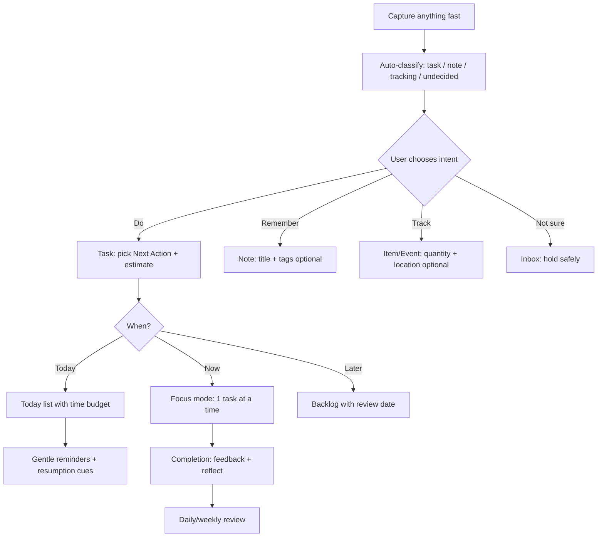
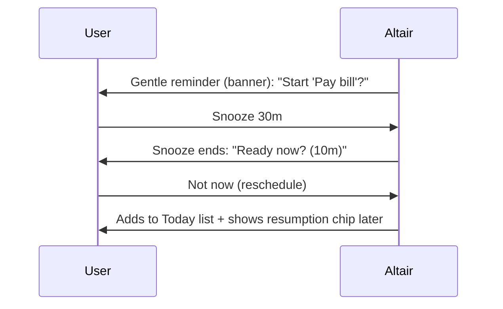

# ADHD-Friendly UI and UX Best Practices for Altair Productivity and Life-Management Stack

This report synthesizes cognitive-accessibility guidance, peer‑reviewed research, and accessibility standards into actionable UI/UX recommendations for a productivity/life‑management stack (tasks, routines, notes, and tracking) optimized for neurodivergent users—especially ADHD. It emphasizes reducing cognitive friction (attention, working memory, time perception, motivation, sensory load) while preserving power-user speed and cross‑device reliability. citeturn8search5turn7search0turn0search0

## Executive summary

ADHD is commonly associated with persistent inattention/impulsivity symptoms and day‑to‑day difficulties staying organized and on task, and many users benefit when systems reduce interruptions, externalize memory, and make “what to do next” obvious. citeturn7search0turn7search4turn0search0 Neurodivergent-inclusive design also needs to handle overlapping profiles (e.g., ADHD + autism, dyslexia, anxiety), which makes **adaptability** (with safe defaults) more effective than one “ideal” layout. citeturn8search5turn0search0turn2search3

The highest-leverage UI/UX bets for an ADHD-optimized productivity stack are:

First, **a frictionless capture → gentle structuring pipeline**: allow a “brain dump” with near-zero required fields, then guide users through small, reversible choices to convert items into tasks, calendar blocks, notes, or tracked events. This aligns with cognitive-accessibility guidance to reduce cognitive load and avoid overwhelming quantities of content. citeturn0search0turn8search9turn14search9

Second, **attention protection by default**: treat interruptions and notifications as scarce resources—batch by default, allow “focus modes,” and use escalating reminders only when the user opts in. Interruptions increase resumption costs and stress in knowledge work, and cognitive-accessibility guidance explicitly recommends limiting interruptions. citeturn0search3turn8search1turn14search18

Third, **time scaffolding (“time blindness” support)**: represent time visually (countdowns, “time remaining,” calendar heatmaps, time‑budget warnings), and connect tasks to concrete “when/where” plans. ADHD shows measurable time‑perception differences, and prospective memory challenges are relevant to reminder design. citeturn1search12turn2search9turn14search7

Fourth, **working-memory offloading and error tolerance**: keep key context persistent, prefer recognition over recall (search, suggested destinations, templates), provide undo, and prevent destructive actions. Executive function differences (including inhibition and working memory) are repeatedly observed in ADHD research, and cognitive-accessibility guidance emphasizes helping users avoid mistakes and find what they need. citeturn7search1turn8search21turn0search0

Fifth, **motivation without coercion**: use immediate feedback and “small wins,” but keep gamification optional and autonomy-supportive; expected extrinsic rewards can undermine intrinsic motivation, so design rewards as informational feedback rather than control. citeturn15search3turn15search2turn1search1

## Product context and assumptions

Altair is described as a “personal operating system” spanning three domains—Guidance (goals/initiatives/tasks/routines), Knowledge (notes and linked information), and Tracking (inventory and resource monitoring)—with cross-device, offline-first operation, synchronization, global search, tagging/cross-linking, and attachments. fileciteturn0file0 fileciteturn0file1 fileciteturn0file2 fileciteturn0file3

Because the prompt asks to assume unspecified details, the recommendations below map research-backed patterns onto common “productivity stack” components that are consistent with the PRDs and typical user workflows:

- Inbox / processing (capture, triage, conversion into structured items)
- Task lists (today, next actions, backlog)
- Calendar / time blocking (schedule, capacity, conflicts)
- Reminders / notifications (time- and event-based prompting)
- Notes (capture, retrieval, linking)
- Project/goal views (goal → initiative → task → routine structure)
- Dashboards (status, trends, review)
- Settings (modes, customization, privacy, notification controls)

The platform target includes mobile and web (and potentially desktop), so recommendations explicitly consider touch + keyboard and offline sync constraints. fileciteturn0file0

## Neurodivergent user needs and cognitive challenges

Neurodivergence is a spectrum of cognitive styles and conditions (including ADHD, autism, dyslexia, dementia, and others), and needs differ widely across individuals and contexts. citeturn8search5turn0search0 A productivity system should therefore prioritize **flexible supports** that reduce cognitive demands without removing user agency. citeturn2search3turn0search0

### ADHD-relevant cognitive demands for productivity software

ADHD is characterized by patterns of inattention and/or hyperactivity-impulsivity that can interfere with daily functioning; in practice, users often report difficulties with sustained attention, organization, and completing multi-step processes. citeturn7search0turn7search4 Meta-analytic work supports that ADHD is associated (on average) with weaknesses in multiple executive function domains (e.g., inhibition, working memory, planning), though the profile is heterogeneous—important because a “one-size UI” will not fit everyone. citeturn7search1turn0search18turn0search2

Two ADHD-adjacent constructs are particularly relevant to UI/UX:

- **Time perception (“time blindness”)**: a recent meta-analysis quantified deficits in time perception across the lifespan and found moderators such as working memory. citeturn1search12  
- **Motivational sensitivity to immediacy**: delay discounting is elevated in ADHD, consistent with stronger preference for immediate over delayed rewards, which affects task initiation and follow-through. citeturn1search1turn1search17

Additionally, sensory processing differences are increasingly documented in ADHD, with systematic review/meta-analytic evidence showing higher rates of atypical sensory processing patterns compared to controls. citeturn7search6turn7search2 This matters for motion, sound, visual density, and notification design.

### Other common neurodivergent considerations in the same product

Many users will have overlapping traits or comorbidities (e.g., ADHD + autism; ADHD + anxiety/depression), and cognitive-accessibility guidance explicitly addresses broad impacts on attention, memory, comprehension, and perception. citeturn8search5turn0search0 Dyslexia-related research suggests that spacing and crowding can affect reading performance, implying typography controls and careful density management can materially change usability for some users. citeturn7search19turn7search3

## Evidence-based design principles for attention, memory, time, and motivation

This section translates cognitive science and accessibility guidance into design “mechanisms” you can deliberately implement and test.

### Design for attention as a scarce resource

Cognitive-accessibility patterns highlight that interruptions can stop users with attention or memory impairments from completing tasks, and recommend minimizing interruptions. citeturn8search1turn0search0 Empirical work on interruptions in knowledge workers finds measurable costs (stress and performance impacts) associated with interrupted work, reinforcing the need for notification restraint and resumption support. citeturn0search3turn14search18

UX mechanisms that operationalize this:

- Use **non-modal**, deferrable prompts; prefer banners/toasts that persist in a notification center over modal dialogs.
- Add **resumption scaffolds**: “You were doing…” chips, last edited location, and “continue” affordances after contextual switches.
- Make “focus” a **system state**, not a one-off toggle: focus sessions should suppress non-urgent prompts by default and batch them.

### Reduce working-memory load by externalizing state

Working memory is limited (often framed as ~3–5 “chunks” in many contexts), and interfaces that require users to hold multiple states, rules, or steps in mind increase error risk and fatigue. citeturn14search4turn14search9 ADHD is commonly associated with working memory and inhibition weaknesses at the group level, so aggressively minimizing working-memory demands is a rational default strategy for ADHD-friendly design. citeturn7search1turn0search18

UX mechanisms:

- Prefer **recognition over recall**: suggested destinations, recent items, and global search reduce the need to remember where something “lives.” citeturn8search21turn0search0  
- Keep “task state” explicit: show next step, due/scheduled status, and blockers inline rather than behind secondary screens.
- Use **progressive disclosure**: present only the fields needed “right now,” and reveal advanced options on request; cognitive-accessibility guidance explicitly warns against too much content and clutter. citeturn8search9turn0search0

### Support executive function with guided decisions and reversibility

Executive function theories of ADHD are not the only explanatory model, but meta-analytic evidence supports that ADHD is associated with executive-function weaknesses on average, implying a design goal of **reducing planning burden** and **lowering the cost of mistakes**. citeturn7search1turn0search2

UX mechanisms:

- Convert large decisions into **small, sequential choices** (“Do you want to do this today?” → “Morning / afternoon / evening?”).
- Make actions reversible: **Undo**, version history, and non-destructive “archive” reduce risk aversion and task paralysis.
- Replace multi-step “wizard fatigue” with **single-screen defaults + optional refinement**.

### Address time perception and prospective memory explicitly

Time-based functioning is central to productivity tools. A meta-analysis reports a meaningful time-perception deficit in ADHD with moderation by working memory, suggesting UI that makes time concrete and continuously visible can reduce cognitive friction. citeturn1search12 Prospective memory (remembering to perform intended actions later) is also relevant; research in ADHD populations shows prospective memory challenges in more complex paradigms, supporting the need for cue-rich reminders and robust review. citeturn2search9turn2search5

UX mechanisms:

- Visualize time: countdowns, “time remaining,” and time-to-start indicators.
- Prefer “implementation intention” framing for planning (when/where/how), supported by meta-analytic evidence that implementation intentions improve goal achievement across domains. citeturn1search11turn1search19
- Provide both **time-based** and **event-based** reminder options (e.g., “when I arrive home,” “after my last meeting”), because users vary in what cues they reliably notice.

### Design for motivation: immediacy, autonomy, and non-shaming feedback

Delay discounting is elevated in ADHD, consistent with stronger bias toward immediate rewards; productivity tools can harness this by providing immediate, meaningful feedback after small actions. citeturn1search1turn1search17 However, classic meta-analytic evidence indicates that expected tangible rewards can undermine intrinsic motivation in many contexts, so points/badges should be optional and framed as feedback rather than control. citeturn15search3turn15search2

Practical principles:

- “Small wins” should emphasize **competence** and clarity (“You cleared your inbox. 5 items are now scheduled.”), aligning with self-determination theory. citeturn15search2turn15search17  
- Avoid shame-reinforcing streak loss mechanics by default; if streaks exist, use “soft streaks” (grace days) and a “restart with dignity.”
- Use behavior-change techniques transparently: self-monitoring and feedback are frequently used in digital interventions and can support sustained behavior change when done respectfully. citeturn16search0turn16search3

### Reduce sensory overload and motion-triggered discomfort

Atypical sensory processing is associated with ADHD in systematic review/meta-analytic work, supporting the need for adjustable density, sound, and motion defaults. citeturn7search6 On the web, the `prefers-reduced-motion` technique exists explicitly because some users experience distraction or nausea from animations. citeturn3search5turn3search13 Platform guidance also recommends modifying or disabling heavy motion when users prefer reduced motion. citeturn3search0turn3search8

## UI patterns and prioritized recommendations mapped to Altair components

This section is organized in two layers:

- A reusable **pattern library** (what problems occur, what to implement, evidence, complexity, impact)
- A **component mapping** (how to apply patterns to inbox, tasks, calendar, reminders, notes, projects, dashboards, settings)

### Core workflow diagram: capture to execution with ADHD-friendly scaffolding



This flow operationalizes cognitive-accessibility guidance on manageable quantity and minimal interruptions, and aligns with evidence on interruptions and resumption costs by making “focus” and “resumption” first-class concepts. citeturn8search9turn8search1turn0search3

### Comparison table of design patterns

Implementation complexity assumes a modern component-based web app + native/bridged mobile app with offline sync. “Impact” is expected user benefit for ADHD-heavy cohorts if executed well (High/Med/Low).

| Problem addressed | Recommended solution pattern | Evidence / source | Implementation complexity | Expected impact |
|---|---|---|---|---|
| Overwhelm from dense screens | Progressive disclosure; limit concurrent items on screen; “focus view” | Cognitive patterns: manageable quantity; cognitive load framework | Med | High citeturn8search9turn14search9 |
| Task abandonment after interruptions | Focus modes; notification batching; resumption cues (“You were doing…”) | Cognitive pattern: limit interruptions; interruption cost research | Med | High citeturn8search1turn0search3turn14search18 |
| Forgetting where things live | Global search; recents; consistent IA; “move to…” with suggestions | Cognitive pattern: provide search | Med | High citeturn8search21turn0search0 |
| Working-memory overload in editing | Inline context, visible state, defaults; avoid multi-step wizards | Working memory limits; ADHD EF meta-analysis | Med | High citeturn14search4turn7search1 |
| “Time blindness” and missed deadlines | Visual time scaffolding (countdowns, time budget), strong calendar integration | ADHD time-perception meta-analysis | Med | High citeturn1search12 |
| Intentions not turning into action | “If–then” planning prompts; location/event-based reminders | Implementation intentions meta-analysis; prospective memory research | Med | High citeturn1search11turn2search9 |
| Notification fatigue | User-controlled notification levels; relevance gates; quiet hours; digest | “Minimal interruptions” guidance; notification usability principles | Med | High citeturn8search1turn2search2 |
| Anxiety from irreversible actions | Undo, version history, safe “archive” instead of delete | Cognitive-accessibility avoid mistakes emphasis | Low–Med | Med–High citeturn0search0 |
| Confusion from unclear language | Plain-language microcopy; short sentences; concrete verbs; avoid jargon | Plain language guidance; clear content objective | Low | High citeturn17search0turn17search8 |
| Sensory overload (motion) | Respect reduced-motion settings; avoid auto-advancing motion; provide toggles | Reduced motion guidance and technique | Low–Med | Med–High citeturn3search0turn3search5 |
| Reading difficulty (dyslexia/crowding) | Typography controls (size, spacing), stable line length, reduce crowding | Dyslexia spacing research (mixed but meaningful for some) | Low–Med | Med citeturn7search19turn7search3 |
| Over-reliance on extrinsic rewards | Optional gamification; competence feedback; avoid coercive streak loss | Rewards meta-analysis; SDT | Med | Med citeturn15search3turn15search2 |
| Feature overload in settings | “Modes” (ADHD-friendly presets) + advanced settings behind “Customize” | Inclusive cognition guidance; manageable quantity | Med | High citeturn2search3turn8search9 |

### Component-by-component recommendations

Below, “Priority” is framed as **P0 (launch-critical)**, **P1 (next)**, **P2 (later)** for an ADHD-forward release. The intent is to make trade-offs explicit.

#### Inbox / processing (capture and triage)

P0: Make capture near-frictionless.

A capture flow should allow users to record an item with minimal typing and minimal required decisions (title-only entry; optional voice; attachments). This aligns with cognitive-accessibility principles to reduce complexity and supports the reality that ADHD users may capture in bursts and organize later. citeturn0search0turn8search9

P0: Provide a “safe holding” inbox with gentle processing prompts.

Users should be able to leave items unprocessed without penalty, while the system periodically offers a short processing session (e.g., “Process 5 items”) rather than demanding immediate categorization. This supports attention protection and reduces interruption-driven failure. citeturn8search1turn0search3

P1: Offer “one decision at a time” triage chips.

Examples: “This is a: Task / Note / Tracking / Not sure”, then “When? Now / Today / Later”, then “How long?” (optional). This reduces working-memory and executive load. citeturn14search4turn7search1

**Suggested microcopy (inbox triage)** (examples)

```text
Quick sort (10 seconds)
What is this?
[ Do (task) ] [ Remember (note) ] [ Track (item) ] [ Not sure ]

When do you want to think about it again?
[ Today ] [ This week ] [ Pick a date ] [ No reminder ]
```

#### Task lists (today, next, backlog)

P0: A “Today” list that is capacity-aware.

Instead of a flat list, show total estimated time vs available time (“You planned 3h 20m for today”). This directly supports time perception scaffolding. citeturn1search12

P0: A Focus view: one task, visible next action, easy defer.

A focus screen should show exactly one task (or one routine) with only the necessary context and two primary actions: “Done” and “Not now.” Minimizing content directly reflects cognitive guidance about reducing overload and interruptions. citeturn8search9turn8search1

P1: Default to recognition, not recall.

“Next Actions” should offer suggested verbs/templates (“Email…”, “Call…”, “Draft…”) and contextual grouping (home/errands/computer) if those signals exist. This is consistent with reducing executive load and using structure to support cognitive diversity. citeturn2search3turn7search1

**Lightweight wireframe (Today + Focus)**

```text
TODAY (3 tasks)                     Time planned: 3h 20m / 4h available
────────────────────────────────────────────────────────────────────────
[ ] Pay electricity bill      ~10m     Due today   🔔 7pm
[ ] Outline project brief     ~45m      Scheduled  2–3pm
[ ] Take out recycling        ~5m       Routine    After dinner

Button: [ Start Focus ]   Link: Review Inbox (4)
────────────────────────────────────────────────────────────────────────

FOCUS MODE
Now: Outline project brief (~45m)
Next step: Draft 5 bullet points for "Goals" section.
[ Start timer ] [ Mark done ] [ Not now ] (snooze options)
```

#### Calendar / time blocking

P0: Two-way link between tasks and time.

Allow scheduling a task to a calendar slot via drag/drop (web) or a simple “Schedule” action (mobile). Provide “soft scheduling” if users resist hard commitments: placeholders that can be moved without penalty. This supports planning while avoiding shame loops. citeturn1search1turn15search2

P1: Show conflicts as cognitive load, not just collisions.

If a user schedules too many tasks, present a supportive message (“You planned 6h of work in a 3h window. Want to move 2 tasks to tomorrow?”), connecting time perception support to action. citeturn1search12turn17search8

#### Reminders / notifications

P0: Notification controls are a primary UX surface, not buried settings.

Cognitive guidance emphasizes limiting interruptions; users should be able to set notification levels during onboarding and adjust them from the reminder itself (“Too many? Change settings”). citeturn8search1turn0search0

P0: Escalation must be opt-in and reversible.

Provide a gentle reminder first; escalate only if the user chooses “Escalate if not done.” This matches attention protection and respects autonomy (self-determination theory). citeturn15search2turn2search2

Mermaid sequence example: reminder escalation with resumption support



P1: Prefer “cue + action” reminders that include the next step.

Prospective memory research emphasizes the difficulty of delayed intentions; reminders should include the actionable step (“Open bill site and pay $X”), not just “Pay bill.” citeturn2search9turn14search7

**Reminder microcopy templates (supportive, non-shaming)**

```text
Gentle nudge:
"Want to do a 10‑minute version of this now?"
[ Start ] [ Snooze ] [ Move to tomorrow ]

If–then scaffold:
"If it’s after dinner, do: Take out recycling."
[ Done ] [ Change time ] [ Skip today ]

Resumption cue:
"Welcome back — you were working on: Outline project brief."
[ Continue ] [ Switch task ]
```

#### Notes (knowledge capture, retrieval, linking)

P0: Capture first, organize later—with automatic scaffolding.

Notes should allow quick capture (text/voice/image/document), then offer optional “light structure” (title suggestions, auto-tags) without forcing taxonomy decisions at capture time. Cognitive guidance favors usable content and manageable cognitive demands; search and recents reduce recall burden. citeturn0search0turn8search21

P1: Retrieval-first IA.

Make global search omnipresent and fast, and show “recent + pinned” notes as the default landing; this supports “recognition over recall.” citeturn8search21

Typography controls (P1) help dyslexia and general comfort.

Given evidence that spacing and visual crowding can affect reading for dyslexic readers (with mixed results across studies), offering user-controlled text size and spacing is a low-risk accommodation with meaningful upside for a subset of users. citeturn7search19turn7search3turn7search11

#### Project / goal views (Guidance domain)

P0: Always show “the next executable step.”

In goal → initiative → task hierarchies, the UI should surface the next action without requiring users to open multiple levels, reducing executive function and working memory demands (and aligning with ADHD EF evidence). citeturn7search1turn0search18

P1: Convert planning into if–then prompts.

When users create an initiative, prompt for implementation-intention style details (“When will you work on this?” “Where?” “What’s the first 5-minute step?”). This is consistent with evidence that implementation intentions improve goal attainment. citeturn1search11turn1search19

#### Dashboards (status, trends, and review)

P0: A “Today Sheet” that is calm and directive.

Dashboards should answer: “What matters now?” and “What’s my next step?” Avoid dense analytics by default; cognitive guidance warns against too much content and overload. citeturn8search9turn0search0

P1: Reviews as short, guided rituals.

Offer daily/weekly reviews as a checklist with a default small scope (e.g., “Review 10 items”), consistent with manageable quantity and attention constraints. citeturn8search9turn8search1

#### Settings (modes, customization, templates)

P0: Mode presets to prevent settings overwhelm.

Instead of dozens of toggles, provide 3–5 named presets (e.g., “Calm & Minimal,” “Standard,” “Power User,” “ADHD-friendly notifications”), plus a “Customize” path. This aligns with cognitive diversity approaches that recommend starting from motivation and reducing cognitive exclusion. citeturn2search3turn2search11

P1: Templates as cognitive scaffolding.

Provide task templates (“Pay a bill,” “Prep for appointment”), routine templates, and project templates to reduce planning burden and increase consistency. Templates align with behavior-change practice (structured prompts, self-monitoring) without forcing gamification. citeturn16search0turn16search3

### Onboarding flow templates (sample)

Below are two onboarding templates: one for low-friction adoption and one for more guided setup. Both treat notifications as a core decision early (because interruptions are high-risk for ADHD users).

**Template A: 90‑second “start immediately” onboarding**

```text
Screen 1: Welcome
"Capture anything. Organize later."
[ Start ]

Screen 2: Choose your style
"Pick a starting layout. You can change this anytime."
[ Calm & Minimal ] [ Standard ] [ Power User ]

Screen 3: Notifications
"How should reminders behave?"
(A) "Only show today’s plan"
(B) "Gentle reminders (recommended)"
(C) "Escalating reminders (opt‑in)"
[ Continue ]

Screen 4: First capture
"Add one thing on your mind."
Input: ______________________
[ Save ]
```

**Template B: Guided setup (5 minutes, optional)**

```text
Step 1: Your day shape
"Do you prefer tasks or time blocks?"
[ Tasks-first ] [ Calendar-first ]

Step 2: Time scaffolding
"Do you want time estimates?"
[ Yes, show time budget ] [ No, hide estimates ]

Step 3: Reminder style
"Pick your default reminder tone."
[ Gentle ] [ Direct ] [ Silent (no push) ]

Step 4: Home screen
"Choose what you see first."
[ Today ] [ Inbox ] [ Notes ] [ Projects ]
```

## Interaction modalities and accessibility and legal considerations

### Interaction modalities: keyboard, voice, touch, and multimodal

A neurodivergent-friendly productivity stack should support multiple “best paths,” because what reduces friction varies by context (home vs commute; low vs high executive capacity days). Cognitive inclusion guidance emphasizes identifying cognitive demands and reducing exclusion by offering adaptable paths. citeturn2search3turn8search5

Keyboard (web/desktop): Make “speed” a first-class accessibility feature.

A command palette (“Ctrl/Cmd+K”), quick-add (“T then type”), and full keyboard navigation reduce working-memory and attention costs for power users and can reduce friction for ADHD users who benefit from momentum and fewer context switches. WCAG also requires keyboard operability for web content, reinforcing this as both usability and accessibility. citeturn0search1turn0search0

Voice (mobile): Voice capture should be “append-only” and then structured later.

For ADHD users, voice capture can reduce capture friction during transitions; the key is to avoid forcing immediate categorization. (Design implication: voice notes land in inbox with an auto-transcript and a single “Convert to task” option.) citeturn0search0turn8search9

Touch (mobile): Large targets, low precision demands.

Mobile use often occurs during distraction or movement; target size and error forgiveness are core. WCAG 2.2 adds criteria that improve usability for many users, including aspects relevant to mobile interaction. citeturn0search1turn0search5

### Accessibility standards and legal landscape

For a modern cross-platform product, a pragmatic target is **WCAG 2.2 Level AA** for web surfaces, plus platform accessibility APIs for native experiences, and WCAG2ICT guidance for non-web software where relevant. WCAG 2.2 is the current W3C recommendation and explicitly frames success criteria as technology-neutral statements with supporting guidance. citeturn0search1turn3search11

Cognitive accessibility is not fully “solved” by WCAG conformance; W3C guidance on making content usable for people with cognitive and learning disabilities provides supplemental patterns beyond WCAG conformance that are directly applicable to productivity apps. citeturn0search0turn8search0

Legal considerations vary by jurisdiction and customer/market:

- In the U.S., Section 508 standards for federal ICT incorporate WCAG 2.0 Level A/AA by reference under the revised standards (not WCAG 2.2). citeturn5view1turn5view2  
- Also in the U.S., the entity["organization","U.S. Department of Justice","civil rights division"]’s ADA Title II rule for state/local government web and mobile apps adopts WCAG 2.1 Level AA, with compliance dates beginning April 24, 2026 for entities serving populations ≥50,000 (and April 26, 2027 for smaller/special district governments). citeturn9view1turn10view2  
- In the EU, the entity["organization","European Commission","brussels, belgium, eu"] frames the European Accessibility Act; Directive (EU) 2019/882 applies to covered products/services provided after 28 June 2025, with Member States applying measures from that date. citeturn11view0turn13view0  
- EN 301 549 is the harmonized European standard defining accessibility requirements for ICT products and services and is commonly used for compliance alignment in Europe. citeturn3search6

Practical implication: even if Altair is not in a regulated procurement context, building to WCAG 2.2 AA + cognitive patterns is a defensible “best practice” posture that reduces legal risk and increases usability for neurodivergent users. citeturn0search1turn0search0

## Measurement and evaluation plan

A rigorous evaluation plan should measure (a) whether the UI reduces cognitive friction and (b) whether that translates into sustained productivity outcomes without increasing annoyance or privacy risk.

### Metrics to instrument in-product

Attention / interruption metrics:

- Notification interaction quality: open rate is not enough; track “acted vs dismissed vs snoozed,” and time-to-resume after notification-driven context switch. Interruption research treats resumption lag as a productivity cost. citeturn14search18turn0search3  
- Focus integrity: average uninterrupted focus duration (user-controlled), plus “self-interruption events” (navigation away within X seconds) as a proxy for friction.

Working memory / complexity metrics:

- “Time to capture” (from open → saved), and “fields touched” per capture. Overly complex capture increases cognitive load. citeturn8search9turn14search9  
- “Processing conversion rate” (inbox items converted into tasks/notes/tracking) and “stuck inbox age distribution.”

Time scaffolding metrics:

- Scheduling rate (tasks assigned a time block), reschedule frequency, and “overcapacity warnings accepted vs ignored.”
- Due-date miss rate before vs after time-visualization features (segmented by reminder settings).

Motivation and retention:

- Week-4 retention and task completion rate are meaningful, but interpret alongside “notification fatigue” opt-outs and abandonment.  
- If gamification exists, measure opt-in rate and churn among opt-outs vs opt-ins; rewards can backfire if perceived as controlling. citeturn15search3turn15search2

### Study designs that validate ADHD/neurodivergent effectiveness

Inclusive recruitment and co-design:

Cognitive-accessibility guidance explicitly recommends including users with cognitive and learning disabilities in research and testing; Microsoft’s cognition inclusion materials similarly argue for co-creating with cognitive diversity in mind. citeturn0search0turn2search3 Recruit cohorts across: ADHD (medicated/unmedicated), autism traits, dyslexia, and “non-diagnosed but self-identified attention challenges,” because formal diagnosis is not the only relevant dimension.

Core study types:

1. Task-based usability studies (remote + moderated): compare baseline vs new patterns for capture, triage, schedule, and reminder flows; collect completion rate, time-on-task, and subjective workload.  
2. Longitudinal diary study (2–4 weeks): measure whether “Today Sheet,” focus mode, and reminders reduce churn and increase follow-through in daily life (where ADHD challenges are most salient). Prospective memory and time-based intentions often fail in real contexts more than in lab tasks, so longitudinal evidence matters. citeturn14search7turn2search9  
3. A/B tests with guardrails: pre-register hypotheses (e.g., “batch notifications reduces dismiss rate without reducing completion”), segment by chosen “mode” and notification preference.

Remote testing accessibility:

Use recruiting and study materials that follow plain language guidelines (short sections, concrete steps), and ensure the research experience itself does not create cognitive barriers. citeturn17search0turn17search13

## Implementation trade-offs, technical constraints, and privacy and data ethics

### Implementation trade-offs and technical constraints (Altair-aligned)

Offline-first + sync conflict resilience is not only a backend concern; it is UX-critical for ADHD users because “lost data” destroys trust and increases avoidance. The PRDs emphasize offline operation, synchronization, and reliability (no data loss during conflicts), with aggressive performance targets for local actions. fileciteturn0file0

UX implications and trade-offs:

- Sync status should be calm but discoverable: show a small “Synced / Syncing / Needs attention” indicator and a single-tap “resolve” flow, avoiding alarming copy unless necessary. (Trade-off: hiding details reduces anxiety but can frustrate power users; solve with progressive disclosure.) citeturn8search9turn0search0  
- Conflict resolution must be “safe by construction”: default to preserving both versions and guiding the user to choose later; destructive merges create high cognitive and emotional cost.  
- Global search is a cognitive accessibility feature (recognition over recall), but it requires indexing and latency control; the PRDs prioritize search across tasks/notes/tracking. Consider staged indexing (local first; cloud enrichment later) to meet <200ms local targets for common queries. fileciteturn0file0 citeturn8search21  
- Customization is a double-edged sword: it enables fit for neurodivergent variability but can itself become overwhelming. Use mode presets and “starter templates” as the front door, with advanced controls behind “Customize.” citeturn2search3turn8search9

### Privacy and data ethics

A life-management stack can collect highly sensitive information (health routines, finances, location-linked reminders, inventories, personal notes). Good neurodivergent UX is incompatible with “growth at all costs” telemetry; users who have experienced shame or surveillance often disengage when systems feel coercive.

Risk management frameworks:

The entity["organization","National Institute of Standards and Technology","us standards agency"] Privacy Framework is designed to help organizations identify and manage privacy risk arising from data processing and is a sound backbone for product privacy engineering. citeturn6search3turn6search10

Key privacy principles for Altair-like products:

- Data minimization and purpose limitation: collect only what is needed for core functions; offer local-only modes for sensitive users.  
- Sensitive data handling: if users track health-adjacent information, consider treating it as sensitive and applying stricter controls; GDPR’s legal text and guidance emphasize special protection for sensitive categories such as health data. citeturn18search0turn18search5  
- Breach and disclosure obligations: in the U.S., the entity["organization","Federal Trade Commission","consumer protection agency"] has emphasized that its Health Breach Notification Rule applies to health apps and similar technologies not covered by HIPAA, underscoring the need to treat certain data flows (including unauthorized disclosures) as potential “breach” events requiring notification. citeturn18search6turn18search14  
- Transparent privacy UX: if distributing on iOS, privacy disclosures (e.g., app privacy details) require accurate data inventories; treat this as a design constraint early. citeturn18search15

Ethical design guardrails (especially relevant to ADHD):

- Avoid dark patterns that exploit impulsivity (e.g., manipulative streak loss, excessive attention traps). If gamification exists, keep it user-controlled and aligned with competence/autonomy rather than coercion. citeturn15search3turn15search2  
- Make notifications user-governed: the system should not “nag” users into engagement; cognitive guidance stresses limiting interruptions, and good notification design emphasizes relevance and personalization rather than volume. citeturn8search1turn2search2  
- Be explicit about AI: if AI is used for suggestions, explain what data is processed, where it runs, and how users can disable it; this prevents trust collapse in a tool that is supposed to reduce cognitive burden (not add uncertainty). citeturn6search3turn6search10
