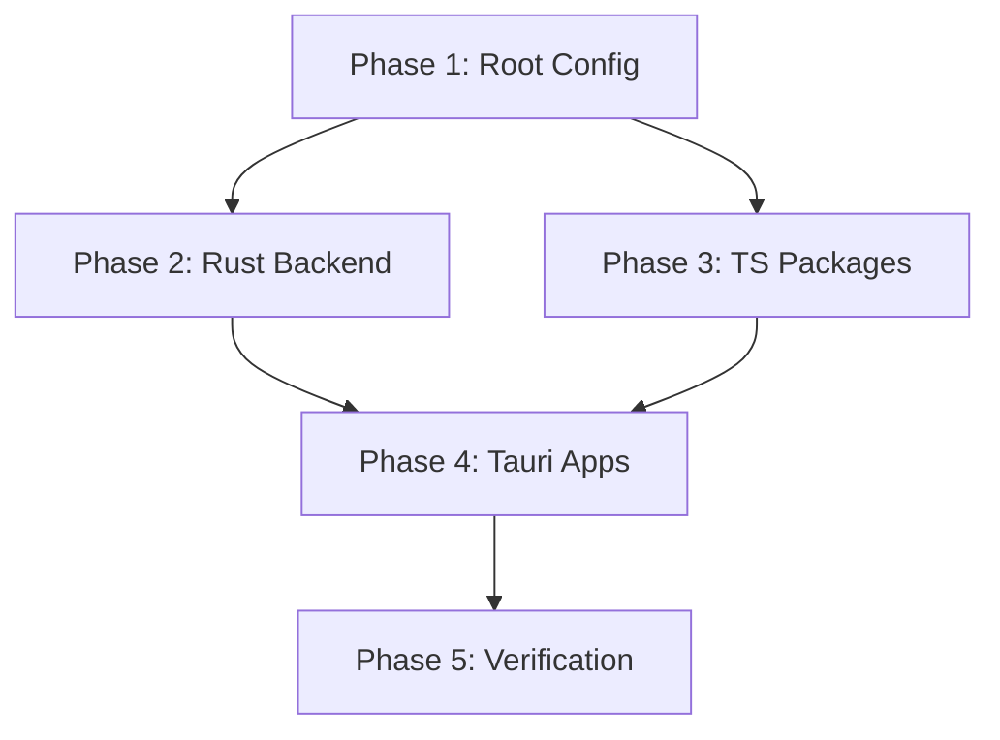

# Implementation Plan: Monorepo Structure, Build System, and Tooling

**Branch**: `spec/core-001-project-setup` | **Date**: 2025-12-01 | **Spec**: [spec.md](./spec.md)
**Input**: Feature specification from `specs/core-001-project-setup/spec.md`

## Summary

Establish the foundational monorepo structure using pnpm workspaces and Turborepo for the Altair productivity ecosystem. This includes scaffolding four Tauri 2.0 + Svelte 5 applications (Guidance, Knowledge, Tracking, Mobile) and six shared packages (ui, bindings, db, sync, storage, search), with consistent development tooling (TypeScript, ESLint, Prettier, prek).

## Technical Context

**Language/Version**: TypeScript 5.x, Rust 1.91.1+, Svelte 5 (runes)
**Primary Dependencies**: pnpm 10+, Turborepo, Tauri 2.9.3+, Vite, svelte-check
**Storage**: N/A (tooling spec only)
**Testing**: Vitest + @testing-library/svelte for frontend, cargo test for Rust
**Target Platform**: Linux, macOS, Windows (desktop); Android (mobile)
**Project Type**: Monorepo with multiple apps and shared packages
**Performance Goals**: Clean build < 2 min, cached rebuild < 10 sec, pre-commit < 5 sec
**Constraints**: Must work offline after initial install, solo developer workflow
**Scale/Scope**: 4 apps, 6 packages, 1 backend

## Constitution Check

_GATE: Must pass before Phase 0 research. Re-check after Phase 1 design._

| Principle | Applies | Status | Notes |
|-----------|---------|--------|-------|
| I. Local-First Architecture | No | N/A | Tooling infrastructure only |
| II. ADHD-Friendly Design | No | N/A | No user-facing features |
| III. Ubiquitous Language | Yes | ✅ PASS | Apps named correctly (Guidance, Knowledge, Tracking) |
| IV. Soft Delete & Data Recovery | No | N/A | No data entities in scope |
| V. Plugin Architecture | No | N/A | No providers in scope |
| VI. Privacy by Default | No | N/A | No data handling in scope |
| VII. Spec-Driven Development | Yes | ✅ PASS | Following spectrena workflow |

**Development Standards Compliance:**
- Rust: Will configure `cargo fmt` and `cargo clippy` in pre-commit
- TypeScript/Svelte: Will configure `pnpm lint` in pre-commit
- Tauri commands: Will set up tauri-specta for type generation

## Project Structure

### Documentation (this feature)

```text
specs/core-001-project-setup/
├── spec.md              # Feature specification (complete)
├── plan.md              # This file
└── tasks.md             # Phase 2 output (/spectrena.tasks command)
```

### Source Code (repository root)

```text
altair/
├── apps/
│   ├── guidance/                # Tauri app - Quest management
│   │   ├── src/                 # Svelte 5 frontend
│   │   │   ├── lib/
│   │   │   ├── routes/
│   │   │   └── app.html
│   │   ├── src-tauri/           # Tauri backend (workspace member)
│   │   │   ├── Cargo.toml
│   │   │   ├── tauri.conf.json
│   │   │   └── src/
│   │   ├── package.json
│   │   ├── svelte.config.js
│   │   ├── tsconfig.json
│   │   └── vite.config.ts
│   ├── knowledge/               # Tauri app - PKM (same structure)
│   ├── tracking/                # Tauri app - Inventory (same structure)
│   └── mobile/                  # Tauri Android app (same structure)
├── packages/
│   ├── ui/                      # Shared Svelte 5 components
│   │   ├── src/
│   │   │   └── index.ts
│   │   ├── package.json
│   │   └── tsconfig.json
│   ├── bindings/                # Generated TypeScript bindings (tauri-specta)
│   ├── db/                      # SurrealDB queries and types
│   ├── sync/                    # Change feed sync utilities
│   ├── storage/                 # S3 client utilities
│   └── search/                  # Embedding and search utilities
├── backend/                     # Shared Rust crates
│   ├── Cargo.toml               # Workspace root
│   └── crates/
│       ├── altair-core/
│       ├── altair-db/
│       ├── altair-sync/
│       ├── altair-storage/
│       ├── altair-search/
│       ├── altair-auth/
│       └── altair-commands/
├── package.json                 # Root package with scripts
├── pnpm-workspace.yaml          # Workspace configuration
├── turbo.json                   # Turborepo pipeline
├── tsconfig.json                # Root TypeScript config
├── tsconfig.base.json           # Shared TypeScript settings
├── eslint.config.js             # Flat ESLint configuration
├── .prettierrc                  # Prettier rules
├── .prek.yaml                   # Pre-commit hooks
├── .gitignore                   # Git ignore patterns
└── .editorconfig                # Editor settings
```

**Structure Decision**: Monorepo with `apps/` for Tauri applications, `packages/` for shared TypeScript, and `backend/` for Rust workspace. Each app's `src-tauri/` is a Cargo workspace member pointing to shared crates.

## Implementation Phases

### Phase 1: Root Configuration (Foundation)

**Goal**: Establish root-level tooling and workspace configuration.

| Task | Description | Files Created/Modified |
|------|-------------|------------------------|
| 1.1 | Initialize pnpm workspace | `pnpm-workspace.yaml` |
| 1.2 | Create root package.json with scripts and pnpm.overrides | `package.json` |
| 1.3 | Configure Turborepo pipeline | `turbo.json` |
| 1.4 | Create shared TypeScript configs | `tsconfig.json`, `tsconfig.base.json` |
| 1.5 | Configure ESLint (flat config for Svelte 5) | `eslint.config.js` |
| 1.6 | Configure Prettier | `.prettierrc`, `.prettierignore` |
| 1.7 | Set up prek pre-commit hooks | `.prek.yaml` |
| 1.8 | Create .gitignore and .editorconfig | `.gitignore`, `.editorconfig` |

**Exit Criteria**: `pnpm install` succeeds at repo root.

### Phase 2: Rust Backend Workspace

**Goal**: Set up Cargo workspace with shared crates.

| Task | Description | Files Created/Modified |
|------|-------------|------------------------|
| 2.1 | Create backend Cargo workspace | `backend/Cargo.toml` |
| 2.2 | Scaffold altair-core crate (shared types) | `backend/crates/altair-core/` |
| 2.3 | Scaffold altair-db crate (placeholder) | `backend/crates/altair-db/` |
| 2.4 | Scaffold altair-sync crate (placeholder) | `backend/crates/altair-sync/` |
| 2.5 | Scaffold altair-storage crate (placeholder) | `backend/crates/altair-storage/` |
| 2.6 | Scaffold altair-search crate (placeholder) | `backend/crates/altair-search/` |
| 2.7 | Scaffold altair-auth crate (placeholder) | `backend/crates/altair-auth/` |
| 2.8 | Scaffold altair-commands crate (Tauri commands) | `backend/crates/altair-commands/` |

**Exit Criteria**: `cargo check` succeeds in `backend/`.

### Phase 3: Shared TypeScript Packages

**Goal**: Create shared packages with placeholder exports.

| Task | Description | Files Created/Modified |
|------|-------------|------------------------|
| 3.1 | Scaffold ui package (Svelte 5 components) | `packages/ui/` |
| 3.2 | Scaffold bindings package (tauri-specta output) | `packages/bindings/` |
| 3.3 | Scaffold db package (SurrealDB utilities) | `packages/db/` |
| 3.4 | Scaffold sync package (sync utilities) | `packages/sync/` |
| 3.5 | Scaffold storage package (S3 utilities) | `packages/storage/` |
| 3.6 | Scaffold search package (embedding utilities) | `packages/search/` |

**Exit Criteria**: `pnpm build` succeeds for all packages.

### Phase 4: Tauri Applications

**Goal**: Scaffold all four Tauri apps with Svelte 5 frontends.

| Task | Description | Files Created/Modified |
|------|-------------|------------------------|
| 4.1 | Scaffold Guidance app (Tauri 2 + Svelte 5) | `apps/guidance/` |
| 4.2 | Scaffold Knowledge app (Tauri 2 + Svelte 5) | `apps/knowledge/` |
| 4.3 | Scaffold Tracking app (Tauri 2 + Svelte 5) | `apps/tracking/` |
| 4.4 | Scaffold Mobile app (Tauri Android) | `apps/mobile/` |
| 4.5 | Configure tauri-specta for bindings generation | Update Tauri configs |
| 4.6 | Wire src-tauri as Cargo workspace members | Update `backend/Cargo.toml` |

**Exit Criteria**: `pnpm dev` starts all apps; `pnpm build` produces artifacts.

### Phase 5: Verification & Documentation

**Goal**: Validate all success criteria and document setup.

| Task | Description | Verification |
|------|-------------|--------------|
| 5.1 | Verify fresh clone + install + dev workflow | Manual test |
| 5.2 | Verify build produces all artifacts | Check `target/` directories |
| 5.3 | Verify pre-commit blocks bad formatting | Stage bad file, attempt commit |
| 5.4 | Verify Turborepo cache reduces rebuild time | Time comparison |
| 5.5 | Update docs/technical-architecture.md if needed | Review against implementation |

**Exit Criteria**: All success criteria from spec pass.

## Dependencies

### External Dependencies

| Dependency | Version | Purpose |
|------------|---------|---------|
| Node.js | 24+ | JavaScript runtime |
| pnpm | 10+ | Package manager |
| Rust | 1.91.1+ | Backend compilation |
| Tauri CLI | 2.9.3+ | App scaffolding and builds |

### Internal Dependencies (Task Order)



## Risks and Mitigations

| Risk | Likelihood | Impact | Mitigation |
|------|------------|--------|------------|
| pnpm workspace resolution issues | Low | Medium | Use `pnpm.overrides` for shared deps |
| Turborepo cache invalidation bugs | Low | Low | Configure explicit input hashes |
| Svelte 5 + Tauri integration gaps | Low | Medium | Follow official Tauri + Vite template |
| tauri-specta version mismatch | Medium | Low | Pin compatible versions |

## Complexity Tracking

No constitution violations. This is foundational infrastructure with straightforward tooling choices.

## Estimated Effort

| Phase | Tasks | Complexity |
|-------|-------|------------|
| Phase 1 | 8 | Low-Medium |
| Phase 2 | 8 | Low |
| Phase 3 | 6 | Low |
| Phase 4 | 6 | Medium |
| Phase 5 | 5 | Low |
| **Total** | **33** | - |
