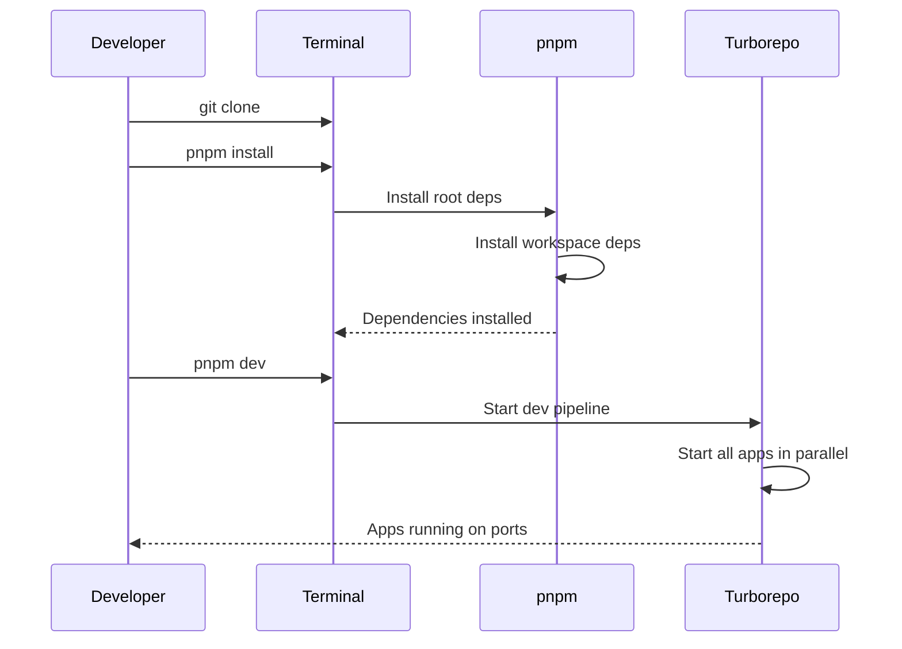

# Specification: Monorepo Structure, Build System, and Tooling

<!-- prettier-ignore-start -->
<!-- markdownlint-disable -->
<!--
SPEC WEIGHT: [ ] LIGHTWEIGHT  [x] STANDARD  [ ] FORMAL

Weight Guidelines:
- LIGHTWEIGHT: Bug fixes, small enhancements, config changes (<2 days work)
  Required sections: Quick Reference, Problem/Solution, Requirements, Acceptance Criteria

- STANDARD: New features, integrations, moderate complexity (2-10 days work)
  Required sections: All LIGHTWEIGHT + Data Model, Security, Test Requirements

- FORMAL: Major systems, compliance-sensitive, cross-team impact (>10 days work)
  Required sections: All sections, full sign-off
-->
<!-- markdownlint-enable -->
<!-- prettier-ignore-end -->

**Spec ID**: core-001-project-setup
**Component**: CORE
**Weight**: STANDARD
**Version**: 1.0
**Status**: DRAFT
**Created**: 2025-12-01
**Author**: Claude (AI-assisted)

---

## Quick Reference

> Establish the foundational monorepo structure, build system, and development tooling for the Altair productivity ecosystem.

**What**: A pnpm workspace monorepo with Turborepo for orchestrating builds across four Tauri apps and six shared packages.
**Why**: Enable parallel development of Guidance, Knowledge, and Tracking apps with shared infrastructure while maintaining fast, cached builds.
**Impact**: Developers can run `pnpm dev` from root and work on any app with hot-reload, type safety, and consistent tooling.

**Success Metrics**:

| Metric                    | Target       | How Measured                            |
| ------------------------- | ------------ | --------------------------------------- |
| Clean build time          | < 2 minutes  | `time pnpm build` on CI                 |
| Cached rebuild time       | < 10 seconds | `time pnpm build` with Turborepo cache |
| Type-check all packages   | < 30 seconds | `time pnpm typecheck`                   |
| Pre-commit hook execution | < 5 seconds  | `time prek run`                         |

---

## Problem Statement

### Current State

Altair is a greenfield project with no existing codebase. Before any feature development can begin, we need a properly structured repository that supports:

- Four separate Tauri applications (Guidance, Knowledge, Tracking, Mobile)
- Six shared packages (ui, bindings, db, sync, storage, search)
- A Rust backend shared across all desktop apps
- Consistent code quality tooling (linting, formatting, type-checking)
- Fast, cached builds to maintain developer productivity

Without this foundation, developers would duplicate configuration across apps, have inconsistent tooling, and face slow build times as the codebase grows.

### Desired State

A single `pnpm dev` command starts all development servers. A single `pnpm build` produces all artifacts. Pre-commit hooks catch issues before they reach the repository. Turborepo caches ensure incremental builds are fast.

The repository structure matches the architecture document (ARCH §Project Structure), enabling clear separation of concerns between apps, packages, and backend.

### Why Now

This is Phase 1, Foundation. No other work can proceed until the project structure exists. Every subsequent spec (core-002 through platform-020) depends on this infrastructure being in place.

---

## Solution Overview

### Approach

Create a pnpm workspace monorepo using Turborepo for build orchestration. Each Tauri app lives in `apps/` and shares common frontend packages from `packages/`. The Rust backend lives in `backend/` and is referenced by each Tauri app's `src-tauri/` configuration.

Frontend applications use **Svelte 5** with the new runes reactivity system for modern, performant UI development.

Development tooling uses:

- **pnpm** for package management (fast, disk-efficient, strict)
- **Turborepo** for task orchestration and caching
- **TypeScript** with a shared base config for type safety
- **ESLint + Prettier** for consistent code style
- **prek** for pre-commit hook orchestration (linting, formatting, type-checking)

### Scope

**In Scope**:

- pnpm workspace configuration (`pnpm-workspace.yaml`)
- Turborepo build pipeline (`turbo.json`)
- App scaffolding with placeholder Tauri 2.x + Svelte 5 setup
- Package scaffolding with placeholder exports
- Shared TypeScript, ESLint, and Prettier configurations
- Pre-commit hooks via prek
- Root-level npm scripts for common operations
- `.gitignore` and editor configuration

**Out of Scope**:

- Actual app implementation — covered by guidance-001, knowledge-001, tracking-001
- Database schema — covered by core-002-schema-migrations
- UI components — covered by future ui package specs
- Backend implementation — covered by core-003-backend-skeleton
- CI/CD pipelines — future spec

**Future Considerations**:

- Changesets for package versioning — when publishing packages externally
- Docker development environment — when onboarding non-Rust developers

### Key Decisions

| Decision                      | Options Considered           | Rationale                                                            |
| ----------------------------- | ---------------------------- | -------------------------------------------------------------------- |
| pnpm over npm/yarn            | npm, yarn, pnpm              | Faster installs, strict dependency resolution, efficient disk usage |
| Turborepo over Nx             | Turborepo, Nx, Lerna         | Simpler config, excellent caching, good Tauri support                |
| prek over husky+lint-staged   | husky+lint-staged, lefthook  | Single tool for pre-commit, explicit task ordering, no Node required |
| Shared tsconfig extends       | Per-app configs, shared base | Reduces duplication, ensures consistency                             |
| Svelte 5 with runes           | Svelte 4, Svelte 5           | Modern reactivity, better performance, future-proof                  |

---

## Requirements

### Functional Requirements

| ID     | Requirement                                                                      | Priority | Notes                            |
| ------ | -------------------------------------------------------------------------------- | -------- | -------------------------------- |
| FR-001 | The system shall use pnpm workspaces to manage all packages and apps             | CRITICAL |                                  |
| FR-002 | The system shall use Turborepo to orchestrate build, dev, and test tasks         | CRITICAL |                                  |
| FR-003 | The system shall scaffold four Tauri apps: guidance, knowledge, tracking, mobile | CRITICAL | Placeholder Svelte 5 frontends   |
| FR-004 | The system shall scaffold six packages: ui, bindings, db, sync, storage, search  | CRITICAL | Placeholder exports              |
| FR-005 | The system shall provide shared TypeScript configuration                         | HIGH     | Base tsconfig for extends        |
| FR-006 | The system shall provide shared ESLint configuration                             | HIGH     | Svelte 5 + TypeScript rules      |
| FR-007 | The system shall provide shared Prettier configuration                           | HIGH     | Consistent formatting            |
| FR-008 | The system shall use prek for pre-commit hooks                                   | HIGH     | Lint, format, typecheck          |
| FR-009 | The system shall provide root npm scripts for common operations                  | MEDIUM   | dev, build, test, lint, etc.     |
| FR-010 | The system shall configure .gitignore for all generated artifacts                | MEDIUM   |                                  |
| FR-011 | The system shall use Svelte 5 with runes for all frontend applications           | CRITICAL | Modern reactivity system         |

### Non-Functional Requirements

| ID      | Requirement                                       | Priority | Notes                           |
| ------- | ------------------------------------------------- | -------- | ------------------------------- |
| NFR-001 | Clean build shall complete in under 2 minutes     | HIGH     | On standard developer machine   |
| NFR-002 | Cached rebuild shall complete in under 10 seconds | HIGH     | With Turborepo remote cache     |
| NFR-003 | Pre-commit hooks shall complete in under 5 seconds| MEDIUM   | For staged files only           |
| NFR-004 | All TypeScript shall use strict mode              | HIGH     | strictNullChecks, noImplicitAny |
| NFR-005 | pnpm install shall complete in under 30 seconds   | MEDIUM   | With warm cache                 |

### User Stories

**US-001: Developer Setup**

- **As** a developer joining the project,
- **I** need to
  - clone the repository
  - run `pnpm install`
  - run `pnpm dev`
- **so** that I can start developing any app immediately.

Acceptance:

- [ ] Single command installs all dependencies
- [ ] Single command starts all development servers
- [ ] Hot-reload works for Svelte 5 changes
- [ ] TypeScript errors appear in the editor

Independent Test: Clone fresh, run commands, verify app loads in browser.

**US-002: Build All Apps**

- **As** a developer preparing a release,
- **I** need to
  - run `pnpm build`
- **so** that all Tauri apps are built for distribution.

Acceptance:

- [ ] All four apps produce build artifacts
- [ ] Build fails if any app has TypeScript errors
- [ ] Build fails if any app has ESLint errors (with `--max-warnings 0`)

Independent Test: Run build, verify artifacts in each app's `target/` directory.

**US-003: Pre-commit Quality Gates**

- **As** a developer committing code,
- **I** need
  - pre-commit hooks to run automatically
- **so** that I don't accidentally commit poorly formatted or type-unsafe code.

Acceptance:

- [ ] prek runs on staged files before commit
- [ ] Commit blocked if Prettier format fails
- [ ] Commit blocked if ESLint errors exist
- [ ] Commit blocked if TypeScript errors exist

Independent Test: Stage a file with formatting issues, attempt commit, verify rejection.

---

## Data Model

This specification does not introduce persistent data entities. Configuration files are documented in the Interfaces section.

---

## Interfaces

### Operations

**pnpm dev**

- **Purpose**: Start all development servers concurrently
- **Trigger**: Developer runs `pnpm dev` from repo root
- **Inputs**: None
- **Outputs**: Running dev servers for all apps
- **Behavior**:
  - Turborepo starts all `dev` tasks in parallel
  - Each app's Vite dev server starts on unique port
  - Backend Tauri process starts in development mode
  - Svelte 5 HMR enabled for instant updates
- **Error Conditions**:
  - Port conflict: Exit with error, suggest killing process

**pnpm build**

- **Purpose**: Build all apps for production
- **Trigger**: Developer or CI runs `pnpm build`
- **Inputs**: None
- **Outputs**: Production bundles in each app's `target/` directory
- **Behavior**:
  - Turborepo builds dependencies in correct order
  - TypeScript is compiled
  - Vite bundles frontend assets (Svelte 5 compiled)
  - Tauri produces platform-specific binaries
- **Error Conditions**:
  - TypeScript error: Exit with error, show diagnostics
  - ESLint error: Exit with error, show violations

**pnpm lint**

- **Purpose**: Check all code for lint errors
- **Trigger**: Developer or pre-commit hook
- **Inputs**: None (or specific files from staged changes)
- **Outputs**: List of violations or success message
- **Behavior**:
  - ESLint checks all TypeScript/Svelte files
  - Prettier checks formatting
- **Error Conditions**:
  - Violations found: Exit with non-zero code

**pnpm typecheck**

- **Purpose**: Type-check all TypeScript without emitting
- **Trigger**: Developer or pre-commit hook
- **Inputs**: None
- **Outputs**: Type error diagnostics or success
- **Behavior**:
  - TypeScript compiler runs in `--noEmit` mode
  - All packages and apps are checked
  - Svelte 5 component types validated
- **Error Conditions**:
  - Type errors: Exit with non-zero code, show diagnostics

### Configuration Files

| File                  | Purpose                          |
| --------------------- | -------------------------------- |
| `pnpm-workspace.yaml` | Define workspace packages        |
| `turbo.json`          | Turborepo pipeline configuration |
| `tsconfig.json`       | Root TypeScript config           |
| `tsconfig.base.json`  | Shared TypeScript settings       |
| `.eslintrc.cjs`       | Shared ESLint configuration      |
| `.prettierrc`         | Prettier formatting rules        |
| `.prek.yaml`          | Pre-commit hook configuration    |
| `.gitignore`          | Git ignore patterns              |
| `.editorconfig`       | Editor settings                  |

---

## Workflows

### Developer Setup Workflow

**Actors**: New developer
**Preconditions**: Node.js 24+ (Active LTS), Rust 1.91.1+, pnpm 10+ installed
**Postconditions**: Development environment running



**Steps**:

1. Developer clones repository → local copy
2. Developer runs `pnpm install` → all dependencies installed
3. Developer runs `pnpm dev` → all apps running with hot-reload

**Error Flows**:

- If Node version < 24: pnpm install fails with clear message
- If Rust not installed: Tauri build fails with install instructions

---

## Security and Compliance

### Authorization

Not applicable — this is development tooling infrastructure.

### Data Classification

| Data Element    | Classification | Handling Requirements       |
| --------------- | -------------- | --------------------------- |
| Source code     | Internal       | Git access control          |
| Build artifacts | Internal       | Not committed to repository |
| npm tokens (CI) | Secret         | Environment variables only  |

---

## Test Requirements

### Success Criteria

| ID     | Criterion                                             | Measurement                     |
| ------ | ----------------------------------------------------- | ------------------------------- |
| SC-001 | Fresh clone + `pnpm install` + `pnpm dev` succeeds    | Manual test on clean machine    |
| SC-002 | `pnpm build` produces artifacts for all four apps     | CI verification                 |
| SC-003 | Pre-commit hook blocks commits with formatting issues | Manual test with staged file    |
| SC-004 | Turborepo cache reduces rebuild time by >80%          | Time comparison: clean vs cached|

### Acceptance Criteria

**Scenario**: Fresh developer setup _(maps to US-001)_

```gherkin
Given a clean machine with Node 24+, Rust 1.91.1+, and pnpm 10+ installed
When I clone the repository and run "pnpm install"
Then all dependencies are installed without errors
And when I run "pnpm dev"
Then all four apps start their dev servers
And I can access each app in my browser
```

**Scenario**: Pre-commit hook enforcement _(maps to US-003)_

```gherkin
Given I have staged a TypeScript file with a missing semicolon
When I attempt to commit
Then prek runs and detects the formatting issue
And the commit is blocked
And I see an error message explaining the violation
```

### Test Scenarios

| ID     | Scenario                             | Type        | Priority | Maps To |
| ------ | ------------------------------------ | ----------- | -------- | ------- |
| TS-001 | Fresh install and dev server startup | Functional  | CRITICAL | US-001  |
| TS-002 | Production build all apps            | Functional  | CRITICAL | US-002  |
| TS-003 | Pre-commit blocks bad formatting     | Functional  | HIGH     | US-003  |
| TS-004 | Pre-commit blocks TypeScript errors  | Functional  | HIGH     | US-003  |
| TS-005 | Turborepo cache hit performance      | Performance | HIGH     | NFR-002 |

### Performance Criteria

| Operation    | Metric   | Target       | Conditions              |
| ------------ | -------- | ------------ | ----------------------- |
| pnpm install | Duration | < 30 seconds | Warm cache              |
| pnpm build   | Duration | < 2 minutes  | Cold cache              |
| pnpm build   | Duration | < 10 seconds | Turborepo cache hit     |
| prek run     | Duration | < 5 seconds  | Staged files only (~10) |

---

## Constraints and Assumptions

### Technical Constraints

- **Node.js 24+**: Active LTS required for modern ESM and TypeScript features
- **Rust 1.91.1+**: Latest stable required for Tauri backend compilation
- **pnpm 10+**: Required for workspace protocol support and performance
- **Tauri 2.9.3+**: Current stable for desktop and mobile targets
- **Svelte 5**: Required for runes reactivity system

### Business Constraints

- Solo developer initially — tooling must not require complex setup
- Must work offline after initial install

### Assumptions

- Developers have basic familiarity with TypeScript and pnpm
- Target platforms are Linux, macOS, Windows (desktop) and Android (mobile)
- All apps share the same backend process on desktop

### Dependencies

| Dependency | Type | Status | Impact if Delayed           |
| ---------- | ---- | ------ | --------------------------- |
| None       | —    | —      | This is the foundation spec |

### Risks

| Risk                         | Likelihood | Impact | Mitigation                        |
| ---------------------------- | ---------- | ------ | --------------------------------- |
| pnpm workspace edge cases    | Low        | Low    | Well-tested in large monorepos    |
| Turborepo cache invalidation | Low        | Low    | Configure proper input hashes     |
| Svelte 5 ecosystem maturity  | Low        | Medium | Svelte 5 is stable, monitor ecosystem |

---

## Open Questions

None — all decisions are documented above.

---

## References

### Internal

- [Technical Architecture](../../docs/technical-architecture.md) — §Project Structure
- [Spec Backlog](../../docs/spec-backlog.md) — core-001-project-setup entry

### External

- [pnpm Workspaces](https://pnpm.io/workspaces)
- [Turborepo Documentation](https://turbo.build/repo/docs)
- [Tauri 2.x Documentation](https://v2.tauri.app/)
- [Svelte 5 Documentation](https://svelte.dev/docs/svelte)
- [prek Documentation](https://prek.dev/)

---

## Changelog

| Version | Date       | Author | Changes               |
| ------- | ---------- | ------ | --------------------- |
| 1.0     | 2025-12-01 | Claude | Initial specification |
