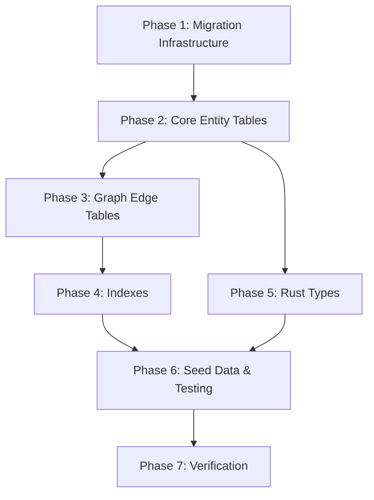

# Implementation Plan: SurrealDB Schema and Migrations

**Branch**: `spec/core-002-schema-migrations` | **Date**: 2025-12-06 | **Spec**: [spec.md](./spec.md)
**Input**: Feature specification from `specs/core-002-schema-migrations/spec.md`

## Summary

Define the complete SurrealDB schema for all Altair entities (15+ tables, 10 graph edges) with CHANGEFEED-enabled sync and implement a Rust-based migration runner that tracks versions and applies changes idempotently. This establishes the data layer foundation that all three apps (Guidance, Knowledge, Tracking) require to persist and sync data.

## Technical Context

**Language/Version**: Rust 2024 edition, SurrealQL (SurrealDB 2.x)
**Primary Dependencies**: surrealdb crate (2.x), tokio, tracing
**Storage**: SurrealDB embedded (SurrealKV) for local, SurrealDB cloud for sync
**Testing**: cargo test with in-memory SurrealDB instances
**Target Platform**: Linux, macOS, Windows (embedded database)
**Project Type**: Monorepo with shared backend crates
**Performance Goals**: Full migration < 5s, single INSERT < 50ms
**Constraints**: Offline-first (embedded mode), CHANGEFEED 7d on all tables
**Scale/Scope**: 15+ entity tables, 10 edge tables, single-user per database

## Constitution Check

_GATE: Must pass before Phase 0 research. Re-check after Phase 1 design._

| Principle                       | Applies | Status  | Notes                                                                                                             |
| ------------------------------- | ------- | ------- | ----------------------------------------------------------------------------------------------------------------- |
| I. Local-First Architecture     | Yes     | ✅ PASS | Uses embedded SurrealDB (SurrealKV), no network required                                                          |
| II. ADHD-Friendly Design        | Partial | ✅ PASS | Energy cost (tiny/small/medium/large/huge) for quests, energy level (1-5) for daily check-ins, WIP=1 at app level |
| III. Ubiquitous Language        | Yes     | ✅ PASS | Quest, Campaign, Note, Item terminology in schema                                                                 |
| IV. Soft Delete & Data Recovery | Yes     | ✅ PASS | All entities have `status` field with 'archived' option                                                           |
| V. Plugin Architecture          | No      | N/A     | Database layer, not provider integration                                                                          |
| VI. Privacy by Default          | Yes     | ✅ PASS | Local embedded DB, no telemetry                                                                                   |
| VII. Spec-Driven Development    | Yes     | ✅ PASS | Following spectrena workflow                                                                                      |

**Development Standards Compliance:**

- Rust: Using `cargo fmt` and `cargo clippy` (configured in workspace)
- SurrealDB: All tables SCHEMAFULL with CHANGEFEED 7d
- Tauri commands: Schema used by Tauri apps via altair-db crate

## Project Structure

### Documentation (this feature)

```text
specs/core-002-schema-migrations/
├── spec.md              # Feature specification (complete)
├── plan.md              # This file
└── tasks.md             # Phase 2 output (/spectrena.tasks command)
```

### Source Code (repository root)

```text
backend/
├── crates/
│   └── altair-db/
│       ├── src/
│       │   ├── lib.rs           # Re-exports and module structure
│       │   ├── client.rs        # SurrealDB client wrapper
│       │   ├── migration.rs     # Migration runner logic
│       │   └── schema/          # Entity type definitions (Rust structs)
│       │       ├── mod.rs
│       │       ├── quest.rs
│       │       ├── note.rs
│       │       ├── item.rs
│       │       └── ...
│       └── Cargo.toml
└── migrations/                   # SurrealQL migration files
    ├── 001_initial_schema.surql  # Core tables and fields
    ├── 002_edge_tables.surql     # Graph relationships
    ├── 003_indexes.surql         # Performance indexes
    └── 004_seed_data.surql       # Optional dev seed data

tests/
└── integration/
    └── migration_tests.rs        # Full migration integration tests
```

**Structure Decision**: Migrations live in `backend/migrations/` as numbered `.surql` files. The `altair-db` crate contains the migration runner and Rust type definitions that mirror the SurrealDB schema.

## Implementation Phases

### Phase 1: Migration Infrastructure

**Goal**: Create the migration runner and `_migrations` tracking table.

| Task | Description                                      | Files Created/Modified                             |
| ---- | ------------------------------------------------ | -------------------------------------------------- |
| 1.1  | Add surrealdb dependency to altair-db            | `backend/crates/altair-db/Cargo.toml`              |
| 1.2  | Create migrations directory with README          | `backend/migrations/README.md`                     |
| 1.3  | Implement MigrationRunner struct                 | `backend/crates/altair-db/src/migration.rs`        |
| 1.4  | Implement version tracking (`_migrations` table) | `backend/crates/altair-db/src/migration.rs`        |
| 1.5  | Implement file discovery (NNN\_\*.surql pattern) | `backend/crates/altair-db/src/migration.rs`        |
| 1.6  | Implement idempotent apply logic                 | `backend/crates/altair-db/src/migration.rs`        |
| 1.7  | Create SurrealDB client wrapper                  | `backend/crates/altair-db/src/client.rs`           |
| 1.8  | Add integration test for migration runner        | `backend/crates/altair-db/tests/migration_test.rs` |

**Exit Criteria**: `cargo test -p altair-db` passes; empty migration applies successfully.

### Phase 2: Core Entity Tables

**Goal**: Define all 15+ entity tables with SCHEMAFULL constraints and CHANGEFEED.

| Task | Description                                                                        | Files Created/Modified                        |
| ---- | ---------------------------------------------------------------------------------- | --------------------------------------------- |
| 2.1  | Create 001_initial_schema.surql with namespace/database                            | `backend/migrations/001_initial_schema.surql` |
| 2.2  | Define `user` table with auth fields                                               | `backend/migrations/001_initial_schema.surql` |
| 2.3  | Define Quest domain tables (campaign, quest, focus_session, energy_checkin)        | `backend/migrations/001_initial_schema.surql` |
| 2.4  | Define Knowledge domain tables (note, folder, daily_note)                          | `backend/migrations/001_initial_schema.surql` |
| 2.5  | Define Inventory domain tables (item, location, reservation, maintenance_schedule) | `backend/migrations/001_initial_schema.surql` |
| 2.6  | Define Capture table (multi-modal input)                                           | `backend/migrations/001_initial_schema.surql` |
| 2.7  | Define Gamification tables (user_progress, achievement, streak)                    | `backend/migrations/001_initial_schema.surql` |
| 2.8  | Define shared tables (attachment, tag)                                             | `backend/migrations/001_initial_schema.surql` |
| 2.9  | Add field assertions for enums (column, energy_level, status)                      | `backend/migrations/001_initial_schema.surql` |
| 2.10 | Verify CHANGEFEED 7d on all tables                                                 | Integration test                              |

**Exit Criteria**: All entity tables created; `INFO FOR DB` shows all tables; field assertions reject invalid data.

### Phase 3: Graph Edge Tables

**Goal**: Define 13 relationship edge tables for graph queries (includes reserves, has_session, has_maintenance).

| Task | Description                                          | Files Created/Modified                     |
| ---- | ---------------------------------------------------- | ------------------------------------------ |
| 3.1  | Create 002_edge_tables.surql                         | `backend/migrations/002_edge_tables.surql` |
| 3.2  | Define `contains` edge (Campaign→Quest, Folder→Note) | `backend/migrations/002_edge_tables.surql` |
| 3.3  | Define `references` edge (Quest→Note)                | `backend/migrations/002_edge_tables.surql` |
| 3.4  | Define `requires` edge (Quest→Item)                  | `backend/migrations/002_edge_tables.surql` |
| 3.5  | Define `links_to` edge (Note→Note, bidirectional)    | `backend/migrations/002_edge_tables.surql` |
| 3.6  | Define `stored_in` edge (Item→Location)              | `backend/migrations/002_edge_tables.surql` |
| 3.7  | Define `documents` edge (Note→Item)                  | `backend/migrations/002_edge_tables.surql` |
| 3.8  | Define `reserved_for` edge (Reservation→Quest)       | `backend/migrations/002_edge_tables.surql` |
| 3.9  | Define `blocks` edge (Quest→Quest)                   | `backend/migrations/002_edge_tables.surql` |
| 3.10 | Define `has_attachment` and `tagged` edges           | `backend/migrations/002_edge_tables.surql` |

**Exit Criteria**: All 13 edge tables created with CHANGEFEED 7d; graph queries (`->edge->`) work correctly.

### Phase 4: Indexes and Performance

**Goal**: Create indexes for common query patterns.

| Task | Description                                              | Files Created/Modified                 |
| ---- | -------------------------------------------------------- | -------------------------------------- |
| 4.1  | Create 003_indexes.surql                                 | `backend/migrations/003_indexes.surql` |
| 4.2  | Add owner index on all entity tables                     | `backend/migrations/003_indexes.surql` |
| 4.3  | Add status index on all entity tables                    | `backend/migrations/003_indexes.surql` |
| 4.4  | Add full-text search index on note.content               | `backend/migrations/003_indexes.surql` |
| 4.5  | Add full-text search index on quest.title                | `backend/migrations/003_indexes.surql` |
| 4.6  | Reserve vector index structure for note.embedding (HNSW) | `backend/migrations/003_indexes.surql` |
| 4.7  | Add unique index on user.email                           | `backend/migrations/003_indexes.surql` |
| 4.8  | Add date index on daily_note.date                        | `backend/migrations/003_indexes.surql` |

**Exit Criteria**: Indexes created; `INFO FOR TABLE` shows expected indexes.

### Phase 5: Rust Type Definitions

**Goal**: Create Rust structs that mirror the SurrealDB schema for type-safe operations.

| Task | Description                                                                      | Files Created/Modified                                |
| ---- | -------------------------------------------------------------------------------- | ----------------------------------------------------- |
| 5.1  | Create schema module structure                                                   | `backend/crates/altair-db/src/schema/mod.rs`          |
| 5.2  | Define Quest domain types (Campaign, Quest, FocusSession, EnergyCheckIn)         | `backend/crates/altair-db/src/schema/quest.rs`        |
| 5.3  | Define Knowledge domain types (Note, Folder, DailyNote)                          | `backend/crates/altair-db/src/schema/note.rs`         |
| 5.4  | Define Inventory domain types (Item, Location, Reservation, MaintenanceSchedule) | `backend/crates/altair-db/src/schema/item.rs`         |
| 5.5  | Define Capture type                                                              | `backend/crates/altair-db/src/schema/capture.rs`      |
| 5.6  | Define Gamification types (UserProgress, Achievement, Streak)                    | `backend/crates/altair-db/src/schema/gamification.rs` |
| 5.7  | Define shared types (User, Attachment, Tag)                                      | `backend/crates/altair-db/src/schema/shared.rs`       |
| 5.8  | Define enum types (QuestColumn, EnergyLevel, CaptureType, etc.)                  | `backend/crates/altair-db/src/schema/enums.rs`        |
| 5.9  | Add serde derives for SurrealDB serialization                                    | All schema files                                      |

**Exit Criteria**: Rust types compile; types match SurrealDB schema 1:1.

### Phase 6: Seed Data and Testing

**Goal**: Create optional seed data and comprehensive tests.

| Task | Description                                               | Files Created/Modified                   |
| ---- | --------------------------------------------------------- | ---------------------------------------- |
| 6.1  | Create 004_seed_data.surql (optional, for dev)            | `backend/migrations/004_seed_data.surql` |
| 6.2  | Add sample user with preferences                          | `backend/migrations/004_seed_data.surql` |
| 6.3  | Add sample campaign with quests                           | `backend/migrations/004_seed_data.surql` |
| 6.4  | Add sample notes with links                               | `backend/migrations/004_seed_data.surql` |
| 6.5  | Test: Fresh migration creates all tables (SC-001, SC-002) | Integration test                         |
| 6.6  | Test: CHANGEFEED enabled on all tables (SC-003)           | Integration test                         |
| 6.7  | Test: Field assertions reject invalid data (SC-004)       | Integration test                         |
| 6.8  | Test: Running migrations twice is idempotent (SC-006)     | Integration test                         |
| 6.9  | Test: CHANGEFEED captures INSERT/UPDATE/DELETE (US-003)   | Integration test                         |

**Exit Criteria**: All success criteria from spec verified; tests pass.

### Phase 7: Verification and Documentation

**Goal**: Final verification and update documentation.

| Task | Description                                | Verification              |
| ---- | ------------------------------------------ | ------------------------- |
| 7.1  | Verify migration applies in < 5 seconds    | Time measurement          |
| 7.2  | Verify all 15+ entity tables created       | `INFO FOR DB`             |
| 7.3  | Verify all 10 edge tables created          | `INFO FOR DB`             |
| 7.4  | Verify indexes created correctly           | `INFO FOR TABLE` for each |
| 7.5  | Update technical-architecture.md if needed | Review against spec       |
| 7.6  | Commit and push all changes                | Git operations            |

**Exit Criteria**: All success criteria pass; documentation current.

## Dependencies

### External Dependencies

| Dependency | Version | Purpose                              |
| ---------- | ------- | ------------------------------------ |
| surrealdb  | 2.x     | Database client and embedded runtime |
| tokio      | 1.x     | Async runtime                        |
| tracing    | 0.1.x   | Logging and instrumentation          |
| serde      | 1.x     | Serialization for schema types       |
| chrono     | 0.4.x   | Datetime handling                    |

### Internal Dependencies (Task Order)



**Key Dependencies**:

- Phase 2-4 must run in order (migrations are sequential)
- Phase 5 can run in parallel with Phases 3-4 (Rust types don't require migrations to exist)
- Phase 6 requires all migrations complete

## Risks and Mitigations

| Risk                            | Likelihood | Impact | Mitigation                                   |
| ------------------------------- | ---------- | ------ | -------------------------------------------- |
| SurrealDB 2.x API changes       | Low        | Medium | Pin crate version, follow release notes      |
| CHANGEFEED performance at scale | Low        | Low    | Monitor in production, add indexes as needed |
| Migration file conflicts        | Low        | Low    | Numbered files, single developer workflow    |
| Embedded vs cloud schema drift  | Low        | Medium | Same migrations apply to both modes          |
| Vector index not yet stable     | Medium     | Low    | Reserve structure, implement in core-012     |

## Complexity Tracking

No constitution violations. Schema design follows established patterns from domain model and decision log.

## Estimated Effort

| Phase     | Tasks  | Complexity |
| --------- | ------ | ---------- |
| Phase 1   | 8      | Medium     |
| Phase 2   | 10     | Medium     |
| Phase 3   | 10     | Low        |
| Phase 4   | 8      | Low        |
| Phase 5   | 9      | Medium     |
| Phase 6   | 9      | Medium     |
| Phase 7   | 6      | Low        |
| **Total** | **60** | -          |

**Weight**: STANDARD (2-10 days work) — aligns with spec assessment.
