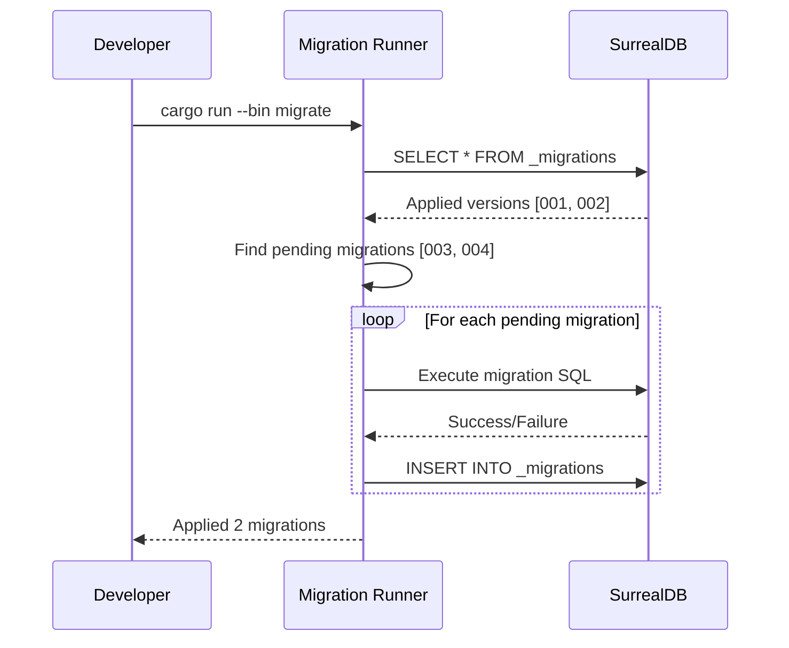

# Specification: SurrealDB Schema and Migrations

<!-- prettier-ignore-start -->
<!-- markdownlint-disable -->
<!--
SPEC WEIGHT: [ ] LIGHTWEIGHT  [x] STANDARD  [ ] FORMAL

Weight Guidelines:
- LIGHTWEIGHT: Bug fixes, small enhancements, config changes (<2 days work)
  Required sections: Quick Reference, Problem/Solution, Requirements, Acceptance Criteria

- STANDARD: New features, integrations, moderate complexity (2-10 days work)
  Required sections: All LIGHTWEIGHT + Data Model, Security, Test Requirements

- FORMAL: Major systems, compliance-sensitive, cross-team impact (>10 days work)
  Required sections: All sections, full sign-off
-->
<!-- markdownlint-enable -->
<!-- prettier-ignore-end -->

**Spec ID**: core-002-schema-migrations
**Component**: CORE
**Weight**: STANDARD
**Version**: 1.0
**Status**: DRAFT
**Created**: 2025-12-06
**Author**: Claude (AI Assistant)

---

## Quick Reference

> Define the complete SurrealDB schema for all Altair domains with CHANGEFEED-enabled sync and a version-tracked migration system.

**What**: Complete database schema definition and migration runner for all Altair entities
**Why**: Applications need a well-defined, type-safe data layer to store and sync quests, notes, items, and related entities
**Impact**: All three apps (Guidance, Knowledge, Tracking) can persist and sync data with consistent schema

**Success Metrics**:

| Metric                 | Target     | How Measured                             |
| ---------------------- | ---------- | ---------------------------------------- |
| Schema coverage        | 100%       | All entities from domain model defined   |
| Migration success rate | 100%       | All migrations apply without errors      |
| CHANGEFEED enabled     | All tables | Verify with `INFO FOR TABLE`             |
| Type safety            | Full       | All fields have explicit types + asserts |

---

## Problem Statement

### Current State

The Altair monorepo has been scaffolded (core-001) with four Tauri applications and shared packages, but there is no database schema. Applications currently have placeholder UI but cannot persist any data.

SurrealDB was selected (ADR-001) for its native graph queries, built-in vector search, and change feeds for sync. However, the database is an empty canvas—no tables, no fields, no relationships defined.

Without a schema, developers cannot:

- Store quests, notes, or items
- Create relationships between entities (Quest→Note→Item)
- Implement sync via change feeds
- Enable semantic search via vector indexes

### Desired State

A complete, well-documented SurrealDB schema that:

- Defines all 15+ entities from the domain model with SCHEMAFULL constraints
- Establishes 10 graph edge tables for relationships
- Enables 7-day CHANGEFEED on all tables for sync
- Includes appropriate indexes for common query patterns
- Provides a migration runner that tracks versions and applies changes idempotently

Developers can import the schema, run migrations, and immediately start implementing CRUD operations with full type safety.

### Why Now

This is a foundational dependency—nothing can be built without a data layer. core-003 (backend skeleton) and all feature specs (guidance-001, knowledge-001, tracking-001) depend on having a defined schema to work against.

---

## Solution Overview

### Approach

Create a migration-based schema definition system using numbered SurrealQL files. Each migration file is idempotent and defines a portion of the schema. A Rust-based migration runner tracks applied versions in a `_migrations` table and applies pending migrations in order.

The schema follows SurrealDB best practices:

- **SCHEMAFULL tables** — Explicit field definitions, no schemaless data
- **CHANGEFEED 7d** — All tables emit changes for sync (7-day retention)
- **Graph edges** — Relationships as edge tables (`->contains->`, `->references->`)
- **Assertions** — Field-level validation (enums, ranges, required fields)
- **Indexes** — Optimized for common queries (by owner, by status, full-text, vector)

### Scope

**In Scope**:

- All entity tables from domain model (campaign, quest, note, item, etc.)
- All graph edge tables (contains, references, links_to, requires, etc.)
- Field definitions with types, defaults, and assertions
- CHANGEFEED configuration on all tables
- Index definitions for common queries
- Migration runner (Rust) with version tracking
- Initial seed data (default user, sample data for dev)

**Out of Scope**:

- CRUD query functions — Covered by core-003 (backend skeleton)
- Vector search queries — Covered by core-012 (embeddings)
- Sync protocol — Covered by core-013 (sync engine)
- Row-level security policies — Covered by core-010 (auth)

**Future Considerations**:

- Additional indexes based on query profiling
- Partitioning strategies if data volume grows

### Key Decisions

| Decision                           | Options Considered               | Rationale                                              |
| ---------------------------------- | -------------------------------- | ------------------------------------------------------ |
| SCHEMAFULL over SCHEMALESS         | SCHEMAFULL, SCHEMALESS           | Type safety, validation, explicit contracts            |
| 7-day CHANGEFEED retention         | 1d, 7d, 30d                      | Balances sync window with storage; mobile syncs weekly |
| Soft delete via `status: archived` | Hard delete, soft delete         | Recoverability, sync tombstones (ADR-010)              |
| Migration runner in Rust           | Rust, TypeScript, standalone CLI | Same language as backend, runs at app startup          |
| Edge tables for relationships      | Foreign keys, edge tables        | Native graph queries, cleaner traversal (ADR-001)      |

---

## Requirements

### Functional Requirements

| ID     | Requirement                                                     | Priority | Notes                          |
| ------ | --------------------------------------------------------------- | -------- | ------------------------------ |
| FR-001 | Define all entity tables from domain model with SCHEMAFULL      | CRITICAL | 15+ tables                     |
| FR-002 | Define all graph edge tables for relationships                  | CRITICAL | 10 edge tables                 |
| FR-003 | Enable CHANGEFEED 7d on all tables                              | CRITICAL | Required for sync              |
| FR-004 | Define field types with explicit assertions                     | CRITICAL | Enums, ranges, required fields |
| FR-005 | Create indexes for owner, status, and common filter patterns    | HIGH     | Performance requirement        |
| FR-006 | Implement migration runner with version tracking                | HIGH     | `_migrations` table            |
| FR-007 | Support idempotent migration application                        | HIGH     | Re-running is safe             |
| FR-008 | Create full-text search indexes on note.content and quest.title | MEDIUM   | Keyword search                 |
| FR-009 | Reserve vector index definitions (HNSW) for embedding fields    | MEDIUM   | Semantic search prep           |
| FR-010 | Provide optional seed data for development                      | LOW      | Sample quests, notes, items    |

### Non-Functional Requirements

| ID      | Requirement                                          | Priority | Notes           |
| ------- | ---------------------------------------------------- | -------- | --------------- |
| NFR-001 | Migrations complete in < 5 seconds on fresh database | HIGH     | Startup time    |
| NFR-002 | Schema supports 100k+ records per table              | MEDIUM   | Scalability     |
| NFR-003 | All fields have explicit documentation comments      | MEDIUM   | Maintainability |

### User Stories

**US-001: Developer applies migrations**

- **As** a developer,
- **I** need to
  - Run a migration command that creates all tables
  - See which migrations have been applied
  - Have migrations skip if already applied
- **so** that I can set up a working database in one step.

Acceptance:

- [ ] `cargo run --bin migrate` creates all tables
- [ ] Running migrate twice produces no errors
- [ ] `_migrations` table shows applied versions

Independent Test: Run migrate on empty DB, verify tables exist

**US-002: Backend stores a quest**

- **As** a backend developer,
- **I** need to
  - INSERT a quest record with required fields
  - Have invalid data rejected (wrong enum, missing required field)
  - Have created_at/updated_at auto-populated
- **so** that I can build the Quest CRUD API.

Acceptance:

- [ ] Quest with all required fields inserts successfully
- [ ] Quest with invalid `column` value is rejected
- [ ] Quest with missing `title` is rejected
- [ ] Timestamps auto-populate

Independent Test: Direct SurrealQL INSERT statements

**US-003: Sync receives changes**

- **As** the sync engine,
- **I** need to
  - Query CHANGEFEED for recent changes
  - Receive inserts, updates, and deletes
  - Filter by versionstamp
- **so** that I can replicate changes to other devices.

Acceptance:

- [ ] CHANGEFEED returns INSERT operations
- [ ] CHANGEFEED returns UPDATE operations
- [ ] CHANGEFEED returns DELETE operations
- [ ] Changes include versionstamp for cursor

Independent Test: Insert record, query CHANGEFEED, verify event

---

## Data Model

### Key Entities

Based on the domain model (docs/domain-model.md):

**Quest Domain (Guidance)**:

- **Campaign**: Container for related quests; has title, status, color
- **Quest**: Task with energy cost; has title, column (6-column QBA), energy_level, estimated_minutes
- **FocusSession**: Active work session; tracks quest, duration, completed steps
- **EnergyCheckIn**: Daily energy self-assessment; date, level (1-5), notes

**Knowledge Domain**:

- **Note**: Markdown content; title, content, embedding vector, is_daily flag
- **Folder**: Optional hierarchy; name, parent reference, color
- **DailyNote**: Auto-created daily entry; date (unique), note reference

**Inventory Domain (Tracking)**:

- **Item**: Physical object; name, quantity, status, category, custom_fields
- **Location**: Hierarchical storage; name, parent reference, geo coordinates
- **Reservation**: Item allocated to quest; quantity, status (pending/active/released)
- **MaintenanceSchedule**: Recurring tasks; interval, next_due, last_performed

**Capture Domain**:

- **Capture**: Multi-modal input; type (text/voice/photo/video), content, status, ai_suggestion

**Gamification Domain**:

- **UserProgress**: XP and level tracking; xp_total, level, title
- **Achievement**: Unlockable badges; name, icon, unlocked_at
- **Streak**: Consecutive activity; type, current_count, longest_count

**Shared Domain**:

- **User**: Identity; email, display_name, preferences (JSON), role
- **Attachment**: Media files; filename, mime_type, storage_key, checksum
- **Tag**: Cross-domain labels; name, namespace (optional)

### Edge Tables

| Edge             | From        | To         | Semantics                     |
| ---------------- | ----------- | ---------- | ----------------------------- |
| `contains`       | Campaign    | Quest      | Parent-child grouping         |
| `contains`       | Folder      | Note       | Hierarchical organization     |
| `references`     | Quest       | Note       | Quest links to related note   |
| `requires`       | Quest       | Item       | Quest needs this item         |
| `links_to`       | Note        | Note       | Wiki-style bidirectional link |
| `stored_in`      | Item        | Location   | Physical location             |
| `documents`      | Note        | Item       | Note describes item           |
| `reserved_for`   | Reservation | Quest      | Allocation                    |
| `blocks`         | Quest       | Quest      | Dependency graph              |
| `has_attachment` | Any         | Attachment | Media association             |
| `tagged`         | Any         | Tag        | Categorization                |

### Entity Details

**Quest**

- **Purpose**: Individual task in the QBA system
- **Key Attributes**: title, description, column, energy_level, estimated_minutes, actual_minutes, xp_value, due_date, completed_at
- **Relationships**: belongs to Campaign (via contains edge), references Notes, requires Items
- **Lifecycle**: Created in idea_greenhouse → moves through columns → archived after harvested
- **Business Rules**:
  - `column` must be one of: idea_greenhouse, quest_log, this_cycle, next_up, in_progress, harvested, archived
  - `energy_level` must be one of: tiny, small, medium, large, huge
  - Only ONE quest can be in `in_progress` at a time (enforced at app level)
  - `this_cycle` max 1, `next_up` max 5 (enforced at app level)

**Note**

- **Purpose**: Markdown content unit in PKM system
- **Key Attributes**: title, content (markdown), embedding (vector 384d), is_daily, version
- **Relationships**: links_to other Notes (bidirectional), documents Items
- **Lifecycle**: Created manually or auto-created as DailyNote → updated → archived
- **Business Rules**:
  - `embedding` is 384-dimensional vector (all-MiniLM-L6-v2)
  - `is_daily` notes have unique date in title

**Item**

- **Purpose**: Physical object or consumable in inventory
- **Key Attributes**: name, quantity, status, category, custom_fields (flexible JSON)
- **Relationships**: stored_in Location, has Reservations
- **Lifecycle**: Created → updated (quantity adjustments) → depleted or archived
- **Business Rules**:
  - `quantity` >= 0 always
  - `status` derived from quantity and reservations (available, reserved, in_use, depleted, archived)

### State Transitions

**Quest Column Flow**:

```
idea_greenhouse → quest_log → this_cycle → next_up → in_progress → harvested → archived
                                    ↑__________________________|
                                    (can skip to harvested from any active column)
```

**Reservation Status**:

```
pending → active → released
```

**Capture Status**:

```
pending → processed (routed to quest/note/item)
        → discarded
```

---

## Interfaces

### Operations

**Apply Migrations**

- **Purpose**: Initialize or update database schema
- **Trigger**: Application startup, CLI command
- **Inputs**:
  - `migrations_dir` (required): Path to migration files
  - `db_connection` (required): SurrealDB connection
- **Outputs**: List of applied migrations, success/failure status
- **Behavior**:
  - Read all `NNN_*.surql` files from migrations directory
  - Query `_migrations` table for already-applied versions
  - Apply pending migrations in order
  - Record each successful migration in `_migrations`
- **Error Conditions**:
  - Migration syntax error: Rollback, report line number
  - Connection failure: Retry with backoff

**Verify Schema**

- **Purpose**: Confirm all expected tables exist with correct fields
- **Trigger**: Health check, test setup
- **Inputs**: Expected table list
- **Outputs**: Boolean pass/fail, list of missing tables/fields
- **Behavior**:
  - `INFO FOR DB` to list tables
  - `INFO FOR TABLE x` for each table
  - Compare against expected schema

### Integration Points

| System    | Direction | Purpose                         | Data Exchanged |
| --------- | --------- | ------------------------------- | -------------- |
| SurrealDB | Outbound  | Apply schema definitions        | SurrealQL DDL  |
| Backend   | Inbound   | Uses schema for CRUD operations | Record types   |
| Sync      | Inbound   | Queries CHANGEFEED for changes  | Change events  |

---

## Workflows

### Migration Application Workflow

**Actors**: Developer, Migration Runner
**Preconditions**: SurrealDB running, migrations directory exists
**Postconditions**: Schema up to date, `_migrations` records all versions



**Steps**:

1. Developer runs migrate command → runner starts
2. Runner queries `_migrations` → gets applied versions
3. Runner scans `migrations/` directory → finds all migration files
4. Runner applies each pending migration in order → records in `_migrations`
5. Runner reports completion → developer sees summary

**Error Flows**:

- If migration fails: Stop immediately, report error with file and line, leave `_migrations` unchanged for that version

---

## Security and Compliance

### Authorization

| Operation        | Required Permission | Notes                                  |
| ---------------- | ------------------- | -------------------------------------- |
| Apply migrations | Admin / Root        | Schema changes require elevated access |
| Query tables     | Authenticated user  | Row-level via owner field              |
| CHANGEFEED read  | Sync service        | Internal service account               |

### Data Classification

| Data Element       | Classification | Handling Requirements           |
| ------------------ | -------------- | ------------------------------- |
| User email         | PII            | Encrypt at rest                 |
| Note content       | User content   | User-controlled, encrypted      |
| Quest descriptions | User content   | User-controlled                 |
| Attachment files   | User content   | Stored in S3, referenced by key |

### Data Protection

- **PII handling**: User email stored, hashed for auth
- **Encryption**: SurrealDB at-rest encryption (RocksDB/SurrealKV)
- **Retention/deletion**: Soft delete with `status: archived`, permanent delete on user request

---

## Test Requirements

### Success Criteria

| ID     | Criterion                                     | Measurement                            |
| ------ | --------------------------------------------- | -------------------------------------- |
| SC-001 | All 15+ entity tables created with SCHEMAFULL | `INFO FOR DB` shows all tables         |
| SC-002 | All 10 edge tables created for relationships  | Edge tables exist and are usable       |
| SC-003 | CHANGEFEED enabled on every table             | `INFO FOR TABLE x` shows CHANGEFEED 7d |
| SC-004 | Field assertions reject invalid data          | INSERT with bad enum fails             |
| SC-005 | Migration runner applies all files in order   | `_migrations` shows correct order      |
| SC-006 | Running migrations twice is idempotent        | No errors on second run                |
| SC-007 | Indexes created for owner and status fields   | `INFO FOR TABLE x` shows indexes       |

### Acceptance Criteria

**Scenario**: Fresh migration on empty database _(maps to US-001)_

```gherkin
Given an empty SurrealDB database
When I run the migration command
Then all entity tables are created
And all edge tables are created
And _migrations table shows all applied versions
And each table has CHANGEFEED 7d enabled
```

**Scenario**: Quest insertion with valid data _(maps to US-002)_

```gherkin
Given the schema has been applied
When I INSERT a quest with title, column='quest_log', energy_level='medium'
Then the quest is created successfully
And created_at and updated_at are auto-populated
And owner is set to the current user
```

**Scenario**: Quest insertion with invalid enum _(maps to US-002)_

```gherkin
Given the schema has been applied
When I INSERT a quest with column='invalid_column'
Then the INSERT fails with assertion error
And no record is created
```

**Scenario**: CHANGEFEED captures changes _(maps to US-003)_

```gherkin
Given the schema has been applied
And I know the current versionstamp
When I INSERT a new quest
Then querying CHANGEFEED returns the INSERT operation
And the change includes the new versionstamp
```

### Test Scenarios

| ID     | Scenario                       | Type        | Priority | Maps To |
| ------ | ------------------------------ | ----------- | -------- | ------- |
| TS-001 | All tables created on fresh DB | Functional  | CRITICAL | US-001  |
| TS-002 | Migration idempotency          | Functional  | HIGH     | FR-007  |
| TS-003 | Field assertions for each enum | Functional  | HIGH     | FR-004  |
| TS-004 | CHANGEFEED events for CRUD     | Functional  | HIGH     | US-003  |
| TS-005 | Index usage in owner queries   | Performance | MEDIUM   | FR-005  |
| TS-006 | Schema verification utility    | Functional  | MEDIUM   | FR-001  |

### Performance Criteria

| Operation            | Metric   | Target  | Conditions             |
| -------------------- | -------- | ------- | ---------------------- |
| Full migration apply | Duration | < 5s    | Empty database         |
| Single record INSERT | Duration | < 50ms  | Table with 10k records |
| Owner-filtered query | Duration | < 100ms | Table with 10k records |

---

## Constraints and Assumptions

### Technical Constraints

- SurrealDB 2.x required (CHANGEFEED API)
- 384-dimensional vectors for embedding field (all-MiniLM-L6-v2 model)
- Migration files must be numbered (NNN_description.surql)

### Business Constraints

- Must support offline-first (schema works in embedded mode)
- Must enable sync via CHANGEFEED (all tables)

### Assumptions

- Single user per database (row-level multi-tenancy not required initially)
- SurrealDB embedded mode performs comparably to server mode for this scale
- 7-day CHANGEFEED retention sufficient for typical sync patterns

### Dependencies

| Dependency             | Type     | Status    | Impact if Delayed |
| ---------------------- | -------- | --------- | ----------------- |
| core-001-project-setup | Internal | Complete  | Already done      |
| SurrealDB 2.x crate    | External | Available | Use latest stable |

### Risks

| Risk                            | Likelihood | Impact | Mitigation                             |
| ------------------------------- | ---------- | ------ | -------------------------------------- |
| SurrealDB schema changes        | Low        | Medium | Pin SurrealDB version, test on upgrade |
| Migration conflicts in team     | Low        | Low    | Numbered files, linear versioning      |
| CHANGEFEED performance at scale | Low        | Medium | Monitor, add indexes as needed         |

---

## Open Questions

| #   | Question | Location | Owner | Due | Status |
| --- | -------- | -------- | ----- | --- | ------ |
| -   | None     | -        | -     | -   | -      |

All design questions resolved via domain model and decision log references.

---

## References

### Internal

- [Domain Model](../../docs/domain-model.md) — Entity definitions
- [Technical Architecture](../../docs/technical-architecture.md) — Database layer design
- [Decision Log - ADR-001](../../docs/decision-log.md#adr-001-surrealdb-over-sqlite) — Why SurrealDB

### External

- [SurrealDB Documentation](https://surrealdb.com/docs) — SurrealQL reference
- [SurrealDB CHANGEFEED](https://surrealdb.com/docs/surrealql/statements/define/table#changefeed-clause) — Change feed syntax

---

## Approval

| Role             | Name   | Date       | Status  |
| ---------------- | ------ | ---------- | ------- |
| Author           | Claude | 2025-12-06 | DRAFT   |
| Technical Review |        |            | PENDING |

---

## Changelog

| Version | Date       | Author | Changes               |
| ------- | ---------- | ------ | --------------------- |
| 1.0     | 2025-12-06 | Claude | Initial specification |
