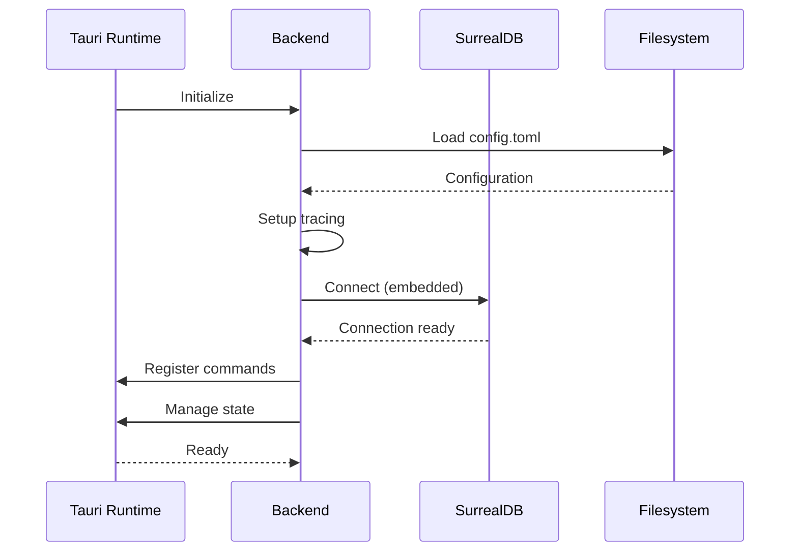

# Specification: Tauri Backend Service Foundation

<!-- prettier-ignore-start -->
<!-- markdownlint-disable -->
<!--
SPEC WEIGHT: [ ] LIGHTWEIGHT  [x] STANDARD  [ ] FORMAL
-->
<!-- markdownlint-enable -->
<!-- prettier-ignore-end -->

**Spec ID**: core-003-backend-skeleton
**Component**: CORE
**Weight**: STANDARD
**Version**: 1.0
**Status**: DRAFT
**Created**: 2025-12-06
**Author**: Robert Hamilton

---

## Quick Reference

> Foundation for Tauri 2.0 backend service with embedded SurrealDB, shared state management, and type-safe IPC command infrastructure.

**What**: Establish the core Rust backend skeleton that all Tauri desktop apps share
**Why**: Provide consistent infrastructure for database access, configuration, error handling, and IPC commands
**Impact**: All subsequent specs (auth, sync, embeddings, domain CRUD) build on this foundation

**Success Metrics**:

| Metric                       | Target | How Measured                         |
| ---------------------------- | ------ | ------------------------------------ |
| Backend starts successfully  | 100%   | Health check returns healthy         |
| Type generation works        | 100%   | tauri-specta generates valid TS      |
| All Tauri apps share backend | 3 apps | Same crates linked in each src-tauri |

---

## Problem Statement

### Current State

After CORE-001 (project setup), the monorepo has placeholder app scaffolding but no functional Rust backend. The Tauri apps have empty `src-tauri` directories without:

- Database connection setup
- Shared state management
- Error handling patterns
- Tauri command registration
- Configuration loading
- Logging infrastructure

Without this foundation, subsequent specs (auth, sync, embeddings, domain CRUD) have no base to build upon.

### Desired State

A working Tauri backend skeleton that:

1. Initializes embedded SurrealDB on app startup
2. Provides `AppState` accessible to all Tauri commands
3. Defines consistent `ApiError` type for error handling
4. Registers commands using a standard pattern with tauri-specta
5. Includes health check command for monitoring
6. Loads configuration from standard locations
7. Sets up structured logging with tracing

All three desktop apps (guidance, knowledge, tracking) share the same backend crates.

### Why Now

This is Phase 1 foundational infrastructure. No domain features can be implemented until the backend skeleton exists. core-001 (project setup) is complete, making this the natural next step.

---

## Solution Overview

### Approach

Create a Cargo workspace with shared crates that Tauri apps import:

1. **altair-core**: Shared types, error definitions, utilities
2. **altair-db**: SurrealDB connection, initialization, health check

Each Tauri app's `src-tauri` imports these crates and registers commands. The `AppState` struct holds database connection and configuration, passed to commands via Tauri's state injection.

Commands are defined using `#[tauri::command]` with `specta::Type` derivation for TypeScript generation. A single `generate-bindings` binary produces `packages/bindings/` output.

Configuration uses TOML files in standard platform locations (`~/.config/altair/` on Linux). Logging uses the `tracing` crate with JSON structured output.

### Scope

**In Scope**:

- Rust workspace configuration with shared crates
- altair-core crate: ApiError, Result type alias, common utilities
- altair-db crate: SurrealDB embedded initialization, connection pool
- AppState struct with database handle and config
- Tauri command registration pattern with tauri-specta
- Health check command implementation
- Configuration loading from TOML files
- Tracing/logging setup with file and console output
- Type generation binary for packages/bindings

**Out of Scope**:

- Domain-specific commands (quests, notes, items) — future specs
- S3/storage integration — core-011-storage-service
- Sync engine — core-013-sync-engine
- Embeddings — core-012-embeddings
- Authentication — core-010-auth-local
- Database schema/migrations — core-002-schema-migrations

**Future Considerations**:

- Metrics endpoint (when usage scales beyond solo use)
- Plugin system for backend extensions

### Key Decisions

| Decision                | Options Considered            | Rationale                                     |
| ----------------------- | ----------------------------- | --------------------------------------------- |
| Embedded SurrealDB      | Embedded vs standalone server | ADR-001: Simpler deployment, same for desktop |
| Tauri IPC over REST     | REST API vs Tauri Commands    | ADR-008: Type-safe, no HTTP overhead          |
| Shared crates workspace | Per-app code vs shared crates | DRY, consistent behavior across apps          |
| tracing for logging     | log vs tracing                | tracing has better async support, spans       |
| TOML configuration      | TOML vs JSON vs YAML          | Rust ecosystem standard, serde support        |

---

## Requirements

### Functional Requirements

| ID     | Requirement                                                        | Priority | Notes |
| ------ | ------------------------------------------------------------------ | -------- | ----- |
| FR-001 | Backend shall initialize embedded SurrealDB on startup             | CRITICAL |       |
| FR-002 | Backend shall provide AppState accessible to all Tauri commands    | CRITICAL |       |
| FR-003 | Backend shall define ApiError type with HTTP status mapping        | CRITICAL |       |
| FR-004 | Backend shall support Tauri command registration with tauri-specta | CRITICAL |       |
| FR-005 | Backend shall provide health_check command returning system status | HIGH     |       |
| FR-006 | Backend shall load configuration from platform-specific locations  | HIGH     |       |
| FR-007 | Backend shall initialize structured logging on startup             | HIGH     |       |
| FR-008 | Backend shall generate TypeScript bindings via tauri-specta        | HIGH     |       |
| FR-009 | All three desktop apps shall share the same backend crates         | CRITICAL |       |

### Non-Functional Requirements

| ID      | Requirement                                          | Priority | Notes            |
| ------- | ---------------------------------------------------- | -------- | ---------------- |
| NFR-001 | Backend startup time < 2 seconds                     | HIGH     | Includes DB init |
| NFR-002 | Health check response time < 50ms                    | MEDIUM   |                  |
| NFR-003 | Generated TypeScript bindings compile without errors | HIGH     |                  |
| NFR-004 | Logs written in JSON format for machine parsing      | MEDIUM   |                  |

### User Stories

**US-001: Developer uses health check to verify backend**

- **As** a developer,
- **I** need to
  - invoke a health_check command
  - see database connectivity status
- **so** that I can verify the backend is running correctly.

Acceptance:

- [ ] health_check command returns JSON with db status
- [ ] Returns healthy when DB connected
- [ ] Returns unhealthy with error when DB unavailable

Independent Test: Start app, invoke health_check, verify response

**US-002: Developer registers new Tauri command**

- **As** a developer,
- **I** need to
  - create a new Tauri command function
  - have TypeScript types generated automatically
- **so** that I can add new backend functionality with type safety.

Acceptance:

- [ ] Command function uses #[tauri::command] and specta::Type
- [ ] Running generate-bindings produces updated TS types
- [ ] Frontend can call command with typed invoke()

Independent Test: Add test command, generate bindings, verify TS compiles

---

## Data Model

### Key Entities

- **AppState**: Runtime state holding database connection, configuration, and service handles
- **ApiError**: Structured error type with code, message, and optional details for consistent error handling
- **HealthStatus**: Response structure for health check containing service statuses
- **AppConfig**: Configuration structure loaded from TOML with database and logging settings

### Entity Details

**AppState**

- **Purpose**: Central state container passed to all Tauri commands via State<'\_, AppState>
- **Key Attributes**: db (SurrealDB connection), config (AppConfig)
- **Relationships**: Owned by Tauri app, injected into commands
- **Lifecycle**: Created at app startup, lives for app lifetime
- **Business Rules**:
  - Must be initialized before any command can execute
  - Database connection must be healthy for commands to succeed

**ApiError**

- **Purpose**: Consistent error type returned from all backend operations
- **Key Attributes**: code (string identifier), message (human-readable), details (optional context)
- **Relationships**: Returned by all fallible commands
- **Lifecycle**: Created when error occurs, serialized to frontend
- **Business Rules**:
  - Must serialize cleanly to JSON for IPC transport
  - Must map to appropriate error categories

**HealthStatus**

- **Purpose**: Response from health_check indicating service health
- **Key Attributes**: overall (healthy/unhealthy), database (status), timestamp
- **Relationships**: Returned by health_check command
- **Lifecycle**: Created per health check request

**AppConfig**

- **Purpose**: Application configuration loaded from TOML files
- **Key Attributes**: database_path, log_level, log_dir
- **Relationships**: Stored in AppState, used by all services
- **Lifecycle**: Loaded at startup, read-only during execution

---

## Interfaces

### Operations

**health_check**

- **Purpose**: Report backend health status for monitoring and debugging
- **Trigger**: Frontend invoke('health_check') or startup verification
- **Inputs**: None
- **Outputs**: HealthStatus with database status and timestamp
- **Behavior**:
  - Pings SurrealDB to verify connectivity
  - Returns overall healthy if all services respond
  - Includes response times for each service
- **Error Conditions**:
  - Database unreachable: Returns unhealthy with error message

**get_config**

- **Purpose**: Retrieve current configuration (non-sensitive portions)
- **Trigger**: Frontend settings display or debugging
- **Inputs**: None
- **Outputs**: Sanitized configuration (no secrets)
- **Behavior**:
  - Returns log level, database path, version info
  - Excludes any sensitive configuration

### Integration Points

| System         | Direction | Purpose                    | Data Exchanged    |
| -------------- | --------- | -------------------------- | ----------------- |
| SurrealDB      | Internal  | Primary data storage       | Queries, results  |
| File system    | Internal  | Configuration, logs        | TOML files, logs  |
| Tauri frontend | Inbound   | Command invocation via IPC | Commands, results |

---

## Workflows

### Backend Initialization

**Actors**: Tauri runtime, Backend service
**Preconditions**: App binary executed
**Postconditions**: Backend ready to handle commands



**Steps**:

1. Tauri runtime starts backend initialization
2. Backend loads configuration from platform config directory
3. Backend initializes tracing subscriber with configured log level
4. Backend connects to embedded SurrealDB at configured path
5. Backend registers all Tauri commands with tauri-specta
6. Backend provides AppState to Tauri's managed state
7. Backend signals ready

**Error Flows**:

- If config file missing: Use default configuration, log warning
- If database path inaccessible: Fail startup with clear error message
- If database connection fails: Fail startup, suggest troubleshooting

---

## Security and Compliance

### Authorization

| Operation    | Required Permission | Notes                         |
| ------------ | ------------------- | ----------------------------- |
| health_check | None                | Public diagnostic info only   |
| get_config   | None                | Sanitized, no secrets exposed |

### Data Classification

| Data Element  | Classification | Handling Requirements      |
| ------------- | -------------- | -------------------------- |
| Configuration | Internal       | No secrets in config files |
| Log files     | Internal       | Exclude PII from logs      |
| Database path | Internal       | User-specific location     |

---

## Test Requirements

### Success Criteria

| ID     | Criterion                                            | Measurement          |
| ------ | ---------------------------------------------------- | -------------------- |
| SC-001 | Backend initializes within 2 seconds                 | Startup time logging |
| SC-002 | health_check returns healthy on clean startup        | Command invocation   |
| SC-003 | TypeScript bindings compile without errors           | tsc --noEmit         |
| SC-004 | All three apps successfully start with shared crates | cargo build per app  |

### Acceptance Criteria

**Scenario**: Backend starts and reports healthy _(maps to US-001)_

```gherkin
Given the application is not running
When I start any Tauri app (guidance, knowledge, or tracking)
Then the backend initializes within 2 seconds
And the health_check command returns status "healthy"
And the database field shows "connected"
```

**Scenario**: TypeScript bindings are generated _(maps to US-002)_

```gherkin
Given the backend crates are built
When I run cargo run --bin generate-bindings
Then packages/bindings/ contains updated TypeScript files
And the TypeScript files compile without errors
And health_check command type is exported
```

### Test Scenarios

| ID     | Scenario                      | Type        | Priority | Maps To |
| ------ | ----------------------------- | ----------- | -------- | ------- |
| TS-001 | Backend startup healthy       | Functional  | CRITICAL | US-001  |
| TS-002 | health_check when DB down     | Functional  | HIGH     | FR-005  |
| TS-003 | Config loading from defaults  | Functional  | MEDIUM   | FR-006  |
| TS-004 | TypeScript binding generation | Integration | HIGH     | FR-008  |
| TS-005 | All apps share crates         | Integration | CRITICAL | FR-009  |

### Performance Criteria

| Operation    | Metric        | Target | Conditions         |
| ------------ | ------------- | ------ | ------------------ |
| Startup      | Time to ready | < 2s   | Cold start         |
| health_check | Response time | < 50ms | Database connected |

---

## Constraints and Assumptions

### Technical Constraints

- Must use Tauri 2.0 (not 1.x) for Android compatibility
- SurrealDB must be embedded mode for desktop (not client/server)
- Must work on Linux, macOS, Windows

### Business Constraints

- Single-user focus (no multi-tenancy in this spec)
- Desktop-first (mobile uses different architecture)

### Assumptions

- core-001 project setup is complete with valid pnpm/turbo workspace
- Rust toolchain (stable) is installed
- Developer has basic Rust and Tauri knowledge

### Dependencies

| Dependency             | Type     | Status   | Impact if Delayed               |
| ---------------------- | -------- | -------- | ------------------------------- |
| core-001-project-setup | Spec     | Complete | Blocking - need workspace setup |
| Tauri 2.0              | External | Stable   | None - released                 |
| SurrealDB 2.x          | External | Stable   | None - released                 |
| tauri-specta           | External | Stable   | None - released                 |

### Risks

| Risk                          | Likelihood | Impact | Mitigation                     |
| ----------------------------- | ---------- | ------ | ------------------------------ |
| SurrealDB embedded issues     | Medium     | High   | Test early, have fallback path |
| tauri-specta breaking changes | Low        | Medium | Pin versions, test on upgrade  |
| Platform-specific behavior    | Medium     | Medium | CI testing on all platforms    |

---

## Open Questions

| #   | Question | Location | Owner | Due | Status |
| --- | -------- | -------- | ----- | --- | ------ |
| -   | None     | -        | -     | -   | -      |

---

## References

### Internal

- [Technical Architecture](../../docs/technical-architecture.md) §Communication Patterns
- [Decision Log](../../docs/decision-log.md) ADR-003 (Rust Backend), ADR-008 (Tauri IPC)
- [CORE-001 Spec](../core-001-project-setup/spec.md) (dependency)

### External

- [Tauri 2.0 Documentation](https://v2.tauri.app/)
- [SurrealDB Rust SDK](https://surrealdb.com/docs/sdk/rust)
- [tauri-specta](https://github.com/oscartbeaumont/specta)
- [tracing crate](https://docs.rs/tracing)

---

## Approval

| Role             | Name            | Date       | Status  |
| ---------------- | --------------- | ---------- | ------- |
| Author           | Robert Hamilton | 2025-12-06 | DRAFT   |
| Technical Review |                 |            | PENDING |

---

## Changelog

| Version | Date       | Author          | Changes               |
| ------- | ---------- | --------------- | --------------------- |
| 1.0     | 2025-12-06 | Robert Hamilton | Initial specification |
