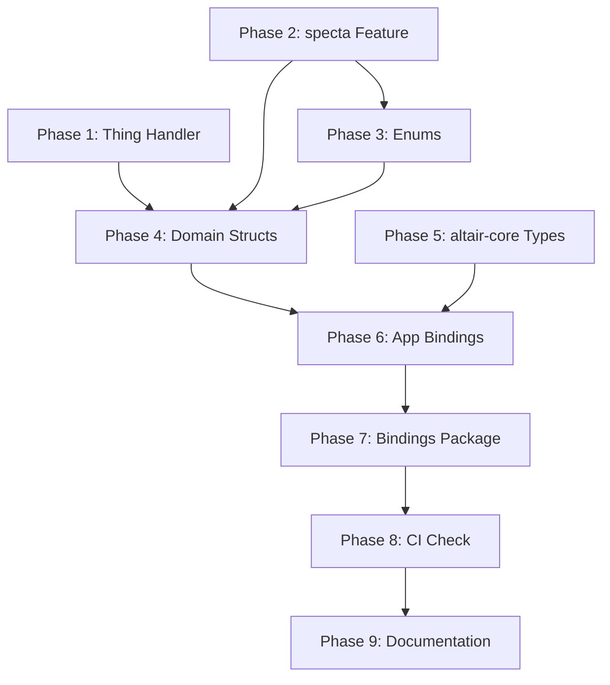

# Implementation Plan: Type-Safe Rust ↔ TypeScript Boundary

**Branch**: `spec/core-004-type-generation` | **Date**: 2025-12-07 | **Spec**: [spec.md](spec.md)
**Input**: Feature specification from `/specs/core-004-type-generation/spec.md`

## Summary

Add `specta::Type` derives to all domain types in `altair-db/schema/` and `altair-core/types.rs` to enable automatic TypeScript generation via tauri-specta. Create custom serde/specta handling for SurrealDB `Thing` type (→ `{ tb, id }` object) and `chrono::NaiveTime` (→ `HH:MM` string). Add CI validation to fail builds when generated bindings drift from Rust sources.

## Technical Context

**Language/Version**: Rust 2024 edition (1.91.1+), TypeScript 5.x
**Primary Dependencies**: tauri-specta 2.0.0-rc.20, specta 2.0.0-rc.20, specta-typescript 0.0.7
**Storage**: SurrealDB 2.x (embedded) - provides `Thing` type for record IDs
**Testing**: cargo test (Rust), pnpm typecheck (TypeScript)
**Target Platform**: Tauri 2.0 desktop (Linux, macOS, Windows), Android
**Project Type**: Monorepo (apps/ + backend/ + packages/)
**Performance Goals**: Type generation < 5 seconds (NFR-001)
**Constraints**: Deterministic output to avoid spurious git diffs (NFR-002)
**Scale/Scope**: ~14 enums, ~15 domain structs, 4 Tauri apps

## Constitution Check

_GATE: Spec is LIGHTWEIGHT weight. Checking complexity gates._

| Gate                  | Status | Notes                                                             |
| --------------------- | ------ | ----------------------------------------------------------------- |
| Modifies > 20 files   | PASS   | ~15 Rust files + bindings package                                 |
| Adds new dependencies | PASS   | No new deps, using existing workspace specta                      |
| Creates new patterns  | PASS   | Following existing `#[cfg_attr(feature = "specta", ...)]` pattern |
| Requires CI changes   | PASS   | Adding binding validation to CI                                   |

## Project Structure

### Documentation (this feature)

```text
specs/core-004-type-generation/
├── spec.md              # Specification (complete)
├── plan.md              # This file
└── tasks.md             # Will be generated by /spectrena.tasks
```

### Source Code (repository root)

```text
backend/
├── crates/
│   ├── altair-db/
│   │   ├── Cargo.toml                    # Add specta feature
│   │   └── src/schema/
│   │       ├── mod.rs                    # Re-exports
│   │       ├── enums.rs                  # 14 enums (add specta derives)
│   │       ├── quest.rs                  # Quest, Campaign, FocusSession, EnergyCheckIn
│   │       ├── note.rs                   # Note, Folder, DailyNote
│   │       ├── item.rs                   # Item, Location, GeoPoint, Reservation, MaintenanceSchedule
│   │       ├── capture.rs                # Capture
│   │       ├── gamification.rs           # UserProgress, Achievement, Streak
│   │       └── shared.rs                 # User, UserPreferences, Attachment, Tag
│   ├── altair-core/
│   │   ├── Cargo.toml                    # Already has specta feature
│   │   └── src/
│   │       ├── types.rs                  # UserId, EntityId, EnergyCost, EntityStatus
│   │       └── api_error.rs              # ApiError (already has specta)
│   └── altair-commands/
│       └── src/lib.rs                    # CommandResponse, HealthStatus (already has specta)
├── apps/
│   ├── guidance/src-tauri/
│   │   ├── src/lib.rs                    # Update Builder to export domain types
│   │   └── Cargo.toml                    # Already depends on altair-db
│   ├── knowledge/src-tauri/
│   ├── tracking/src-tauri/
│   └── mobile/src-tauri/

packages/
├── bindings/
│   ├── src/
│   │   ├── index.ts                      # Re-exports + shared type exports
│   │   ├── guidance.ts                   # Generated (Quest, Campaign, etc.)
│   │   ├── knowledge.ts                  # Generated (Note, Folder, etc.)
│   │   ├── tracking.ts                   # Generated (Item, Location, etc.)
│   │   └── mobile.ts                     # Generated (all types)
│   └── package.json                      # @altair/bindings package

.github/
└── workflows/
    └── ci.yml                            # Add binding freshness check
```

**Structure Decision**: Existing monorepo structure with apps/, backend/, packages/ directories.

---

## Implementation Phases

### Phase 1: SurrealDB Thing Type Handler (Critical Path)

The `surrealdb::sql::Thing` type is used extensively throughout domain structs (`id`, `owner` fields). It needs custom specta/serde handling to serialize as `{ tb: string, id: string }` instead of the default string format.

**Tasks:**

1. Create `altair-db/src/schema/serde_helpers.rs` with:
   - Custom serde serialization for `Thing` → `{ tb, id }` object
   - specta type definition for `Thing` as TypeScript interface
2. Update domain structs to use the custom serializer for `Thing` fields
3. Verify serialization in unit tests

**Key Decision**: Use `#[serde(with = "thing_serde")]` attribute on Thing fields vs. newtype wrapper. The `with` attribute is less invasive.

**Risk**: SurrealDB may change `Thing` internals. Mitigation: Pin surrealdb version, add integration tests.

---

### Phase 2: Add specta Feature to altair-db

Add the `specta` optional feature to `altair-db` crate.

**Tasks:**

1. Update `backend/crates/altair-db/Cargo.toml`:
   - Add `specta = { workspace = true, optional = true }`
   - Add `[features] specta = ["dep:specta"]`
2. Update workspace `Cargo.toml` to add altair-db with specta feature to apps

---

### Phase 3: Add specta Derives to Enums (enums.rs)

All 14 enums in `altair-db/src/schema/enums.rs` need specta derives.

**Types to update:**

- `QuestColumn` (7 variants)
- `EnergyCost` (5 variants)
- `EnergyLevel` (newtype struct)
- `EntityStatus` (2 variants)
- `ItemStatus` (5 variants)
- `ReservationStatus` (3 variants)
- `CaptureStatus` (3 variants)
- `CaptureType` (5 variants)
- `CaptureSource` (4 variants)
- `StreakType` (3 variants)
- `MediaType` (4 variants)
- `UserRole` (2 variants)
- `FocusSessionStatus` (3 variants)

**Pattern:**

```rust
#[derive(Debug, Clone, PartialEq, Serialize, Deserialize)]
#[cfg_attr(feature = "specta", derive(specta::Type))]
#[serde(rename_all = "snake_case")]
pub enum QuestColumn { ... }
```

---

### Phase 4: Add specta Derives to Domain Structs

Add specta derives to all domain structs across schema modules.

**quest.rs** (4 types):

- `Campaign`
- `Quest`
- `FocusSession`
- `EnergyCheckIn`

**note.rs** (3 types):

- `Note`
- `Folder`
- `DailyNote`

**item.rs** (5 types):

- `Item`
- `Location`
- `GeoPoint`
- `Reservation`
- `MaintenanceSchedule`

**capture.rs** (1 type):

- `Capture`

**gamification.rs** (3 types):

- `UserProgress`
- `Achievement`
- `Streak`

**shared.rs** (4 types):

- `User`
- `UserPreferences`
- `Attachment`
- `Tag`

**Special handling needed:**

- `Vec<f32>` in `Note.embedding` - verify specta handles this
- `Option<JsonValue>` in `Item.custom_fields` - may need custom type
- `NaiveTime` in `UserPreferences.weekly_harvest_time` - needs custom specta type for HH:MM format
- `NaiveDate` in `DailyNote.date` and `EnergyCheckIn.date` - verify chrono support

---

### Phase 5: Add specta Derives to altair-core Types

**types.rs:**

- `UserId` (newtype)
- `EntityId` (newtype)
- `EnergyCost` (enum - note: duplicate of altair-db version, may need consolidation)
- `EntityStatus` (enum - duplicate, may need consolidation)

**Note**: There are duplicate enum definitions between `altair-core/types.rs` and `altair-db/schema/enums.rs`. Phase 5 should address whether to:

- Remove duplicates from altair-core (prefer altair-db as source of truth)
- Keep both with re-exports
- Consolidate into one location

**Recommendation**: altair-db should be the authoritative source for domain types. altair-core should only contain utility types and errors.

---

### Phase 6: Update Tauri App Bindings Generation

Each Tauri app's `lib.rs` generates bindings. Update to export domain types.

**Current pattern in `apps/guidance/src-tauri/src/lib.rs`:**

```rust
let builder = tauri_specta::Builder::<tauri::Wry>::new()
    .commands(tauri_specta::collect_commands![health_check]);
```

**New pattern:**

```rust
use altair_db::schema::*;

let builder = tauri_specta::Builder::<tauri::Wry>::new()
    .commands(tauri_specta::collect_commands![health_check])
    .types(tauri_specta::collect_types![
        Quest, Campaign, QuestColumn, EnergyCost,
        // ... app-specific types
    ]);
```

**Per-app type exports:**

- **Guidance**: Quest, Campaign, FocusSession, EnergyCheckIn, gamification types
- **Knowledge**: Note, Folder, DailyNote
- **Tracking**: Item, Location, GeoPoint, Reservation, MaintenanceSchedule
- **Mobile**: All types (unified mobile experience)

**Shared types** (all apps):

- Enums: EntityStatus, UserRole
- User, UserPreferences
- Attachment, Tag
- Capture (Quick Capture is cross-app)

---

### Phase 7: Update Bindings Package Structure

Improve `packages/bindings/` for better developer experience.

**Tasks:**

1. Update `packages/bindings/src/index.ts` to export shared types at top level
2. Add type re-exports for common imports
3. Verify `@altair/bindings` package exports work correctly

**Target API:**

```typescript
// Import app-specific types with namespace
import { guidance, knowledge, tracking } from '@altair/bindings';
const quest: guidance.Quest = { ... };

// Import shared types directly
import { EntityStatus, EnergyCost, User } from '@altair/bindings';
```

---

### Phase 8: CI Binding Freshness Check

Add GitHub Actions workflow to validate bindings aren't stale.

**Strategy** (from spec clarifications):

1. Regenerate bindings in CI
2. Run `git diff --exit-code packages/bindings/`
3. Fail if bindings changed

**Tasks:**

1. Create `.github/workflows/ci.yml` with:
   - Checkout code
   - Setup Rust toolchain
   - Build Tauri apps in debug mode (triggers generation)
   - Check for uncommitted changes to `packages/bindings/`
2. Add documentation about running `pnpm build` to regenerate bindings

---

### Phase 9: Developer Documentation

Update project documentation for maintainability.

**Tasks:**

1. Add section to `CLAUDE.md` under "Development Patterns" → "Adding a New Type"
2. Document the specta feature flag pattern
3. Document CI binding check and how to fix failures

**Content:**

```markdown
### Adding a New Rust Type to TypeScript Bindings

1. Add `#[cfg_attr(feature = "specta", derive(specta::Type))]` to your type
2. If using `Thing` (SurrealDB record ID), add `#[serde(with = "thing_serde")]`
3. Add the type to the relevant app's `collect_types![]` macro
4. Run `pnpm build` to regenerate bindings
5. Commit the updated `packages/bindings/src/*.ts` files
```

---

## Dependencies Between Phases



**Critical path**: P1 → P2 → P3 → P4 → P6 → P7

---

## Risk Assessment

| Risk                                             | Likelihood | Impact | Mitigation                                |
| ------------------------------------------------ | ---------- | ------ | ----------------------------------------- |
| specta doesn't handle nested Option types        | Low        | Medium | Test with actual types, check specta docs |
| NaiveTime serialization breaks existing code     | Medium     | High   | Add unit tests before changing            |
| CI workflow adds too much build time             | Low        | Low    | Cache Rust compilation                    |
| Type duplication between crates causes conflicts | Medium     | Medium | Consolidate during Phase 5                |
| Generated bindings have non-deterministic order  | Medium     | High   | Pin specta version, test determinism      |

---

## Verification Checklist

After implementation, verify:

- [ ] All 14 enums from `altair-db/schema/enums.rs` appear in TypeScript
- [ ] All 15+ domain structs from schema modules appear in TypeScript
- [ ] `Thing` fields serialize as `{ tb: string, id: string }` objects
- [ ] `NaiveTime` serializes as `"HH:MM"` format string
- [ ] `pnpm build` completes without TypeScript errors
- [ ] `pnpm typecheck` passes in apps consuming bindings
- [ ] CI correctly fails when bindings are stale
- [ ] Running build twice produces identical bindings (determinism)

---

## Notes

- **Type duplication**: `EnergyCost` and `EntityStatus` exist in both `altair-core` and `altair-db`. Recommend keeping `altair-db` as authoritative and deprecating duplicates in `altair-core`.

- **JsonValue handling**: `serde_json::Value` in `Item.custom_fields` may need special handling. specta-typescript might generate `unknown` or `any`. Consider documenting this limitation.

- **Embedding vectors**: `Vec<f32>` in `Note.embedding` should generate as `number[]` in TypeScript. Verify this works correctly with the 384-dimension vectors.

- **chrono types**: The spec clarifies `NaiveTime` → `"HH:MM"` string. Standard `DateTime<Utc>` should serialize as ISO 8601 via chrono's serde integration.
