# Implementation Plan: S3-Compatible Object Storage Service

**Branch**: `spec/core-011-storage-service` | **Date**: 2025-12-12 | **Spec**: [spec.md](./spec.md)
**Input**: Feature specification from `/specs/core-011-storage-service/spec.md`

## Summary

Implement `altair-storage` crate providing S3-compatible object storage with presigned URL upload flow, thumbnail generation, and quota tracking. Uses `aws-sdk-s3` for S3 operations with embedded Minio for local development. Exposes Tauri commands for frontend integration.

## Technical Context

**Language/Version**: Rust 1.91.1+ (Edition 2024)
**Primary Dependencies**: aws-sdk-s3, image, sha2, keyring, tokio
**Storage**: S3-compatible (Minio local, Backblaze B2/R2/etc cloud)
**Testing**: cargo test with testcontainers-modules for Minio
**Target Platform**: Tauri desktop (macOS, Windows, Linux), Tauri Android
**Project Type**: Monorepo - shared crate used by multiple Tauri apps
**Performance Goals**: <50ms presigned URL generation, <2s thumbnail generation
**Constraints**: <100MB file uploads, streaming checksum for files >10MB
**Scale/Scope**: Single-user local-first, 5GB default quota

## Constitution Check

_GATE: Must pass before Phase 0 research. Re-check after Phase 1 design._

| Principle                | Check                                               | Status  |
| ------------------------ | --------------------------------------------------- | ------- |
| I. Local-First           | Embedded Minio, works offline                       | ✅ Pass |
| II. ADHD-Friendly        | Zero-friction upload flow, background thumbnail gen | ✅ Pass |
| III. Ubiquitous Language | Uses "Attachment" terminology from glossary         | ✅ Pass |
| IV. Soft Delete          | Attachments archived, S3 objects cleaned up         | ✅ Pass |
| V. Plugin Architecture   | StorageProvider trait for extensibility             | ✅ Pass |
| VI. Privacy by Default   | Local storage, secrets in OS keychain               | ✅ Pass |
| VII. Spec-Driven         | Following spectrena workflow                        | ✅ Pass |

## Project Structure

### Documentation (this feature)

```text
specs/core-011-storage-service/
├── spec.md              # Feature specification (complete)
├── plan.md              # This file
└── tasks.md             # Phase 2 output (/spectrena.tasks command)
```

### Source Code (repository root)

```text
backend/crates/altair-storage/
├── Cargo.toml           # Dependencies: aws-sdk-s3, image, sha2, keyring
└── src/
    ├── lib.rs           # Module exports, StorageService facade
    ├── config.rs        # StorageConfig, credential loading from keychain
    ├── client.rs        # S3Client wrapper around aws-sdk-s3
    ├── presigned.rs     # Presigned URL generation (upload/download)
    ├── checksum.rs      # SHA-256 calculation (streaming for large files)
    ├── thumbnail.rs     # Image thumbnail generation using `image` crate
    ├── quota.rs         # Per-user quota tracking and enforcement
    ├── mime.rs          # MIME type validation and media classification
    ├── minio.rs         # Embedded Minio process management
    └── error.rs         # StorageError types

backend/crates/altair-commands/
└── src/
    └── storage.rs       # Tauri commands: request_upload, confirm_upload, etc.

backend/migrations/
└── 004_storage_quota.surql  # storage_quota table definition

backend/tests/
└── storage/
    ├── mod.rs
    ├── upload_flow_test.rs    # End-to-end upload workflow
    ├── quota_test.rs          # Quota enforcement tests
    └── thumbnail_test.rs      # Thumbnail generation tests
```

**Structure Decision**: Extends existing `altair-storage` crate (currently placeholder) with full implementation. Tauri commands added to `altair-commands` crate following established pattern from core-003.

## Complexity Tracking

> No constitution violations. Standard complexity for STANDARD-weight feature.

---

## Phase 0: Research & Dependencies

### 0.1 aws-sdk-s3 Integration

**Goal**: Validate aws-sdk-s3 works with Minio and supports presigned URLs

**Research Items**:

- [ ] Presigned PUT URL generation with content-type/length restrictions
- [ ] Presigned GET URL generation with configurable expiration
- [ ] HEAD object for existence check
- [ ] GET object with streaming for checksum calculation
- [ ] Custom endpoint configuration for Minio

**Reference**: [aws-sdk-s3 docs](https://docs.rs/aws-sdk-s3/latest/aws_sdk_s3/)

### 0.2 Minio Embedding Strategy

**Goal**: Determine how to bundle/manage Minio binary for local development

**Options**:

1. **Sidecar binary**: Bundle Minio server binary, start/stop with app
2. **Docker via Tauri**: Use Tauri's process API to manage Docker container
3. **External requirement**: Document Minio installation as prerequisite

**Decision Required**: Per spec, Option 1 (embedded binary) chosen, but need:

- [ ] Platform-specific binary paths (macOS arm64/x64, Windows, Linux)
- [ ] Process lifecycle management (start on app init, stop on exit)
- [ ] Data directory location (app data dir)
- [ ] Fallback behavior if binary fails

### 0.3 OS Keychain Integration

**Goal**: Validate `keyring` crate for credential storage

**Research Items**:

- [ ] Store/retrieve S3 access key and secret key
- [ ] Platform support: macOS Keychain, Windows Credential Manager, Linux Secret Service
- [ ] Error handling when keychain unavailable
- [ ] First-run credential setup flow

**Reference**: [keyring crate](https://docs.rs/keyring/latest/keyring/)

### 0.4 Image Processing

**Goal**: Validate `image` crate for thumbnail generation

**Research Items**:

- [ ] Supported formats: JPEG, PNG, GIF, WebP
- [ ] Resize to max dimension (256px) maintaining aspect ratio
- [ ] JPEG encoding at 80% quality
- [ ] Memory efficiency for 10MB images

**Reference**: [image crate](https://docs.rs/image/latest/image/)

---

## Phase 1: Core Infrastructure

### 1.1 Storage Configuration

**Files**: `config.rs`, `error.rs`

**Tasks**:

1. Define `StorageConfig` struct with endpoint, region, bucket, credential refs
2. Implement `StorageConfig::from_keychain()` to load credentials
3. Define `StorageError` enum with variants for all failure modes
4. Add config validation (endpoint format, bucket name rules)

**Acceptance**:

- Config loads from keychain on supported platforms
- Clear error messages when credentials missing
- Supports both Minio (localhost) and cloud S3 endpoints

### 1.2 S3 Client Wrapper

**Files**: `client.rs`

**Tasks**:

1. Initialize aws-sdk-s3 client from `StorageConfig`
2. Implement `head_object()` for existence check
3. Implement `get_object()` with streaming body
4. Implement `delete_object()`
5. Add connection health check method

**Acceptance**:

- Client connects to Minio on localhost:9000
- Operations complete within performance targets
- Errors propagate with context

### 1.3 Presigned URL Generation

**Files**: `presigned.rs`

**Tasks**:

1. Implement `generate_upload_url()` with PUT presigning
2. Implement `generate_download_url()` with GET presigning
3. Add content-type and content-length restrictions to upload URLs
4. Configure expiration times (15 min upload, 1 hour download)
5. Generate UUID-prefixed object keys

**Acceptance**:

- Upload URL allows PUT with correct content-type
- Download URL expires after configured time
- URLs work with Minio S3 API

---

## Phase 2: Upload Flow

### 2.1 MIME Type Validation

**Files**: `mime.rs`

**Tasks**:

1. Define allowed MIME types constant (per spec: images, documents, audio)
2. Implement `validate_mime_type()` returning Result
3. Implement `classify_media_type()` returning MediaType enum
4. Add file extension to MIME type mapping for validation

**Acceptance**:

- Rejects disallowed MIME types with clear error
- Correctly classifies images vs documents vs audio
- Extension validation matches content-type header

### 2.2 Checksum Calculation

**Files**: `checksum.rs`

**Tasks**:

1. Implement in-memory SHA-256 for files ≤10MB
2. Implement streaming SHA-256 for files >10MB
3. Add async streaming from S3 GET response
4. Return hex-encoded checksum string

**Acceptance**:

- Correct checksums for all file sizes
- Memory usage bounded for large files
- Streaming doesn't block Tokio runtime

### 2.3 Upload Confirmation

**Files**: `lib.rs` (StorageService)

**Tasks**:

1. Implement `request_upload()` → PresignedUpload
2. Implement `confirm_upload()` → Attachment
3. Add HEAD check for object existence
4. Calculate checksum and create attachment record
5. Update user quota

**Acceptance**:

- Full upload flow works end-to-end
- Attachment record created with correct metadata
- Quota updated atomically

---

## Phase 3: Thumbnail Generation

### 3.1 Image Processing

**Files**: `thumbnail.rs`

**Tasks**:

1. Implement `generate_thumbnail()` for supported formats
2. Resize to 256×256 max dimension preserving aspect ratio
3. Encode as JPEG at 80% quality
4. Upload thumbnail to S3 with `_thumb` suffix key

**Acceptance**:

- Thumbnails generated for JPEG, PNG, GIF, WebP
- Output always JPEG regardless of input format
- Quality visually acceptable at 256px

### 3.2 Background Processing

**Files**: `lib.rs`

**Tasks**:

1. Queue thumbnail generation after upload confirmation
2. Use tokio::spawn for background processing
3. Update attachment record with thumbnail_key when complete
4. Handle failures gracefully (attachment still usable without thumbnail)

**Acceptance**:

- Thumbnails generated within 2 seconds for 10MB images
- Upload confirmation returns immediately (doesn't wait for thumbnail)
- Failed thumbnail generation logged but doesn't fail upload

---

## Phase 4: Quota Management

### 4.1 Database Schema

**Files**: `backend/migrations/004_storage_quota.surql`

**Tasks**:

1. Define `storage_quota` table with user ref, bytes_used, bytes_limit
2. Add `CHANGEFEED 7d` for sync support
3. Add index on user field
4. Create default quota on user creation (or first storage access)

**Acceptance**:

- Table follows project schema patterns
- Change feed enabled for sync

### 4.2 Quota Tracking

**Files**: `quota.rs`

**Tasks**:

1. Implement `get_quota()` returning current usage and limit
2. Implement `check_quota()` for pre-upload validation
3. Implement `update_quota()` for post-upload/delete updates
4. Add reconciliation method to sync with actual S3 usage

**Acceptance**:

- Quota prevents uploads exceeding limit
- Quota decreases on attachment deletion
- Reconciliation corrects drift within 1%

---

## Phase 5: Tauri Commands

### 5.1 Command Implementation

**Files**: `backend/crates/altair-commands/src/storage.rs`

**Tasks**:

1. `storage_request_upload` command with validation
2. `storage_confirm_upload` command with checksum verification
3. `storage_get_url` command for download URLs
4. `storage_delete` command for attachment removal
5. `storage_get_quota` command for usage display

**Acceptance**:

- All commands follow Tauri command pattern from core-003
- Type-safe via tauri-specta
- Proper error handling with ApiError

### 5.2 Integration with AppState

**Files**: `backend/src/main.rs` (or app entry points)

**Tasks**:

1. Initialize StorageService in AppState
2. Start Minio process on app init (if embedded)
3. Stop Minio process on app exit
4. Register storage commands with Tauri

**Acceptance**:

- Storage available when app starts
- Clean shutdown on app exit
- Minio data persists between sessions

---

## Phase 6: Minio Process Management

### 6.1 Embedded Binary

**Files**: `minio.rs`

**Tasks**:

1. Locate Minio binary in app resources
2. Determine data directory (app data dir / minio)
3. Start Minio process with correct arguments
4. Health check loop until ready
5. Graceful shutdown on app exit

**Acceptance**:

- Minio starts automatically with app
- Data persists in correct location
- Process terminates cleanly

### 6.2 Fallback Configuration

**Files**: `config.rs`, `minio.rs`

**Tasks**:

1. Check for external Minio endpoint in config
2. Skip embedded binary if external configured
3. Provide clear error if embedded fails and no fallback
4. Document fallback setup for development

**Acceptance**:

- Works with external Minio endpoint
- Clear error messaging when storage unavailable
- Development workflow documented

---

## Phase 7: Testing

### 7.1 Unit Tests

**Scope**: Individual module tests

**Test Files**:

- `config.rs` tests: Config validation, keychain mocking
- `mime.rs` tests: MIME validation, media classification
- `checksum.rs` tests: Correct hashes for known inputs
- `quota.rs` tests: Quota calculation logic

### 7.2 Integration Tests

**Scope**: End-to-end flows with real Minio

**Test Files**: `backend/tests/storage/`

**Tests**:

- TS-001: Upload small image (<1MB)
- TS-002: Upload large file (50MB)
- TS-003: Upload with invalid MIME type → error
- TS-004: Upload exceeding quota → error
- TS-005: Confirm upload for non-existent object → error
- TS-006: Download with expired URL → error
- TS-008: Delete attachment cleanup
- TS-009: Thumbnail generation for various formats

**Infrastructure**: Use `testcontainers-modules` for Minio container

### 7.3 Performance Tests

**Scope**: Latency and throughput validation

**Tests**:

- Presigned URL generation: <50ms (100 iterations average)
- Confirm upload (1MB): <500ms including checksum
- Thumbnail generation (10MB image): <2s

---

## Dependencies

### Internal Dependencies

| Dependency                 | Status      | Required For                 |
| -------------------------- | ----------- | ---------------------------- |
| altair-core                | ✅ Complete | Error types, Result alias    |
| altair-db                  | ✅ Complete | Attachment record creation   |
| altair-commands            | ✅ Complete | Tauri command infrastructure |
| core-003-backend-skeleton  | ✅ Complete | AppState pattern             |
| core-002-schema-migrations | ✅ Complete | Attachment table             |

### External Dependencies

| Crate      | Version | Purpose                  |
| ---------- | ------- | ------------------------ |
| aws-sdk-s3 | 1.x     | S3 client operations     |
| aws-config | 1.x     | AWS SDK configuration    |
| image      | 0.25    | Thumbnail generation     |
| sha2       | 0.10    | Checksum calculation     |
| keyring    | 3.x     | OS keychain integration  |
| tokio      | 1.x     | Async runtime (existing) |
| uuid       | 1.x     | Object key generation    |

### Test Dependencies

| Crate                  | Version | Purpose                   |
| ---------------------- | ------- | ------------------------- |
| testcontainers-modules | 0.11    | Minio container for tests |
| tempfile               | 3.x     | Temporary directories     |
| tokio-test             | 0.4     | Async test utilities      |

---

## Risks and Mitigations

| Risk                             | Likelihood | Impact | Mitigation                                                  |
| -------------------------------- | ---------- | ------ | ----------------------------------------------------------- |
| Minio binary bundling complexity | Medium     | Medium | Test all platforms early; fallback to external endpoint     |
| aws-sdk-s3 Minio compatibility   | Low        | Medium | Integration tests with real Minio; check signature versions |
| Large file memory pressure       | Low        | Medium | Streaming checksum implemented for >10MB files              |
| Keychain platform differences    | Medium     | Low    | Graceful fallback; allow env var override for dev           |

---

## Implementation Order

```mermaid
gantt
    title core-011-storage-service Implementation Phases
    dateFormat X
    axisFormat %s

    section Phase 0
    Research & Dependencies    :p0, 0, 1

    section Phase 1
    Storage Config            :p1a, after p0, 1
    S3 Client Wrapper         :p1b, after p0, 1
    Presigned URLs            :p1c, after p1b, 1

    section Phase 2
    MIME Validation           :p2a, after p1a, 1
    Checksum Calculation      :p2b, after p1c, 1
    Upload Confirmation       :p2c, after p2a p2b, 1

    section Phase 3
    Thumbnail Generation      :p3, after p2c, 1

    section Phase 4
    Quota Schema              :p4a, after p1a, 1
    Quota Tracking            :p4b, after p4a p2c, 1

    section Phase 5
    Tauri Commands            :p5, after p3 p4b, 1

    section Phase 6
    Minio Management          :p6, after p5, 1

    section Phase 7
    Testing                   :p7, after p6, 2
```



**Critical Path**: Phase 0 → Phase 1 → Phase 2 → Phase 5 → Phase 7

**Parallelizable**:

- Phase 3 (Thumbnails) can run parallel with Phase 4 (Quotas)
- Phase 6 (Minio) can start after Phase 1 completes

---

## Success Criteria

| Criterion               | Measurement                    | Target    |
| ----------------------- | ------------------------------ | --------- |
| Upload works end-to-end | Manual test + integration test | ✅        |
| Presigned URL latency   | Performance test               | <50ms     |
| Thumbnail generation    | 10MB image test                | <2s       |
| Quota accuracy          | Reconciliation check           | Within 1% |
| All test scenarios pass | CI/CD pipeline                 | 100%      |

---

## Next Steps

1. Run `/spectrena.tasks` to generate task breakdown
2. Start with Phase 0 research to validate dependencies
3. Implement Phase 1 infrastructure
4. Iteratively build through phases with tests at each stage
