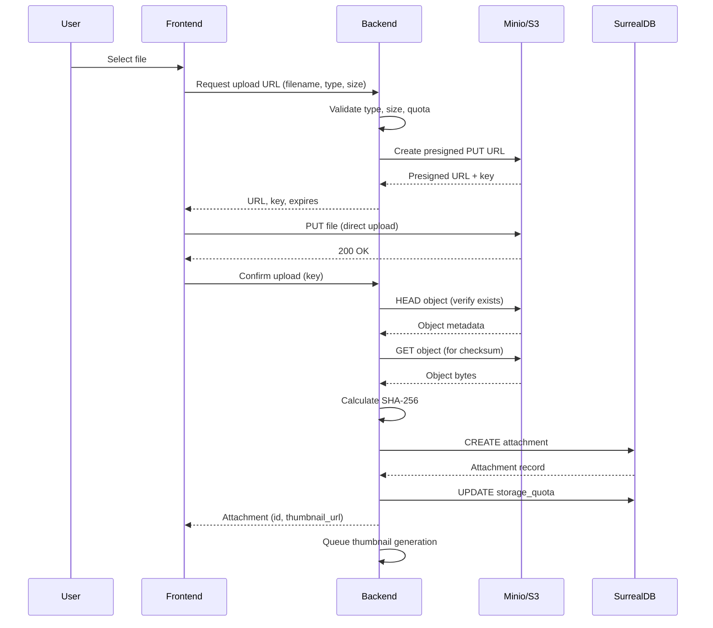

# Specification: S3-Compatible Object Storage Service

<!-- prettier-ignore-start -->
<!-- markdownlint-disable -->
<!--
SPEC WEIGHT: [ ] LIGHTWEIGHT  [x] STANDARD  [ ] FORMAL

Weight Guidelines:
- LIGHTWEIGHT: Bug fixes, small enhancements, config changes (<2 days work)
  Required sections: Quick Reference, Problem/Solution, Requirements, Acceptance Criteria

- STANDARD: New features, integrations, moderate complexity (2-10 days work)
  Required sections: All LIGHTWEIGHT + Data Model, Security, Test Requirements

- FORMAL: Major systems, compliance-sensitive, cross-team impact (>10 days work)
  Required sections: All sections, full sign-off
-->
<!-- markdownlint-enable -->
<!-- prettier-ignore-end -->

**Spec ID**: core-011-storage-service
**Component**: CORE
**Weight**: STANDARD
**Version**: 1.0
**Status**: DRAFT
**Created**: 2025-12-12
**Author**: Claude (AI Assistant)

---

## Quick Reference

> S3-compatible object storage service providing unified file management for photos, audio, video, and documents across all Altair apps with presigned URL upload flow, thumbnail generation, and storage quota tracking.

**What**: S3-compatible object storage service using aws-sdk-s3 with Minio for local development
**Why**: Enable file attachments (photos, audio, video, documents) across Guidance, Knowledge, and Tracking apps
**Impact**: All apps can attach and retrieve files with < 100ms metadata operations and direct S3 upload/download

**Success Metrics**:

| Metric                           | Target             | How Measured                  |
| -------------------------------- | ------------------ | ----------------------------- |
| Presigned URL generation latency | < 50ms             | Backend performance tests     |
| Upload success rate              | > 99.5%            | S3 upload completion tracking |
| Thumbnail generation time        | < 2s for images    | Background job metrics        |
| Storage quota accuracy           | 100% match with S3 | Periodic reconciliation       |

---

## Problem Statement

### Current State

Altair currently has no object storage capability. The database schema defines an `attachment` table (per core-002-schema-migrations) with metadata fields including `storage_key`, `storage_bucket`, and `checksum`, but no backend service exists to actually store, retrieve, or manage files.

Users cannot attach photos to inventory items (Tracking), embed images in notes (Knowledge), or attach reference materials to quests (Guidance). This limits the utility of all three apps, especially for:

- **Tracking**: Cannot photograph items for visual identification or condition documentation
- **Knowledge**: Cannot include images, diagrams, or file attachments in notes
- **Guidance**: Cannot attach reference files or screenshots to quests
- **Quick Capture**: Cannot capture photos, audio, or video (a core feature per platform-001)

### Desired State

A fully functional object storage service that:

1. Provides presigned URLs for direct browser-to-S3 uploads (no backend proxy)
2. Generates thumbnails for images and video files
3. Tracks storage usage per user with quota enforcement
4. Verifies file integrity via SHA-256 checksums
5. Works locally with embedded Minio and in cloud with any S3-compatible provider
6. Supports the attachment entity lifecycle (create metadata → upload → confirm → access)

Users can attach files to any entity (Quest, Note, Item, Capture) via the `has_attachment` graph edge, with immediate feedback and reliable storage.

### Why Now

- **Blocking dependency**: Multiple downstream specs (platform-001-quick-capture, tracking-020-attachments, knowledge-001-note-crud) require file storage
- **Foundation complete**: core-003-backend-skeleton provides the Tauri command infrastructure and AppState pattern
- **Schema ready**: core-002-schema-migrations defined the `attachment` table and `has_attachment` edge
- **Architecture defined**: ADR-004 established S3-compatible storage as the approach

---

## Solution Overview

### Approach

Implement an `altair-storage` Rust crate that wraps the `aws-sdk-s3` client with Altair-specific functionality:

1. **Configuration management**: Load S3 credentials from OS keychain, support Minio (local) and any S3-compatible provider (cloud)
2. **Presigned URL generation**: Create time-limited upload URLs with size/type restrictions
3. **Upload confirmation**: Verify uploaded file exists, calculate checksum, create attachment record
4. **Download access**: Generate presigned download URLs or serve directly for public files
5. **Thumbnail generation**: Use `image` crate for images, `ffmpeg` (optional) for video
6. **Quota tracking**: Maintain running total per user, enforce limits

The service integrates with the existing Tauri command pattern, exposing commands that the frontend calls via `invoke()`.

### Scope

**In Scope**:

- Minio Docker setup for local development
- aws-sdk-s3 Rust client wrapper with presigned URL support
- Upload flow: request URL → direct upload → confirmation → metadata storage
- Download flow: presigned URL generation for private files
- Thumbnail generation for images (JPEG, PNG, GIF, WebP)
- SHA-256 checksum verification on upload confirmation
- Per-user storage quota tracking and enforcement
- Bucket lifecycle: `attachments`, `captures`, `exports`
- Tauri commands: `storage_request_upload`, `storage_confirm_upload`, `storage_get_url`, `storage_delete`, `storage_get_quota`

**Out of Scope**:

- Video thumbnail generation (requires ffmpeg) — tracked in tracking-020-attachments
- Cloud S3 provider setup (Backblaze B2, R2, etc.) — deployment concern, not spec scope
- Sync of objects between local and cloud — tracked in core-013-sync-engine
- Image optimization/compression — future enhancement
- CDN integration — future enhancement

**Future Considerations**:

- Video thumbnails via ffmpeg when platform-001-quick-capture needs video capture
- Object replication between local and cloud Minio instances
- Intelligent storage tiering (hot/warm/cold)

### Key Decisions

| Decision                    | Options Considered               | Rationale                                                                         |
| --------------------------- | -------------------------------- | --------------------------------------------------------------------------------- |
| aws-sdk-s3 over s3 crate    | aws-sdk-s3, rust-s3, custom HTTP | aws-sdk-s3 is official, well-maintained, handles presigned URLs correctly         |
| Presigned upload over proxy | Presigned URL, Backend proxy     | Eliminates backend as bottleneck, reduces memory usage, follows S3 best practices |
| SHA-256 for checksums       | MD5, SHA-256, SHA-512            | SHA-256 is secure, reasonably fast, standard for S3 ETags                         |
| Minio for local             | Minio, LocalStack, fake-s3       | Minio is production-grade, same API as cloud, official Docker image               |
| OS keychain for credentials | Env vars, config file, keychain  | Secure secret storage per ADR, consistent with auth patterns                      |

---

## Requirements

### Functional Requirements

| ID     | Requirement                                                                                       | Priority | Notes                                  |
| ------ | ------------------------------------------------------------------------------------------------- | -------- | -------------------------------------- |
| FR-001 | The system shall generate presigned upload URLs with configurable expiration (default 15 minutes) | CRITICAL | Core upload flow                       |
| FR-002 | The system shall validate file size and MIME type before generating upload URLs                   | CRITICAL | Prevents quota abuse and invalid files |
| FR-003 | The system shall verify uploaded file exists and calculate SHA-256 checksum on confirmation       | CRITICAL | Data integrity                         |
| FR-004 | The system shall create attachment records in SurrealDB on successful upload confirmation         | CRITICAL | Links to has_attachment edge           |
| FR-005 | The system shall generate presigned download URLs for private files                               | HIGH     | Secure access                          |
| FR-006 | The system shall generate thumbnails for image files (JPEG, PNG, GIF, WebP)                       | HIGH     | Preview support                        |
| FR-007 | The system shall track storage usage per user and enforce configurable quotas                     | HIGH     | Resource management                    |
| FR-008 | The system shall delete objects from S3 when attachment records are deleted                       | MEDIUM   | Cleanup                                |
| FR-009 | The system shall support multiple buckets: attachments, captures, exports                         | MEDIUM   | Separation of concerns                 |
| FR-010 | The system shall load S3 credentials from OS keychain                                             | HIGH     | Security                               |

### Non-Functional Requirements

| ID      | Requirement                                                                    | Priority | Notes              |
| ------- | ------------------------------------------------------------------------------ | -------- | ------------------ |
| NFR-001 | Presigned URL generation shall complete in < 50ms                              | HIGH     | UX responsiveness  |
| NFR-002 | Thumbnail generation shall complete in < 2 seconds for images up to 10MB       | MEDIUM   | Background task    |
| NFR-003 | The system shall handle uploads up to 100MB per file                           | MEDIUM   | Configurable limit |
| NFR-004 | The system shall work offline when Minio is unavailable (graceful degradation) | MEDIUM   | Error handling     |
| NFR-005 | Storage operations shall be idempotent (safe to retry)                         | HIGH     | Reliability        |

### User Stories

**US-001: Attach Photo to Item**

- **As** a Tracking user,
- **I** need to
  - select a photo from my device
  - upload it to storage
  - attach it to an inventory item
- **so** that I can visually identify items and document their condition.

Acceptance:

- [ ] User can select image file from device
- [ ] Upload completes with progress indication
- [ ] Photo appears in item's attachments list
- [ ] Thumbnail displays in item card

Independent Test: Upload image via Tauri command, verify attachment record created with correct checksum.

**US-002: View Attached File**

- **As** a user,
- **I** need to
  - click on an attachment
  - view or download the full file
- **so** that I can access the original uploaded content.

Acceptance:

- [ ] Clicking attachment opens preview/download dialog
- [ ] Large files download rather than display inline
- [ ] Presigned URL works for at least 1 hour

Independent Test: Generate download URL, verify accessible and returns correct content.

**US-003: Check Storage Usage**

- **As** a user,
- **I** need to
  - see my current storage usage
  - understand my remaining quota
- **so** that I can manage my files and avoid hitting limits.

Acceptance:

- [ ] Storage usage displayed in settings/profile
- [ ] Usage updates after uploads/deletes
- [ ] Warning when approaching quota (80%)

Independent Test: Upload files, verify quota tracking matches actual S3 usage.

**US-004: Delete Attachment**

- **As** a user,
- **I** need to
  - remove an attachment from an entity
  - free up storage space
- **so** that I can manage my files and correct mistakes.

Acceptance:

- [ ] Attachment can be deleted from entity
- [ ] S3 object is removed
- [ ] Storage quota decreases appropriately
- [ ] Entity's has_attachment edge is removed

Independent Test: Delete attachment, verify S3 object gone and quota updated.

---

## Data Model

### Key Entities

- **Attachment**: Metadata for a stored file including filename, MIME type, size, storage location, checksum, and media classification (image/audio/video/document/other)
- **StorageConfig**: Configuration for S3 connection including endpoint, bucket, region, and credential references
- **StorageQuota**: Per-user storage usage tracking with current bytes used and maximum allowed
- **PresignedUpload**: Ephemeral data for pending upload including URL, object key, and expiration time

### Entity Details

**Attachment** (existing from core-002, extended here)

- **Purpose**: Persistent record of a stored file with metadata for retrieval and integrity verification
- **Key Attributes**:
  - filename: Original name of uploaded file
  - mime_type: Content type (e.g., image/jpeg, application/pdf)
  - size_bytes: File size for quota tracking
  - storage_key: S3 object key (UUID-prefixed path)
  - storage_bucket: Target bucket name
  - checksum: SHA-256 hash for integrity verification
  - media_type: Classification (image, audio, video, document, other)
  - thumbnail_key: S3 key for generated thumbnail (images only)
  - metadata: Flexible object for EXIF, dimensions, duration, etc.
- **Relationships**: Owned by user, linked via has_attachment edge to Quest/Note/Item/Capture
- **Lifecycle**: Created on upload confirmation, soft-deleted with parent entity or explicitly
- **Business Rules**:
  - storage_key must be unique within bucket
  - checksum must match uploaded file's actual hash
  - size_bytes contributes to owner's storage quota

**StorageQuota** (new)

- **Purpose**: Track per-user storage consumption for quota enforcement
- **Key Attributes**:
  - user: Reference to user record
  - bytes_used: Current total storage consumption
  - bytes_limit: Maximum allowed storage (default: 5GB for local, configurable)
  - last_reconciled: Timestamp of last S3 reconciliation check
- **Relationships**: One-to-one with user
- **Lifecycle**: Created with user, updated on each upload/delete
- **Business Rules**:
  - bytes_used must not exceed bytes_limit
  - Periodic reconciliation with actual S3 usage (daily)

### State Transitions

**Upload Flow**:

```
INITIATED → UPLOADING → CONFIRMING → CONFIRMED
               ↓            ↓
           EXPIRED       FAILED
```

**Transition Rules**:

- INITIATED → UPLOADING: Presigned URL generated, user begins upload
- UPLOADING → CONFIRMING: User reports upload complete
- CONFIRMING → CONFIRMED: Backend verifies file exists, checksum matches, attachment record created
- UPLOADING → EXPIRED: Presigned URL expired (15 min) without confirmation
- CONFIRMING → FAILED: File not found, checksum mismatch, or quota exceeded

---

## Interfaces

### Operations

**Request Upload URL**

- **Purpose**: Generate presigned S3 URL for direct browser upload
- **Trigger**: User selects file to upload
- **Inputs**:
  - `filename` (required): Original filename for storage
  - `mime_type` (required): Content type, must be in allowed list
  - `size_bytes` (required): File size, must be within limits
  - `bucket` (optional): Target bucket, defaults to "attachments"
- **Outputs**: Presigned URL, S3 object key, expiration timestamp
- **Behavior**:
  - Validates MIME type against allowlist
  - Validates size against user quota and max file size
  - Generates UUID-prefixed object key
  - Returns presigned PUT URL valid for 15 minutes
- **Error Conditions**:
  - Invalid MIME type: Returns error with allowed types
  - Size exceeds limit: Returns error with max size
  - Quota exceeded: Returns error with current/max usage

**Confirm Upload**

- **Purpose**: Verify upload completed and create attachment record
- **Trigger**: Browser reports upload success
- **Inputs**:
  - `object_key` (required): S3 key from Request Upload URL
  - `bucket` (required): Bucket where file was uploaded
- **Outputs**: Attachment record with ID
- **Behavior**:
  - HEAD request to S3 to verify object exists
  - GET object to calculate SHA-256 checksum
  - Creates attachment record in SurrealDB
  - Updates user's storage quota
  - Queues thumbnail generation for images
- **Error Conditions**:
  - Object not found: Returns error, no attachment created
  - Quota exceeded (race condition): Delete object, return error

**Get Download URL**

- **Purpose**: Generate presigned URL for file access
- **Trigger**: User requests to view/download attachment
- **Inputs**:
  - `attachment_id` (required): Attachment record ID
  - `expires_in_secs` (optional): URL validity, default 3600 (1 hour)
- **Outputs**: Presigned GET URL, expiration timestamp
- **Behavior**:
  - Validates user owns attachment or has access
  - Generates presigned GET URL
- **Error Conditions**:
  - Attachment not found: 404 error
  - Access denied: 403 error

**Delete Attachment**

- **Purpose**: Remove file from storage and database
- **Trigger**: User deletes attachment or parent entity
- **Inputs**:
  - `attachment_id` (required): Attachment record ID
- **Outputs**: Success confirmation
- **Behavior**:
  - Deletes S3 object (and thumbnail if exists)
  - Removes attachment record
  - Removes has_attachment edges
  - Updates user's storage quota
- **Error Conditions**:
  - Attachment not found: 404 error (idempotent)
  - S3 delete fails: Log error, still remove DB record

**Get Storage Quota**

- **Purpose**: Report user's storage consumption
- **Trigger**: User views storage settings
- **Inputs**: (none, uses authenticated user)
- **Outputs**: Current bytes used, bytes limit, percentage used
- **Behavior**:
  - Returns cached quota from StorageQuota table
  - If stale (> 24h), triggers background reconciliation
- **Error Conditions**: (none, always returns data)

### Integration Points

| System        | Direction     | Purpose                     | Data Exchanged         |
| ------------- | ------------- | --------------------------- | ---------------------- |
| Minio/S3      | Outbound      | Object storage operations   | Files, presigned URLs  |
| SurrealDB     | Bidirectional | Attachment metadata storage | Attachment records     |
| OS Keychain   | Inbound       | S3 credentials              | Access key, secret key |
| Image library | Internal      | Thumbnail generation        | Image bytes            |

---

## Workflows

### Primary Upload Workflow

**Actors**: User, Frontend, Backend, S3
**Preconditions**: User authenticated, S3 available, quota not exceeded
**Postconditions**: File stored in S3, attachment record in DB, quota updated



**Steps**:

1. User selects file in UI → Frontend reads file metadata
2. Frontend requests upload URL from Backend → Backend validates and returns presigned URL
3. Frontend uploads directly to S3 → S3 stores object
4. Frontend confirms upload to Backend → Backend verifies and creates records
5. Backend returns attachment record → Frontend displays success

**Alternate Flows**:

- At step 2, if quota exceeded: Backend returns error, Frontend shows quota warning
- At step 3, if upload fails: Frontend retries up to 3 times with exponential backoff
- At step 4, if object not found: Backend returns error, Frontend shows retry option

**Error Flows**:

- If S3 unreachable: Backend returns service unavailable, Frontend shows offline message
- If presigned URL expired: Frontend must restart from step 2

---

## Security and Compliance

### Authorization

| Operation          | Required Permission         | Notes                              |
| ------------------ | --------------------------- | ---------------------------------- |
| Request upload URL | Authenticated user          | Must have quota available          |
| Confirm upload     | Same user who requested URL | Validated by object key pattern    |
| Get download URL   | Owner or entity accessor    | Via has_attachment edge permission |
| Delete attachment  | Owner only                  | Unless admin                       |
| Get storage quota  | Self only                   | Users see only own quota           |

### Data Classification

| Data Element        | Classification   | Handling Requirements                                    |
| ------------------- | ---------------- | -------------------------------------------------------- |
| File content        | User Private     | Stored encrypted at rest (Minio SSE), no logging         |
| Attachment metadata | User Private     | Stored in user-scoped DB records                         |
| Presigned URLs      | Ephemeral Secret | Short-lived (15 min upload, 1 hour download), not logged |
| S3 credentials      | Secret           | Stored in OS keychain only, never in config files        |

### Data Protection

- **Encryption at rest**: Minio server-side encryption (AES-256-GCM) enabled by default
- **Encryption in transit**: HTTPS required for all S3 operations (except localhost Minio)
- **Access control**: Presigned URLs are the only way to access objects (bucket not public)
- **Credential storage**: S3 access/secret keys stored in OS keychain, never plaintext

---

## Test Requirements

### Success Criteria

| ID     | Criterion                                                               | Measurement                                         |
| ------ | ----------------------------------------------------------------------- | --------------------------------------------------- |
| SC-001 | Users can upload files up to 100MB in under 30 seconds (on local Minio) | Performance test with various file sizes            |
| SC-002 | Uploaded files maintain integrity (checksum matches after download)     | Round-trip checksum verification test               |
| SC-003 | Storage quota is accurate within 1% of actual S3 usage                  | Reconciliation check after multiple uploads/deletes |
| SC-004 | Presigned URLs expire correctly and cannot be used after expiration     | Timed test of URL validity                          |

### Acceptance Criteria

**Scenario**: Upload image file _(maps to US-001)_

```gherkin
Given a user with available storage quota
When the user uploads a 5MB JPEG image
Then a presigned URL is generated in < 50ms
And the upload completes successfully
And an attachment record is created with correct checksum
And the user's quota increases by 5MB
And a thumbnail is generated
```

**Scenario**: Quota enforcement _(maps to FR-007)_

```gherkin
Given a user at 95% of storage quota
When the user attempts to upload a file exceeding remaining quota
Then the upload is rejected with a quota exceeded error
And no S3 object is created
And the user is shown their current usage
```

**Scenario**: Delete attachment _(maps to US-004)_

```gherkin
Given an attachment record with associated S3 object
When the attachment is deleted
Then the S3 object is removed
And the attachment record is removed
And the has_attachment edge is removed
And the user's quota decreases by the file size
```

### Test Scenarios

| ID     | Scenario                                 | Type        | Priority | Maps To |
| ------ | ---------------------------------------- | ----------- | -------- | ------- |
| TS-001 | Upload small image (< 1MB)               | Functional  | CRITICAL | US-001  |
| TS-002 | Upload large file (50MB)                 | Functional  | HIGH     | FR-001  |
| TS-003 | Upload with invalid MIME type            | Functional  | HIGH     | FR-002  |
| TS-004 | Upload exceeding quota                   | Functional  | HIGH     | FR-007  |
| TS-005 | Confirm upload for non-existent object   | Functional  | HIGH     | FR-003  |
| TS-006 | Download with expired URL                | Functional  | MEDIUM   | FR-005  |
| TS-007 | Concurrent uploads from same user        | Performance | MEDIUM   | NFR-001 |
| TS-008 | Delete attachment cleanup                | Functional  | HIGH     | US-004  |
| TS-009 | Thumbnail generation for various formats | Functional  | MEDIUM   | FR-006  |

### Performance Criteria

| Operation            | Metric          | Target  | Conditions                     |
| -------------------- | --------------- | ------- | ------------------------------ |
| Request upload URL   | Response time   | < 50ms  | Local Minio                    |
| Confirm upload (1MB) | Response time   | < 500ms | Including checksum calculation |
| Get download URL     | Response time   | < 50ms  | Cached metadata                |
| Thumbnail generation | Processing time | < 2s    | 10MB image                     |

---

## Constraints and Assumptions

### Technical Constraints

- **aws-sdk-s3 crate**: Uses async Rust with Tokio, must integrate with existing Tauri async runtime
- **Minio compatibility**: Must work with Minio's S3 API (v2 signatures may differ from AWS)
- **File size limits**: Presigned URLs limited by S3 single PUT (5GB), but we limit to 100MB for practicality
- **Checksum calculation**: Requires reading full file into memory; consider streaming for large files

### Business Constraints

- **Local-first**: Must work fully offline with embedded Minio
- **No cloud dependency**: Cloud S3 is optional, local Minio is sufficient for MVP
- **Single-user focus**: Quota and access control designed for single-user, not multi-tenant

### Assumptions

- Minio runs alongside the desktop app (started on app launch or via Docker)
- Users have sufficient disk space for Minio storage
- Images are the most common attachment type (prioritize image thumbnail generation)

### Dependencies

| Dependency                 | Type     | Status   | Impact if Delayed                            |
| -------------------------- | -------- | -------- | -------------------------------------------- |
| core-003-backend-skeleton  | Internal | Complete | Blocking - need Tauri command infrastructure |
| core-002-schema-migrations | Internal | Complete | Blocking - need attachment table             |
| aws-sdk-s3 crate           | External | Stable   | Low - well-maintained crate                  |
| image crate                | External | Stable   | Low - standard image processing              |

### Risks

| Risk                     | Likelihood | Impact | Mitigation                                      |
| ------------------------ | ---------- | ------ | ----------------------------------------------- |
| Minio startup complexity | Medium     | Medium | Provide Docker Compose, document setup          |
| Large file memory usage  | Medium     | Medium | Stream checksums for files > 50MB               |
| Presigned URL security   | Low        | High   | Short expiration, validate user on confirm      |
| S3 API differences       | Low        | Medium | Test with Minio and at least one cloud provider |

---

## References

### Internal

- [ADR-004: S3-Compatible Storage](../../docs/decision-log.md#adr-004-s3-compatible-storage)
- [Technical Architecture: Object Storage](../../docs/technical-architecture.md#object-storage-s3-compatible)
- [core-002-schema-migrations](../core-002-schema-migrations/spec.md) — attachment table definition
- [core-003-backend-skeleton](../core-003-backend-skeleton/spec.md) — Tauri command patterns

### External

- [AWS SDK for Rust](https://github.com/awslabs/aws-sdk-rust)
- [Minio Documentation](https://min.io/docs/minio/linux/index.html)
- [S3 Presigned URLs](https://docs.aws.amazon.com/AmazonS3/latest/userguide/ShareObjectPreSignedURL.html)

---

## Changelog

| Version | Date       | Author                | Changes                            |
| ------- | ---------- | --------------------- | ---------------------------------- |
| 1.0     | 2025-12-12 | Claude (AI Assistant) | Initial specification from backlog |
